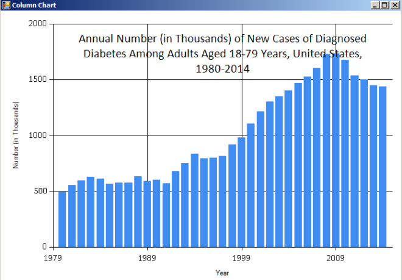

# F# Data Visualization for a neophyte -- CDC Open Data #

*By Rick Pack. Original post at: https://rickpackblog.wordpress.com/2016/11/27/f-data-visualization-for-a-neophyte-cdc-open-data/*

The following introductory post tells how I went from ignorance to reproducing in F# what I'll call the "Hospital Discharges from Diabetes by Year"
graph from this [CDC (Centers for Disease Control) website](http://www.cdc.gov/diabetes/statistics/dmany/fig1.htm).

## Background

[My wife, Ryan Pack, and I](https://msrisingllc.com/) have committed to doing challenging stuff that scares us as part of a plan of personal development
that will propel us towards helping others massively. We listen to Earl Nightingale, Bob Proctor, and Sean Croxton's excellent podcasts ["Quote of the Day"](http://seancroxton.com/quoteoftheday/)
and ["The Sessions"](http://seancroxton.com/sessions/), read affirmations aloud in a mirror (not in the same room),
and habitually behave such that positively transformative ideas are embedded in our subconscious.

This is working.

A Twitter opportunity arose from [Sergey Tihon](https://twitter.com/sergey_tihon) to take one of the remaining "F# Advent 2016" slots and I quickly volunteered.
I then had a week to write a blog post about the programming language F# ("F Sharp"). Yet my anxiety rose everyday because I know little about F#, or .NET and blogging.
I regularly use SAS and R as a data scientist.

I chose the CDC "Hospital Discharges from Diabetes by Year" data because many I follow in the health sphere associate deleterious health outcomes with
compromised blood sugar regulation. Loosely, "open data" refers to electronically stored information that is publicly available and can be used freely.
Please refer to the [Data Foundation website](http://www.datafoundation.org/state-of-the-union-of-open-data-2016#what-is-open-data) for the eight open data tenets.
The Data Foundation was referenced by Data.gov and so is presumed credible.

## Tutorial and code

[Visual Studio 2015 Community](https://www.visualstudio.com/vs/community/) was installed because I had some exposure to the Visual Studio IDE in a prior position,
all of the F# prerequisites were included, and the software was **free**.

Under `File -> New -> Project -> Visual F#`, I discovered a Microsoft-provided "Tutorial". After clicking OK, I found a tutorial in the form of code and comments in the script Tutorial.fsx (".fsx" is an F# script file extension). This allowed me to practice executing code in the immediate feedback-providing REPL (Read Evaluate Print Loop) with ALT-ENTER, a shared shortcut with R Studio.

However, I needed examples for downloading data from a website's HTML. I experimented with a variety of websites' example code in a new script I created and saved with the default name ("Script1.fsx"):
File -> New -> File -> General -> F# Script File

Errors were quickly experienced because websites were using ellipses references such as the following that did not work:

```
#r "../../../bin/FSharp.Data.dll"
```

Studying the code in Jamie Dixon's ["Mastering .NET Machine Learning" (2016)](https://www.amazon.com/Mastering-Machine-Learning-Jamie-Dixon/dp/1785888404),
I realized the need to install the FSharp.Data package and reference the DLL's location. I could then use the popular HtmlProvider method to read data from the CDC website.

Installing packages in Visual Studio is of a similar ease as installing packages in R (#rstats). Just open the Nuget Package Manager console in Visual Studio under
`Tools -> Nuget Package Manager -> Package Manager Console`
then type in the bottom window and hit ENTER to execute:

```
install-package Fsharp.Data
```

The following could finally be typed in an Fsharp script without error:

```
#r "../Tutorial1/packages/FSharp.Data.2.3.2/lib/net40/FSharp.Data.dll"
open FSharp.Data
```

Intellisense in Visual Studio then allowed me to see what methods and objects were detected as available based on the code under the cursor.
R users will recognize this feature as one shared with R Studio.

I then spent hours failing to make progress, taking wrong turns that included "Namespaces". I finally figured out that while the author of
["Why F# is the best language for web scraping"](http://biarity.me/2016/11/23/Why-F-is-the-best-langauge-for-web-scraping/) was able to use `HtmlProvider` without `GetSample()`,
I had to match Edgar Sanchez's work.

I had been mislead by intellisense provided evidence of seeing the chart data via display of column headers from the data table such as "Year".
However, the inclusion of `GetSample()` eliminated the red squiggles that dogged me.

The comments included in the code make reasonable ending the play-by-play account.
Some of these were copied from the ["Why F# is the best language for web scraping"](http://biarity.me/2016/11/23/Why-F-is-the-best-langauge-for-web-scraping/) post with permission.

```
// First use Nuget to acquire FSharp.Data.dll
// Tools -> Nuget Package Manager -> Package Manager Console
// then execute: install-package Fsharp.Data
#r "../Tutorial1/packages/FSharp.Data.2.3.2/lib/net40/FSharp.Data.dll"
open FSharp.Data
 
// Configure the type provider
type NugetStats =
HtmlProvider<"http://www.cdc.gov/diabetes/statistics/incidence/fig1.htm">
 
// load the live package stats, you get intellisense for this
// Discovered the need to use GetSample function to avoid error
// Experimenting with the aid of intellisense ultimately revealed that Tables.Table1
//  captured the nameless table from the CDC website. I knew the table lacked a name because
//  of a study of the website's source [In Firefox, Right Click then select View Source]
let rawStats = NugetStats.GetSample().Tables.Table1
 
// group by minor version and calculate download count
let stats =
rawStats.Rows
|> Seq.groupBy (fun r ->
r.Year)
|> Seq.map (fun (k, xs) ->
k, xs |> Seq.sumBy (fun x -> x.``Number (in Thousands)``))
 
// Load the FSharp.Charting library
#load "../Tutorial1/packages/FSharp.Charting.0.90.14/FSharp.Charting.fsx"
open FSharp.Charting
 
// Visualize the package stats
// Chart.Bar inverted the axes from what I wanted, placing years on the y-axis
Chart.Column(stats,
  Title="Annual Number (in Thousands) of New Cases of Diagnosed Diabetes Among Adults Aged 18-79 Years, United States, 1980-2014",
  XTitle="Year",
  YTitle="Number (in Thousands)")
```



I would like to learn how to offset the title and I also plan to present a related statistical analysis in the next month with more open data.
However, having joined the more F# experienced [Anthony Lloyd](https://anthonylloyd.github.io/blog/2016/11/27/event-sourcing) in the first day of blog writing for F# Advent 2016, I will count this a success:

"If you do not see yourself as a winner, then you cannot perform as a winner." -- Zig Ziglar