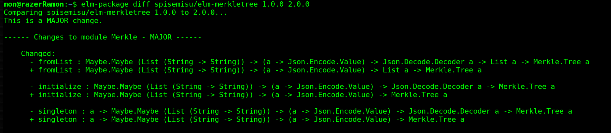
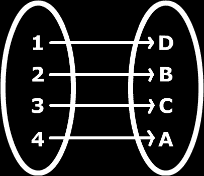

# Semantic Versioning .NET libraries and NuGet packages #

*All text and code copyright (c) 2016 by Ramón Soto Mathiesen. Used with permission.*

*Original post dated 2016-12-01 available at http://blog.stermon.com/articles/2016/12/01/semantic-versioning-dotnet-libs-and-nuget-pkgs*

**By Ramón Soto Mathiesen**


## Background

It should be no secret that I'm a big fan of Elm and it shouldn't be no secret as well that I have been working with F# for a long time and is still a bit of a fanboy.

One of the features that is missed the most when jumping between these two fantastic languages is the *Semantic Versioning* to handle package versions from Elm (*bump* and *diff*).

In this blog post I will argue that I have made a .NET library(very early in development stage but almost complete,
you folks will decide) that will be able to help you out whenever you have to decide if a new version of your Assembly or NuGet package is a *Major*, *Minor* or just a *Patch* (Major.Minor.Patch).

## Semantic Versioning

So what is Semantic Versioning (*SemVer*)? If we look into the following website: [semver.org](http://semver.org/), we can read statements like:

* In the world of software management there exists a dread place called "dependency hell".
* The bigger your system grows and the more packages you integrate into your software, the more likely you are to find yourself in it.
* If dependencies are specified too loosely, you will probably end up breaking your build more than desired.

In the mentioned website there are described 12 rules, to be enforced by documentation or the code itself, to solve the issue but we will stay with the following summary:

* ...given a version number (MAJOR.MINOR.PATCH), increment the:
  * MAJOR version when you make incompatible API changes,
  * MINOR version when you add functionality in a backwards-compatible manner, and
  * PATCH version when you make backwards-compatible bug fixes

And that is pretty much it.

> Note: I have removed the word *documentation*, as I am in the belief that this task should be done automatically by a computer and not by a human.
  In a similar way as a computer help us catch errors at compile time instead of end-users at runtime.

## elm-package bump and diff

If we look into Elm's tool for package publishing, called *elm-package*, it has two main actions which are related to SemVer: *bump* and *diff*

**`elm-package bump`**

As we can see from the GitHub repository of the tool, the version rules as very similar to the ones we just described in the previous section:

* Versions all have exactly three parts: MAJOR.MINOR.PATCH 
* All packages start with initial version 1.0.0 
* Versions are incremented based on how the API changes:
  * PATCH - the API is the same, no risk of breaking code 
  * MINOR - values have been added, existing values are unchanged 
  * MAJOR - existing values have been changed or removed 
* elm-package will bump versions for you, automatically enforcing these rules. 
  * [DING DING DING MF#K](https://youtu.be/h5I5UYxajnQ?t=445)
 
> Note: You can't actually publish a package without running the bump action first.
  
**`elm-package diff`**
  
The previous action, *bump* is really good to tell the hole world (broadcast) the changes you have done to your library, while
*diff* is great for a consumer of a library to actually see which changes have been made and if they are actually going to have an impact on the library they are developing.
Example, if changes are done to some data structures I'm not using, I would probably be able to just upgrade to the newer version without having to refactor any code:



## Rust and others

Other languages have been looking into SemVer as well:

* Rust (suggestion for cargo):
  * [Signature based API comparison](https://users.rust-lang.org/t/signature-based-api-comparison/2377)
* Haskell (why does cabal or stack not have this?):
   * [semver-0.3.3.1](https://hackage.haskell.org/package/semver)

I think we all have tried to use a given package that failed to install due to issues with dependent packages right?
Frustration, most of the time, tend to dropping a given package and sometimes even moving on to other languages...

## SpiseMisu.SemanticVersioning library

Here is my proposal of SemVer for .NET libraries as well as for NuGet packages

> Note: I support both C#/F# (VB? I'm not the right guy to do this task...)

As with Elm, I would like the rules to be enforcement by the *code itself*, instead of by humans. Otherwise we would be back to square one as humans tend to fail with repetitive task and when the library becomes of a considerable size, the task will become unmanageable.

Elm has it easy as everything is Open Source, therefore source code can be parsed while with .NET (proprietary libraries) we will have to fallback to handle this task just like Unit Tests are handled in Fsharp.Core with Reflection:

* FSharp.Core.Unittests:
  * LibraryTestFx.fs#L93
  * LibraryTestFx.fs#L103-L110
  
``` fsharp
asm.GetExportedTypes()
...

(* extract canonical string form for every public member of every type *)
seq {
    yield! 
      t.GetRuntimeEvents()
      |> Seq.filter (fun m -> m.AddMethod.IsPublic)
      |> Seq.map cast
    yield! 
      t.GetRuntimeProperties()
      |> Seq.filter (fun m -> m.GetMethod.IsPublic)
      |> Seq.map cast
    yield! 
      t.GetRuntimeMethods()
      |> Seq.filter (fun m -> m.IsPublic)
      |> Seq.map cast
    yield! 
      t.GetRuntimeFields()
      |> Seq.filter (fun m -> m.IsPublic)
      |> Seq.map cast
    yield! 
      ti.DeclaredConstructors
      |> Seq.filter (fun m -> m.IsPublic)
      |> Seq.map cast
    yield! 
      ti.DeclaredNestedTypes
      |> Seq.filter (fun ty -> ty.IsNestedPublic) 
      |> Seq.map cast
} |> Array.ofSeq
```

There is a bit more to it as the main issue with basic Reflection, is that it works great with C# libraries, but not so much with F#.
The following functions signatures are represented on the same way in .NET canonical form (no curried arguments):

```fsharp
let foo (x,y) = x + y
let bar x y = x + y

(* both represented as *)
x:System.Int32 * y:System.Int32 -> z:System.Int32

(* but should be respectively *)
x:System.Int32 * y:System.Int32 -> z:System.Int32
x:System.Int32 -> y:System.Int32 -> z:System.Int32
```

Therefore we need to have in mind a few other cases such as Product Types, Modules and even Enums & Sum Types (due to pattern matching) that needs to be handled in a special way:

* Cases like Active/Partial Patterns and MeasureOfUnits are not handled (yet? Is it even necessary?).
* Please look into the Open Source code to see what is done for each cases.

The main goal is to create a bijective function that would replace the non-injective and surjective function which will ensure that
a given input value will always have a unique output value. Think of it as a [perfect hash function](https://en.wikipedia.org/wiki/Perfect_hash_function) with no collisions.

* [non-injective and surjective function](https://en.wikipedia.org/wiki/Surjective_function)


* [bijective function](https://en.wikipedia.org/wiki/Bijection)



I'm also becoming really keen to Haskell and Elm signatures readability, where the last type is the return type of the function while the others are input parameters. Example:

```
FooBar : Foo -> (Bar * Baz) -> Qux
```

This is also the reason why I have begun to write F# code like this:

```fsharp
let foobar : int -> (int * int) -> int =
    fun x (y,z) -> x + y + z
```
    
And therefore I'm aiming to produce output that comply with these signatures.

> Note: The learning curve for F# would be non-existent as we already see this kind of signatures when evaluating with F# Interactive but it might be hard, at the beginning, to read for the C# Community, but they probably get used to it.

As mentioned in the title, I'm aiming to support both Assemblies and NuGet packages:

* .NET Library (Assembly): Is usually a single file compiled to target a specific version of the .NET Framework. Example:
```
mscorlib,Version=4.0.0.0, Culture=neutral,PublicKeyToken=...
```

* .NET NuGet package: Is a unit of distribution containing some metadata as well as binaries. In most cases,
  there are binaries targeting several versions of the .NET Framework. We are only interested in libraries (lib/.../???.dll)

Here are a few examples on the usage of the library:

**.NET NuGet package**

```fsharp
#!/usr/bin/env fsharpi

#I @"./SpiseMisu.SemanticVersioning/"
#r @"SpiseMisu.SemanticVersioning.dll"

open System
open System.Diagnostics
open System.Reflection

open SpiseMisu

let pkgid = @"Newtonsoft.Json"

let assembly =
  Assembly.LoadFile
    @"./packages/Newtonsoft.Json.7.0.1/lib/net45/Newtonsoft.Json.dll"

Semantic.Versioning.nugetbump
  pkgid
  NuGet.dotNet.Net45
  assembly
|> printfn "%s"

Semantic.Versioning.nugetdiff
  pkgid
  NuGet.dotNet.Net45
  (Some "7.0.1")
  pkgid
  NuGet.dotNet.Net45
  None
|> Array.iter(printfn "%s")
```

[Output Gist SpiseMisu.NuGet.SemVer.md](https://gist.github.com/gentauro/793d92205d83341ef3b5ea7334ebf4a3)


**.NET Library (Assembly)**

```fsharp
#!/usr/bin/env fsharpi

#I @"./SpiseMisu.SemanticVersioning/"
#r @"SpiseMisu.SemanticVersioning.dll"

open System
open System.Diagnostics
open System.Reflection

open SpiseMisu

let released =
  Assembly.LoadFile
    @"./packages/Newtonsoft.Json/lib/net45/Newtonsoft.Json.dll"
let modified =
  Assembly.LoadFile
    @"./packages/Newtonsoft.Json.7.0.1/lib/net45/Newtonsoft.Json.dll"

Semantic.Versioning.asmbump released modified
|> printfn "%s"

Semantic.Versioning.asmdiff released modified
|> Array.iter(printfn "%s")
```

[Output Gist SpiseMisu.Assembly.SemVer.md](https://gist.github.com/gentauro/c4234c2109fc9e88f72ffdbc2356e74f)

**.NET Library (documentation)**

```fsharp
#!/usr/bin/env fsharpi

#I @"./SpiseMisu.SemanticVersioning/"
#r @"SpiseMisu.SemanticVersioning.dll"

open System
open System.Diagnostics
open System.Reflection

open SpiseMisu

let assembly =
  Assembly.LoadFile
    @"./packages/Newtonsoft.Json/lib/net45/Newtonsoft.Json.dll"

Semantic.Versioning.markdown assembly
|> Array.iter(printfn "%s")
```

[Output Gist SpiseMisu.Docs.SemVer.md](https://gist.github.com/gentauro/c54be635ec2d5b37f36b90a701bf1671)

> Note: A side-effect of the code is that I was actually able to document the hole public API of a given library. Therefore I thought that I would just expose this logic, this was not intentional.


**.NET Library (raw)**

```fsharp
#!/usr/bin/env fsharpi

#I @"./SpiseMisu.SemanticVersioning/"
#r @"SpiseMisu.SemanticVersioning.dll"

open System
open System.Diagnostics
open System.Reflection

open SpiseMisu

let assembly =
  Assembly.LoadFile
    @"./packages/Newtonsoft.Json/lib/net45/Newtonsoft.Json.dll"

Semantic.Versioning.raw assembly
|> Set.toArray
|> Array.iter(fun (prefix, body) -> printfn "%s - %s" prefix body)
```

[Output Gist SpiseMisu.Raw.SemVer.txt](https://gist.github.com/gentauro/f81a97cb162cc1eca26aa609ee13e608)

> Note: I have decided that my output should be of the type of Markdown, if other should differ from this opinion, they can just work with the raw data and produce their own.

## Trivial Pursuit

Just to have an understanding of what is going on under the hood. Lets take a look at the following example code:

**Enum.cs**

```csharp
namespace SpiseMisu
{
    public enum Enum
    {
    Foo=0,
    Bar=42
    }
}
```

**Enum2.cs**

```csharp
namespace SpiseMisu
{
    public enum Enum
    {
    Foo=42,
    Bar=0
    }
}
```

**Enum3.cs**

```csharp
namespace SpiseMisu
{
    public enum Enum
    {
    Foo=0,
    Bar=42,
    Baz=4,
    Qux=2
    }
}
```

which is compiled with Mono producing .NET assemblies.

```
#!/bin/bash

for f in src/*.cs
do
    name=${f##*/}
    if [ ${name%.*} != "AssemblyInfo" ] ; then
    echo "Compiling:" $f
    mcs -target:library -out:"./lib/"${name%.*}".dll" $f "./src/AssemblyInfo.cs"
    fi
done
```

We will now compare the `Enum.cs` vs `Enum2.cs` and `Enum.cs` vs `Enum3.cs`

```fsharp
#!/usr/bin/env fsharpi

#I @"./SpiseMisu.SemanticVersioning/"
#r @"SpiseMisu.SemanticVersioning.dll"

open System
open System.Diagnostics
open System.Reflection

open SpiseMisu

let asm1 =
  Assembly.LoadFile
    @"./lib/Enum.dll"
let asm2 =
  Assembly.LoadFile
    @"./lib/Enum2.dll"
let asm3 =
  Assembly.LoadFile
    @"./lib/Enum3.dll"

Semantic.Versioning.asmbump asm1 asm2
|> printfn "%s"

Semantic.Versioning.asmdiff asm1 asm2
|> Array.iter(printfn "%s")

Semantic.Versioning.asmbump asm1 asm3
|> printfn "%s"

Semantic.Versioning.asmdiff asm1 asm3
|> Array.iter(printfn "%s")
```

What is the outcome that you expect?

[Output Gist SpiseMisu.Talk.SemVer.md](https://gist.github.com/gentauro/da0d98fe9151d5156c57ea73816c673b)

If you guessed that it should be a MAJOR update in both cases, then you are actually right.
I'm one of those guys that always compile my F# code with the following flag: --warnaserror:25 to ensure that all patterns are covered.
Therefore, if you add a new value to Enums and Sum Types, this should state that is a MAJOR update and you should probably revise your code to handle the newly added patterns.

##What's next?

I have given a talk on this matter at [MF#K](https://www.meetup.com/MoedegruppeFunktionelleKoebenhavnere/events/234664265/) where we had an interesting discussion
(a few feature addition were requested). I will see how fast I can make these changes and finalize the project, based on [Project Scaffold](https://github.com/fsprojects/ProjectScaffold),
and then I will release the library as Open Source @ GitHub.

When the code is publicly available, I would RFC from the .NET Community, specially experts in the subject, to review the code.

> Note: Have in mind, that I'm not using the F# Compiler Services as I'm aiming for a very lightweight library with as few dependencies as possible

The outcome I desire for this library is that it gets integrated with:

* NuGet: Or something similar, please steal with pride. The goal is that we get this awesome feature and not so much that it was me who did it.
* FAKE: This is one of the reasons I produce Markdown output as it is possible to just pipe the result of bump and diff to the top of the RELEASE_NOTES.md to automate the generation of this document, as it sometimes can be a bit tedious and boring.
* Paket: This would be optional, but because this tool already has NuGet package publishing capabilities, therefore it would give sense to add the bump and diff functionality.

Last, but not least, in order to catch on with the C# Community, I guess that we will need a standalone executable (something like paket.exe) which is totally transparent with regard of it's F# nature, as we all know some .NET people are allergic to the this amazing programming language. I'm thinking about using for this task:

* [Mono mkbundle](http://www.mono-project.com/archived/guiderunning_mono_applications/)

## Conclusion:

I hope I've convinced you of why SemVer enforced by code is so awesome.

I'm also hopping that you can agree that the presented library:

Supports .NET Assemblies and NuGet packages as well as C# and F# (even proprietary due to Reflection).

SemVer rules are also enforced by the code itself, just like elm-package.

The produced Markdown output is easily readable.

As I mentioned before, I gave a talk on the subject at the [F#unctional Copenhageners Meetup Group](https://www.meetup.com/MoedegruppeFunktionelleKoebenhavnere/)
where we had a really constructive discussion with different points.
One of the main points, delivered by Ulrik Rasmussen was that Semantic Versioning shouldn't be called that in the first place, but instead
it should be called Syntactic Versioning as we are only able to see if a dependencies break when signatures change (syntax) and not if the behavior
(semantics) change. Let's look into a simple example where we just refactor our `foo` function from [fold left with right](http://functionalflow.co.uk/blog/2013/11/10/higher-order-list-operations-across-languages/):

```fsharp
let foo : int list -> int list =
  fun xs -> List.fold(fun a x -> x :: a) [] xs

let foo : int list -> int list =
  fun xs -> List.foldBack(fun x a -> x :: a) xs []
```
  
Syntactically the signatures are the same, but the semantics of the application aren't.

That said, I think the intentions of [Tom Preston-Werner](https://twitter.com/mojombo) was to keep the dependency hell to a minimum as well as limiting the amount of builds breaking.
As with everything else, there is really no silver bullet to solve all our problems at once, but we should strive to achieve it though:

*"Perfection is not attainable, but if we chase perfection we can catch excellence" --Vince Lombardi*