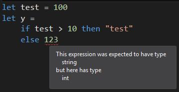
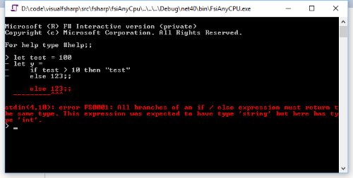
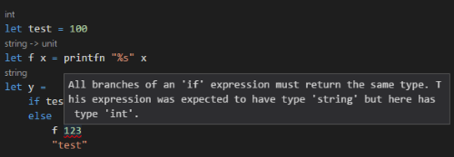

# Context matters #

*All text and code copyright (c) 2016 by Steffen Forkmann. Used with permission.*

*Original post dated 2016-12-01 available at http://www.navision-blog.de/blog/2016/12/01/context-matters/*

**By Steffen Forkmann**


A couple of months ago I wrote a blog post called ["Make failure great again"](http://www.navision-blog.de/blog/2016/04/25/make-failure-great-again-a-small-journey-into-the-f-compiler/) and this joke backfired on me.
The post was meant as an introduction to the [F# compiler project](https://github.com/Microsoft/visualfsharp) and showed in a simple scenario all the steps that are needed to get a Pull Request into the compiler.

Around the same time as the blog post I sent a Pull Request to the compiler project which is pretty similar to the one described in the post.
In [#1142](https://github.com/Microsoft/visualfsharp/pull/1142) I extended it to give a better error message on the following snippet:

```fsharp
let test = 100
let y = 
    if test > 10 then "test"
    else 123
```
    
Before the change the compiler would just complain about the type error between the if and the corresponding else branch.




Newcomers from statement-based languages like C# might have a hard time to understand what’s going on.

After the change we would get something like the following:



This message now additionally explains that F# treats "if/then/else"-constructs as expressions and the return type of both branches must return the same.

Unfortunately reality is a bitch and it turned out my test cases were too narrow. Since the new error messages are already released in Visual Studio 2017 RC1, it didn’t take long for the following bug report to appear:

```fsharp
let test = 100
let f x = printfn "%s" x
let y =
    if test > 10 then "test"
    else 
        f 123
        "test"
```

The compiler is now showing the following error:



Obviously this is not correct, but what exactly went wrong? In order to understand the problem we need to take a look at the principal change of the pull request.

```fsharp
| SynExpr.IfThenElse (e1,e2,e3opt,spIfToThen,isRecovery,mIfToThen,m) ->
    let e1',tpenv = TcExprThatCantBeCtorBody cenv cenv.g.bool_ty env tpenv e1
    let e2',tpenv =
        if not isRecovery && Option.isNone e3opt then
            let env = { env with eContextInfo = ContextInfo.OmittedElseBranch }
            UnifyTypes cenv env m cenv.g.unit_ty overallTy
            TcExprThatCanBeCtorBody cenv overallTy env tpenv e2
        else
            TcExprThatCanBeCtorBody cenv overallTy env tpenv e2
    let e3',sp2,tpenv = 
        match e3opt with 
        | None ->
            mkUnit cenv.g mIfToThen,SuppressSequencePointAtTarget, tpenv 
        | Some e3 ->
            let env = { env with eContextInfo = ContextInfo.ElseBranch }
            let e3',tpenv = TcExprThatCanBeCtorBody cenv overallTy env tpenv e3 
            e3',SequencePointAtTarget,tpenv
    primMkCond spIfToThen SequencePointAtTarget sp2 m overallTy e1' e2' e3', tpenv
```
    

This strange looking code is part of [TypeChecker.fs](https://github.com/Microsoft/visualfsharp/blob/master/src/fsharp/TypeChecker.fs)
and represents the part where F#’s compiler tries to type check "if/then/else"-constructs. It uses pattern mattching on the abstract syntax tree (line 1) to destructure the current expression and calls the the type checker with all sub-expressions recursively (look for TcExpr* calls).

In line 15 I added context information to the current type checker environment. This allows the type checker reporting engine to show a more concrete error message if a type check fails.

The new bug is that we actually type check recursively and that the context information is passed down into all sub-expressions. So basically every type error somewhere in a else branch will show this way too specific error message. Ouch.

So what we really want is to limit the context information only to the one type check of the result type. So I tried to replace line 15-17 with the following:

```fsharp
let tempTy = NewInferenceType ()
let e3',tpenv = TcExprThatCanBeCtorBody cenv tempTy env tpenv e3 

let env = { env with eContextInfo = ContextInfo.ElseBranch }
UnifyTypes cenv env e3.Range overallTy tempty
```

This code splits the type check in two parts. In line 1-2 we type check the else-branch with a fresh type variable and in line 4-5 we add the missing restriction that our if and else branches must have the same type. This actually works nicely and limits the error message to exactly the one type check that we want.

Fortunately red unit tests on the CI server catched the fact that I introduced a new problem. It took me a while to understand the problem, but it comes down to the fact the the type checker also acts as type inference algorithm. In contrast to C#’s var keyword where types are only inferred from the right side of an assignment the F# compiler also infers types from the context. By splitting the type check into 2 parts we didn’t pass captured type inference information (in overallTy) down into the recursive type check call and therefore some specific situations can’t be inferred anymore. Ouch.

I also forgot to pass the new type checker environment to the UnifyTypes call. This would probably have fixed all tests in the compiler code base, but since we would still change the order of type checking there might be cases that are still broken. So that’s a risk we clearly don’t want to take just for fancy error messages.

So what’s the correct solution then? We still need to limit the context to the last type check but we can’t split the check in this naive way.

One way to do that is to keep track from where the context information is coming. The F# compiler is already using a "range" type to specify locations in the source code.

```fsharp
[<RequireQualifiedAccess>] 
/// Information about the context of a type equation.
type ContextInfo =
/// No context was given.
| NoContext
/// The type equation comes from a type check of the result of an else branch.
| ElseBranchResult of range
| ...
```

```fsharp
let env = { env with eContextInfo = ContextInfo.ElseBranchResult e3.Range }
let e3',tpenv = TcExprThatCanBeCtorBody cenv overallTy env tpenv e3 
e3',SequencePointAtTarget,tpenv
```

This allows us to check if the range of reported error matches the range of the whole else-branch and report the corresponding error:

```fsharp
| ConstraintSolverTypesNotInEqualityRelation(denv,t1,t2,m,m2,contextInfo) -> 
    let t1, t2, _cxs = NicePrint.minimalStringsOfTwoTypes denv t1 t2

    match contextInfo with
    | ContextInfo.ElseBranchResult range when range = m -> 
        os.Append(FSComp.SR.elseBranchHasWrongType(t1,t2)) |> ignore
    | _ -> os.Append(ConstraintSolverTypesNotInEqualityRelation2E().Format t1 t2) |> ignore
```

Case closed.

If you are interested in the details then take a look at [#1827](https://github.com/Microsoft/visualfsharp/pull/1827).