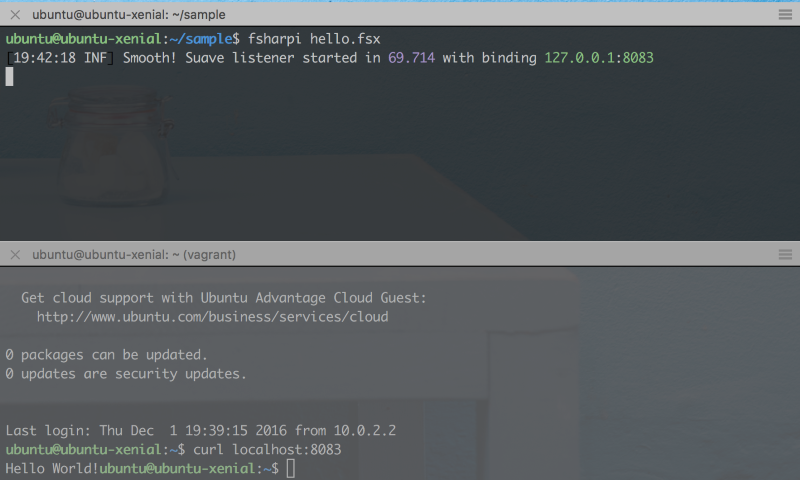
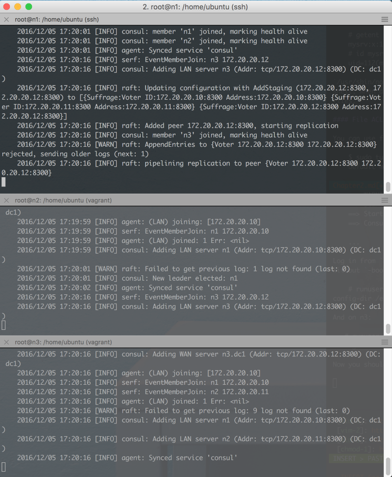
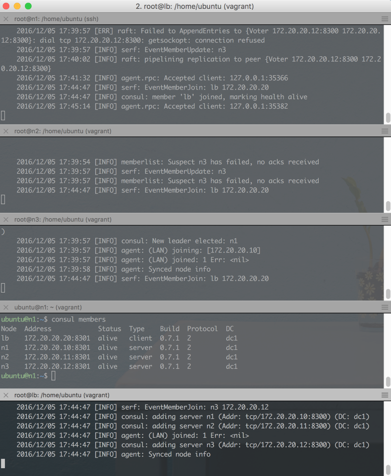

# A gentle introduction to programming networked services on linux #

*All text and code copyright (c) 2016 by Henrik Feldt. Used with permission.*

*Original post dated 2016-12-03 available at https://github.com/haf/linux-intro-course*

**By Henrik Feldt**

# Linux intro course

This course guides you towards a basic understanding of the linux operating
system with focus on operating servers.

# Chapter 01 – Basics

This course guides you towards a basic understanding of the linux operating
system with focus on operating servers.

# Table of Contents

  * [Linux intro course](#linux-intro-course)
  * [Table of Contents](#table-of-contents)
    * [Introduction](#introduction)
    * [Setting up VirtualBox](#setting-up-virtualbox)
    * [Setting up vagrant](#setting-up-vagrant)
      * [Change directory to linux\-intro\-course](#change-directory-to-linux-intro-course)
      * [Look around](#look-around)
    * [Running the lab machine](#running-the-lab-machine)
    * [SSH\-ing into the machine](#ssh-ing-into-the-machine)
      * [The prompt](#the-prompt)
      * [The home directory](#the-home-directory)
      * [The $](#the-)
      * [Testing boundaries with rm](#testing-boundaries-with-rm)
    * [Becoming <em>root</em>, the user\.](#becoming-root-the-user)
    * [Updating the system with APT](#updating-the-system-with-apt)
      * [Reasoning about changes – interlude](#reasoning-about-changes--interlude)
    * [Installing software with apt](#installing-software-with-apt)
      * [Paginating long output](#paginating-long-output)
      * [Installing F](#installing-f)
    * [Editing files from the command line](#editing-files-from-the-command-line)
      * [Entering intsert mode](#entering-intsert-mode)
      * [Pulling down Suave](#pulling-down-suave)
    * [Running networked software](#running-networked-software)
      * [Running the web server](#running-the-web-server)
      * [Querying the web server](#querying-the-web-server)
      * [Run in background](#run-in-background)
      * [Resume and kill jobs](#resume-and-kill-jobs)
      * [chmod](#chmod)
      * [Collecting the IP numbers](#collecting-the-ip-numbers)
      * [curl from host](#curl-from-host)
      * [Change Suave's binding](#change-suaves-binding)
      * [netstat](#netstat)

## Introduction

In this intro to Linux I'll assume that you know how to start *iTerm* or
*Terminal* on OS X or *PowerShell* on Windows. Don't use `cmd.exe`, it's too
archaic for our needs.

If you have *Git Bash* installed on your machine, then you can use that and do
the OSX/Linux version of the commands.

Here we go!

## Setting up VirtualBox

[Download VirtualBox][virtualbox-dl] from its website. Run the installer so that
you have a way of working with virtualised machines.

## Setting up vagrant

Download [version 1.9.0](https://www.vagrantup.com/downloads.html) at the time
of writing.

Clone this repository: `git clone https://github.com/haf/linux-intro-course.git`

If having trouble due to an HTTPS-MITM-ing proxy, run `git config --global
http.sslVerify false` ([ref][git-https-mitm-fix]), then try again.

### Change directory to `linux-intro-course`

After cloning, change your directory through `cd linux-intro-course`. This
changes your **working directory**. You can check your current directory with
`pwd`, or `(Resolve-Path .).Path` on Windows.

### Look around

Once you've changed your working directory, you can look around: run `ls` to see
all files in the folder you're currently in. You can use `cat` or `type` on
Windows, to write the contents of a file to your terminal.

A terminal (emulator, to be precise) is the interface you're typing commands in.
In daily speech, you "type commands in the *terminal*" or "*execute* things in
the *shell*". In other words, they are used interchangeably.

When working with linux servers, you tend to *print* things to the terminal.
This just means that you write the contents of the file to the terminal, e.g. by
executing `cat filename.txt`.

## Running the lab machine

We'll be learning how to use **Ubuntu 16.04 LTS**. This changes your
**working directory**. Then run `vagrant up` to start the machine.

You'll see output like:

**TBD**

If it queries you for the *interface* to bridge, select the interface with a
local IP on your LAN. You can get the name and configuration of the interface
with `ifconfig` on OS X/Linux and `ipconfig /all` on Windows.

## SSH-ing into the machine

While Vagrant provides good support, even for [bootstrapping][vagrant-vault]
clusters, we'll be using the machine as-is and run all of our commands within
it.

Run `vagrant ssh` to connect to the machine over Secure Shell (SSH). This is
called "sshing" in common speech.

.

### The prompt

Now you'll see what's called a *prompt*:

    ubuntu@ubuntu-xenial:~$

This prompt can be customised to a large extent through the files that are
loaded upon *login*. Right now you're looking at the default configuration of
the *shell*, which is the interpreter for your commands.

In the above line of output, the part before the `@` sign is the *username* of
the current user (defaults to *ubuntu*) and the part between the `@`-sign and
the `:` is the name of the machine. In this case the name of the machine is
"ubuntu-zenial".

After the colon comes the current path. In this case it's `~`.

### The home directory

Users normally have a home directory denoted by the environment variable `HOME`.
You can print the home directory by doing this:

    ubuntu@ubuntu-xenial:~$ echo $HOME
    /home/ubuntu
    ubuntu@ubuntu-xenial:~$ pwd
    /home/ubuntu

### The `$`

With the default shell configuration, the `$` means that you're currently
executing things as the specified user. When executing things as an
administrator; root, the dollar changes to a hash, `#`.

Now you're ready to start exploring the operating system. Remember that `cd`
changes directory`, `..` means the parent directory and `.` is the current
directory.

When switching between *root* and the user account, guides like this one tends
to prefix the commands with `#` if you're using *root* or `$` if you're using
a user account. So just think away that symbol in the examples below.

### Testing boundaries with `rm`

Try `cd /` and then `ls -lah` to see all the contents of the root folder. Let's
try to destroy our new machine by removing the kernel, just to see what happens...

    $ cd /
    $ rm vmlinuz
    rm: cannot remove 'vmlinuz': Permission denied
    $

## Becoming *root*, the user.

Phew, the removal of the kernel thankfully didn't succeed. This is because you
tried to do it as a regular user. Now, let's become root; the user with the keys
to the kingdom, by running:

    $ sudo su
    #

**Don't remove the kernel**, but instead let's update the system with the latest
security patches.

## Updating the system with APT

Linux uses a package system that lets packages specify dependencies, provide
their files and execute pre- and post-installation scripts. We'll be using
Ubuntu's Advanced Packing Tool (APT) to perform an update of the system files.

    # apt-get update
    Hit:1 http://archive.ubuntu.com/ubuntu xenial InRelease
    Get:2 http://security.ubuntu.com/ubuntu xenial-security InRelease [102 kB]
    Get:3 http://archive.ubuntu.com/ubuntu xenial-updates InRelease [102 kB]
    ...
    Get:28 http://archive.ubuntu.com/ubuntu xenial-backports/universe Translation-en [1,216 B]
    Fetched 10.8 MB in 2s (4,353 kB/s)
    Reading package lists... Done

In this case there were no updates available. Had there been, you'd be asked to
confirm the update by typing `y` and then pressing ENTER.

### Reasoning about changes – interlude

In all complex systems, changes are what ultimately break the system. But
changes are very often also what keeps the system functional. Without updates
you'll be hacked eventually, but with updates, you have to verify that they work
with your system.

A regular cause of outages for me has been the *nginx* package writing a
`default.conf` file to `/etc/nginx/conf.d/default.conf`, which doesn't
immediately trigger the nginx to reboot. Then a few days later when the nginx
instance is rebooted, it fails to start, because default.conf conflicts with the
production .conf-files in conf.d.

However, [I'm not][latent-config-checker] [alone in experiencing
this][simple-testing]. In the end, the problem needs to be solved by **treating
configuration as code** and **testing your system**.

## Installing software with apt

Now let's install some software. You previously had a look at the `/` folder.
However, `ls` only shows you one level by default, so let's install a util that
visualises the tree structure:

    # apt-get install tree
    # tree -L 2
    .
    ├── bin
    │   ├── bash
    │   ├── btrfs
    │   ├── btrfs-calc-size
    │   ├── btrfsck -> btrfs
    │   ├── btrfs-convert
    │   ├── btrfs-debug-tree
    ...
    │   ├── run -> /run
    │   ├── snap
    │   ├── spool
    │   └── tmp
    └── vmlinuz -> boot/vmlinuz-4.4.0-51-generic

    339 directories, 747 files

### Paginating long output

That was some long output. You had to scroll up to see it, didn't you? Let's
paginate the output with less: `tree -L 2 | less`. The bar symbol `|` takes the
standard output (STDOUT) of the process *tree* and pipes it to the process
*less*.

At the bottom of your terminal, you'll see a colon, `:`. You can now use your
arrow keys or `j` and `k` to scroll up and down.

### Installing F# #

Let's see if we can run some code – after all, we're developers. Let's run
`apt-get install fsharp` to get the F# interactive and the ability to compile F#
code.

    # apt-get install fsharp
    # fsharpc
    F# Compiler for F# 4.0 (Open Source Edition)
    Freely distributed under the Apache 2.0 Open Source License

    error FS0207: No inputs specified
    # exit
    $ cd ~
    $ mkdir sample
    $ cd sample

## Editing files from the command line

Now you have F# installed and are in a folder called *sample*. Let's create a
file called 'hello.fsx' with a small editor called *vim*:

    $ vim hello.fsx

Now you've started the *vim* program. You should see something like this on your
screen:

(the table is my desktop background, your mileage may differ!).

### Entering insert mode

Vim is a modal editor. It means that you can be in a few different modes:
*normal*, *insert*, *visual*, *select*, *command-line* and *ex*. You're currently in the
normal mode, which you get back to by pressing CTRL+C.

To write test, press `i` to enter the insert mode, then type:

    #!/usr/bin/env fsharpi
    #r "./lib/net40/Suave.dll"
    open Suave
    startWebServer defaultConfig (Successful.OK "Hello World!")

Now, press CTRL+C to enter the *normal* mode again. You need to enter the
*command* mode to give the command to vim to save your file and close it; type
`:x` and press ENTER to do this. Colon is used to enter command mode and ENTER
to execute the command.

### Pulling down Suave

One of the upsides of being on the terminal is that it's very flexible with all
commands readily at your finger-tips (if you can remember them).

    $ curl -o Suave.zip -J -L https://www.nuget.org/api/v2/package/Suave/2.0.0-rc2

This will save the `Suave.zip` file in your current folder. All nupkgs are
zipfiles, so let's just unzip it.

    $ sudo apt-get install -y unzip && unzip Suave.zip

Ha! Did you see what I did there? *sudo* is a way to selectively run a command
as *root* and then there's `&&` that executes the right hand side after the
left hand side has finished executing.

You can use the `tree` command to inspect the state of the folder after
unzipping.

## Running networked software

Linux is great for networked software. Let's run some, so we can inspect what
happens on an operating system level as we do.

### Running the web server

With Suave downloaded, we should be able to get going. Let's run hello.fsx!

    $ fsharpi hello.fsx
    [16:25:16 INF] Smooth! Suave listener started in 64.802 with binding 127.0.0.1:8083

Bring up a new terminal on your host machine (the one running the virtual
machine) and do `vagrant ssh` in it.

### Querying the web server

Like it says, it's currently listening at 127.0.0.1:8083. This is means that
it's listening at localhost - 127.0.0.1 is the IPv4 address of localhost, which
means that only processes running locally on the machine can access the socket's
bound endpoint (IP+port).

In the new terminal, inside the virtual machine, run `curl localhost:8083` to
query the web server.

The response contains the body "Hello World!" like one would expect. Note the
lack of a line-break between the end of the response and the start of the
shell's print of `ubuntu@ubuntu-xenial:~$`. This is the default behaviour of
Bash when printing lines that don't end with newlines. Bash is the default shell
on Ubuntu.

### Run in background

Return to the terminal with the running web server. Press CTRL+Z. This moves the
web server to the background and *pauses* it, printing `[1]+  Stopped
fsharpi hello.fsx`.

Note how you can still not make requests to the program, because it's connected
to the terminal's STDIN (input). To enable the program to run in the background,
you can make its STDIN file handle point to `/dev/null`, which is a special file
in the file system which acts as a black hole.

    fsharpi hello.fsx < /dev/null &

Output wasn't redirected and will still print to STDOUT. Now try `curl
127.0.0.1:8083` again; you should see output.

### Resume and kill jobs

To get back the program, so you can close it, either run `fg` (foreground) or
`kill %1`. You can use `jobs` to see what "jobs" that your shell has running in
the bakground.

If you have some other program running that you want to kill, you can "grep" for
it:

    $ ps aux | grep "myprogram"
    ...
    ubuntu   12591  0.0  0.4  95368  5012 ?        R    19:39   0:00 sshd: ubuntu@pts/0
    ...

And then kill it by its process id. This sends a SIGINT to the process:

    $ kill 12591

### chmod

Attentive readers may have noticed that we were had a line at the top of the fsx
file, `#!/usr/bin/env fsharpi`. This line makes it possible for the shell Bash
to know what program to run your file with. Let's try to run it!

    $ hello.fsx
    hello.fsx: command not found

That didn't work. We have to use the dot-syntax for things that can run;

   $ ./hello.fsx
   -bash: ./hello.fsx: Permission denied

This time – a different error message. Bash is telling us that it's not
permitted to execute the fsx file.

   $ chmod +x hello.fsx
   $ ./hello.fsx
   [20:06:35 INF] Smooth! Suave listener started in 65.762 with binding 127.0.0.1:8083

### Collecting the IP numbers

The `Vagrantfile` in this repo by default places the virtual machine on a
bridged network adapter. In other words, the machine is placed on the same
network as the host machine and will most likely receive an IP just like your
laptop has. Let's check what IP it's been given.

    $ ip addr
    1: lo: <LOOPBACK,UP,LOWER_UP> mtu 65536 qdisc noqueue state UNKNOWN group default qlen 1
        link/loopback 00:00:00:00:00:00 brd 00:00:00:00:00:00
        inet 127.0.0.1/8 scope host lo
           valid_lft forever preferred_lft forever
        inet6 ::1/128 scope host
           valid_lft forever preferred_lft forever
    2: enp0s3: <BROADCAST,MULTICAST,UP,LOWER_UP> mtu 1500 qdisc pfifo_fast state UP group default qlen 1000
        link/ether 02:58:f3:11:f2:f2 brd ff:ff:ff:ff:ff:ff
        inet 10.0.2.15/24 brd 10.0.2.255 scope global enp0s3
           valid_lft forever preferred_lft forever
        inet6 fe80::58:f3ff:fe11:f2f2/64 scope link
           valid_lft forever preferred_lft forever
    3: enp0s8: <BROADCAST,MULTICAST,UP,LOWER_UP> mtu 1500 qdisc pfifo_fast state UP group default qlen 1000
        link/ether 08:00:27:b6:04:a0 brd ff:ff:ff:ff:ff:ff
        inet 10.0.1.97/24 brd 10.0.1.255 scope global enp0s8
           valid_lft forever preferred_lft forever
        inet6 fe80::a00:27ff:feb6:4a0/64 scope link
           valid_lft forever preferred_lft forever

Here there are three interfaces (NICs) listed. One `lo`, aka. local or loopback,
which has the local IP 127.0.0.1 in IPv4 and [::1] in IPv6. There's also two
NICs starting with 10. Look at your host's IP and select the equivalent IP. In
my case my host has `inet 10.0.1.195 netmask 0xffffff00` and the guest/ubuntu
machine a corresponding `inet 10.0.1.97/24 brd 10.0.1.255` on the same network.

### curl from host

With the web server started, perform a curl command from the host.

    $ curl 10.0.1.97:8083
    curl: (7) Failed to connect to 10.0.1.97 port 8083: Connection refused

As you can see, even if the web server is listening to 127.0.0.1, it's not
accessible from the host (or any other computer on the same subnet).

### Change Suave's binding

Let's edit the `hello.fsx` file with vim to make it bind to the subnet IP as
well as to the loopback interface/local NIC.

    #!/usr/bin/env fsharpi
    #r "./lib/net40/Suave.dll"
    open Suave
    let config =
      { defaultConfig with
          bindings = [ HttpBinding.createSimple HTTP "127.0.0.1" 8083
                       HttpBinding.createSimple HTTP "10.0.1.97" 8083 ] }
    startWebServer config (Successful.OK "Hello World!")

Now when you start the server;

    [20:29:40 INF] Smooth! Suave listener started in 72.467 with binding 10.0.1.97:8083
    [20:29:40 INF] Smooth! Suave listener started in 82.535 with binding 127.0.0.1:8083

Then from the host, you can curl again:

    $ curl 10.0.1.97:8083
    Hello World!

Now the host can make requests towards the web server. If you're doing this in a
group, you can now share your virtual machine IPs between yourselves and make
requests to your web servers.

### netstat

Again, enter the virtual machine – we'll inspect the listening ports on the
server. A listener is a equivalent to a binding of a process to an interface and
a port.

    $ netstat -napt
    (Not all processes could be identified, non-owned process info
     will not be shown, you would have to be root to see it all.)
    Active Internet connections (servers and established)
    Proto Recv-Q Send-Q Local Address           Foreign Address         State       PID/Program name
    tcp        0      0 127.0.0.1:8083          0.0.0.0:*               LISTEN      12829/cli
    tcp        0      0 10.0.1.97:8083          0.0.0.0:*               LISTEN      12829/cli
    tcp        0      0 0.0.0.0:22              0.0.0.0:*               LISTEN      -
    tcp        0      0 10.0.2.15:22            10.0.2.2:56395          ESTABLISHED -
    tcp        0      0 10.0.2.15:22            10.0.2.2:56386          ESTABLISHED -
    tcp6       0      0 :::22                   :::*                    LISTEN      -

The topmost two sockets are the two sockets that we've bound with Suave. The
four sockets below are; the SSH daemon/service binding (on all interfaces), the
client-server socket for the first host-guest terminal, the client-server socket
for the second host-guest terminal and finally the SSH daemon/service binding on
IPv6 (on all interfaces).

## Conclusion

In this tutorial you've learnt to take your first steps towards building
networked services on linux. Feel free to [send a pull request][github-PR] if
you have improvement suggestions to this tutorial.

 [virtualbox-dl]: https://www.virtualbox.org/wiki/Downloads "VirtualBox can be downloaded from this link"
 [git-https-mitm-fix]: https://stackoverflow.com/questions/12561299/how-to-access-github-through-firewall-playing-man-in-the-middle-when-using-https "How to accept deep traffic inspection"
 [vagrant-vault]: https://github.com/haf/vagrant-vault "A repository that configured Hashicorp Vault in a cluster configuration"
 [latent-config-checker]: ./papers/latent-config-checker.pdf "Early Detection of Configuration Errors to Reduce Failure Damage"
 [simple-testing]: ./papers/simple-testing.pdf "Simple testing can prevent most critical failures"
 [vim-modes]: https://en.wikibooks.org/wiki/Learning_the_vi_Editor/Vim/Modes "The different modes in vim"
 [github-PR]: https://github.com/haf/linux-intro-course/pulls
 
 
# Chapter 2 – Basics

The second chapter of the course continues with the basics while starting a
foray into HTTP and TCP. At the end of this chapter should should be able to
create your own package, install it and verify that the contained service is up
and running.

## Agenda (replace for ToC)

 - Vim recap
 - Command flags – unix convention
 - More useful commands – touch, tail, less, mkdir, mv, cp, rm, rmdir
 - Folders and files – common locations
 - Linux file permissions
 - Adding/removing users from groups
 - stdin, stdout, stderr and file handles
The first chapter had a bit of a vim intro course, so we'll continue start by
doing a vim recap.

## Vim recap

Working with vim is primarily centered around remembering the *verbs*, *nouns*
and *modifiers*:

### Verbs

These are relevant for navigating around the *buffer* (i.e. the text you see in
your terminal).

 - `g` - go (`gg` to go to the top, `G` to the bottom)
 - `f` - find (`f;` to go to the semicolon)
 - `j` - down
 - `k` - up
 - `h` - left
 - `l` - right
 - `v` - visual
 - `d` - delete
 - `u` - undo
 - `y` - yank/copy

### Modifiers

The modifiers specify ranges – how large/small selection to create or what to
select.

 - `t` - to (`vt.` - visual to dot)
 - `a` - around
 - `i` - inside
 - `f` - find

### Nouns

 - `p` - paragraph
 - `w` - word (`ciw` is change inside word)
 - `b` - block

By combining the above you can become very efficient when navigating and
selecting text. You can try your new skills by adding a new binding to the Suave
example from the first chapter; add it to an IPv6 interface this time:
`IPAddress.Parse "::"`.

If you're interested in reading more about vim, [there][vim-1] [are][vim-2]
[numerous][vim-3] tutorials available online.

## Command flags

You've previously seen commands like [`chmod +x file.fsx`][chmod-1], [`ls
-lah`][explain-ls] and `tree -L 2`. There are a few conventions to the unix
command line that are beneficial to know about, as a lot of the unix command
line is built to be composable similar to PowerShell or how
Iteratee/seq/IEnumerable are composable.

Command flags start with a single dash `-` and then a character `h`, like so:
`ls -h` (list directory contents, print human bits/bytes), but they can also be
merged, like so `ls -lah`, which means to print all files, including symlinks
and dotfiles, in a long listing format; as well as human readable.

Alternatively, you can juxtapose the arguments with double dashes, like so: `ls
--all --human-readable -l`.

#### Man!

To see what command flags are available for a given command, you can use `man
<command name>`, like `man ls`. This displays a buffer that is paginated with
`less`, similar to how we paginated long `tree` outputs in the previous chapter.

You can also perform a brute-force search for a string in *all* man pages, by
passing the `-K <searchstring>` argument.

### More useful commands

You can create files, but how to manipulate directories, move files and copy
them? There are commands for most things:

 - `touch <filename>` – create a new file with the passed filename
 - `tail -f <filename>` – continuously print the tail of the file; useful for
   tailing logs
 - `less` – paginate output like we've done before
 - `mkdir -p ./path/to/dir` – create a new directory recursively, if it doesn't
   already exist
 - `mv <source file> <target file>` – move the source file to the target file
   location, or alternatively to a folder. If the target doesn't already exist
   then it's assumed to be a file name. If the target is a folder, then the file
   is copied to it and if the tagret is a file, the target file is overwritten.
 - `cp <source> <target>` – copy a file or directory
 - `rm <file>` – remove a file, or alternatively `rm -rf <dir>` to recursively
   remove a directory
 - `rmdir <dir>` specifically remove a directory if it's empty

Use your newfound skills to create the following tree:

    ubuntu@ubuntu-xenial:~$ tree
    .
    ├── a
    └── b
        ├── c
        │   └── d
        │       └── flag      (an empty file)
        ├── e
        └── f
            └── runner        (an empty file)

    6 directories, 2 files

How many commands did it take you to create this tree? I did it in three
commands. Can you do the same?

When you've successfully created the above, delete it all with a single command.

## Folders and files – common locations

Unix systems have a default folder layout. While the layouts differ slightly
between distros, there's a ["filesystem hierachy standard"][fhs] in place that
looks similar to this:

    .
    ├── bin – system binaries
    ├── sbin – system binaries
    ├── etc – configuration files
    ├── home – user home folders; not much used on servers
    ├── lib – shared libraries across the system
    ├── lib64 – similarly
    ├── tmp – temporary, world-readable, world-writable folder
    ├── opt – place your service's folder here: /opt/mysrv/{bin,public}
    ├── usr – most commands, man-docs and libraries from apt-get are installed here
    │   ├── bin – user (aka. the sys-admin's) commands
    │   ├── include – data used for linking executables
    │   ├── lib – libraries
    │   ├── local – similar for /opt; symlink from /opt/xyz, into here if needed
    │   ├── sbin – more commands
    │   ├── share – data and example configs
    │   └── src – used for source code for installed s/w
    └── var – if this server is stateful, put that state in here
        ├── lock -> /run/lock
        ├── log – logs from different services
        ├── lib – databases, storage
        └── run -> /run

When writing services for Linux, it's most common to have three or four
directories written. `/opt/mysrv/{bin,public}` for the binaries, `/etc/mysrv`
for the configuration and `/var/lib/mysrv` for any potential data. Finally, if
you want file logging, those go in `/var/log/mysrv`.

## Linux file and directory authorisation

Linux is built with *users* and *groups*, where a user can belong to one or many
groups but group cannot belong to other groups. They take the form of a bitmask
of nine bits:

    rwxr-xr-x haf developers
    ^^^ user bits
       ^^^ group bits
          ^^^ others bits

Furthermore, these permissions specify that `haf` is the owner of the file
(UID), that `developers` is the owning group (GID) and that anyone/others can
read and execute the file. A real-world example is `/bin/ls`.

    -rwxr-xr-x  1 root  wheel    38K Jul  9 05:03 /bin/ls

Which shows the owner to be `root`, the group to be `wheel` and allows every
user who has an account on the system to execute the file. That way, only the
system administrator is allowed to change the file.

The permissions are checked with an algorithm similar to:

    let check (op : Read|Write|Execute) =
      uid, gid = `whoami`
      if file.owner = uid then
        allowed op file.userPerms
      elif file.group = gid then
        allowed op file.groupPerms
      else
        allowed op file.otherPerms

– so it first checks to see if the user is the owner. Then checks the user's
group's permissions, then finally if none of those match, checks the permissions
for others. [More][file-perms-1] [reading][file-perms-2].

#### Changing permissions

You can change owning user, owning group and the respective flags with `chmod`
(change mode) and `chown` (change owner). Let's create a folder structure, user
and group for your own service `mysrv`.

    $ sudo su
    # mkdir -p /opt/mysrv/bin /opt/mysrv/public /etc/mysrv
    # addgroup --system mysrv
    Adding group `mysrv' (GID 117) ...
    Done.
    # adduser --system --no-create-home --home /opt/mysrv --shell /usr/sbin/nologin --group mysrv
    Adding system user `mysrv' (UID 112) ...
    Adding new user `mysrv' (UID 112) with group `mysrv' ...
    Not creating home directory `/opt/mysrv'.

You can now verify the properties of the user and the group with the following.

    # getent passwd mysrv
    mysrv:x:112:117::/opt/mysrv:/usr/sbin/nologin
    # id mysrv
    uid=112(mysrv) gid=117(mysrv) groups=117(mysrv)

`/usr/sbin/nologin` is used as a nice way to prohibit the service from spawning a
shell, when all it should do is to make a DB connection and serve some static
files.

#### File ACLs

You can use file ACLs if your file system gives a similar output as

    $ sudo tune2fs -l /dev/sda1 | grep 'Default mount'
    Default mount options:    user_xattr acl

The ACL flag is required for the file system to support it. Remember that
utilities like `mv` and `cp` may not preserve them. ACLs are normally not used;
even less so with the pattern VM/container-per-service which has a much stronger
separation of concerns. None the less, here's [a guide][acl-guide] on how to use
them, should you wish to separate responsibilities between users on your
servers.

## stdin (0), stdout (1) and stderr (2)

Standard-in, standard-out and standard-err are the methods by which your
programs can write to the terminal when running interactively, or write to the
log that comes *systemd*.

When processes communicate over pipes (`|`) they act on stdin and stdout. `a |
b` pipes a's stdout into b's stdin. For services, stderr is normally used for
logging errors and besides that all logs should be shipped to a central log
router or collector.

You can redirect these streams for commands you run. To quelch the output of
`ls`, you could run `ls >/dev/null` which snuffs the stdout output. Similarly
use `ls /non-existent 2>/dev/null` to redirect stderr to `/dev/null`.

These are called *file descriptors* in that they are the file descriptors always
opened for the process. Any other files that you [`open(2)`][open-2] are
numbered upwards. They are opaque handles which let user programs interface the
kernel's [io devices][ioctl].

In the next chapter we'll set up a Consul cluster to get better at using the
terminal to start and debug new services.

 [vim-1]: https://yanpritzker.com/learn-to-speak-vim-verbs-nouns-and-modifiers-d7bfed1f6b2d#.ss7enj0qq
 [vim-2]: http://www.openvim.com/
 [vim-3]: https://danielmiessler.com/study/vim/
 [chmod-1]: http://explainshell.com/explain?cmd=chmod+%2Bx+file.ext
 [explain-ls]: http://explainshell.com/explain?cmd=ls+-lah+file.ext
 [fhs]: http://www.pathname.com/fhs/pub/fhs-2.3.html
 [file-perms-1]: https://unix.stackexchange.com/questions/134332/precedence-of-user-and-group-owner-in-file-permissions?rq=1
 [file-perms-2]: https://wiki.archlinux.org/index.php/File_permissions_and_attributes
 [acl-guide]: https://wiki.archlinux.org/index.php/Access_Control_Lists
 [open-2]: http://man7.org/linux/man-pages/man2/open.2.html
 [ioctl]: http://man7.org/linux/man-pages/man2/ioctl.2.html
 
 
# Chapter 3 – Setting up service discovery

## Table of Contents

* [Chapter 3 – Setting up service discovery](#chapter-3--setting-up-service-discovery)
  * [Spawning four nodes](#spawning-four-nodes)
  * [Run consul on a single node](#run-consul-on-a-single-node)
  * [Clustering consul](#clustering-consul)
  * [Set up consul client on the load balancer](#set-up-consul-client-on-the-load-balancer)
  * [Package Consul](#package-consul)
    * [Creating the \.service file](#creating-the-service-file)
    * [Packaging the \.deb package](#packaging-the-deb-package)
  * [What about security?](#what-about-security)

## Intro

Now that we know a bit more about how to work with files, where to place
configuration and databases, we'll try our hand at setting up a Consul cluster
manually. By doing so, we'll learn more about how to operate non-trivial
networked software and how to debug its setup. Consul, together with
[Fakta][fakta-gh] gives us the foundations for service discovery and external
(side-cart) health checks for our own networked services. It also lets us play
with DNS (over UDP) and TCP and work more with socket bindings.

The steps we're going to take are as follows:

 1. Spawning four nodes
   - 3 for our consul/mysrv cluster
   - 1 nginx load balancer
 1. Set up consul on a single node
 1. Validate setup on a single node
 1. Set up consul server on the three nodes
 1. Validate setup on three nodes
 1. Set up consul client on the fourth node; the load balancer
 1. Validate setup on the load balancer
 1. Set up mysrv on the three nodes with systemd
 1. (homework) Set up load balancing to the three nodes
 1. (homework) Validate load balancing with health checks is working

## Spawning four nodes

In this repository there's a directory called *chapter-03*. Destroy your current
VM and start vagrant from there.

    ✗ cd chapter-03
    ✗ vagrant up
    Bringing machine 'n1' up with 'virtualbox' provider...
    Bringing machine 'n2' up with 'virtualbox' provider...
    Bringing machine 'n3' up with 'virtualbox' provider...
    Bringing machine 'lb' up with 'virtualbox' provider...
    ==> n1: Importing base box 'ubuntu/xenial64'...
    ==> n1: Matching MAC address for NAT networking...
    ...

    ✗ vagrant status
    Current machine states:

    n1                        running (virtualbox)
    n2                        running (virtualbox)
    n3                        running (virtualbox)
    lb                        running (virtualbox)

## Run consul on a single node

    ✗ vagrant ssh n1
    $ consul agent -dev
    ==> Starting Consul agent...
    ==> Starting Consul agent RPC...
    ==> Consul agent running!
               Version: 'v0.7.1'
             Node name: 'n1'
            Datacenter: 'dc1'
                Server: true (bootstrap: false)
           Client Addr: 127.0.0.1 (HTTP: 8500, HTTPS: -1, DNS: 8600, RPC: 8400)
          Cluster Addr: 127.0.0.1 (LAN: 8301, WAN: 8302)
        Gossip encrypt: false, RPC-TLS: false, TLS-Incoming: false
                 Atlas: <disabled>

    ==> Log data will now stream in as it occurs:
    ...

Seems to be working! Consul magically exists, because of a so called
*provisioning* script in the Vagrantfile that downloads and copies the `consul`
binary to /usr/bin/.

Let's SSH to validate that consul is up and running.

    ✗ vagrant ssh n1
    $ curl http://127.0.0.1:8500/ -i
    HTTP/1.1 301 Moved Permanently
    Location: /ui/
    Date: Mon, 05 Dec 2016 16:53:30 GMT
    Content-Length: 39
    Content-Type: text/html; charset=utf-8

    <a href="/ui/">Moved Permanently</a>.

Looking good. Now, let's cluster it!

## Clustering consul

Consul nodes can work both as server nodes and client nodes. The server nodes
should be an uneven number of nodes larger than three, with mutual connectivity.
The rest of your computers can run consul in client mode: aim for a ratio of,
say, 1:10 of server-to-client nodes.

We'll start by pinging `n2` and `n3` from `n1`, to verify connectivity.

    ubuntu@n1:~$ ping 172.20.20.11
    PING 172.20.20.11 (172.20.20.11) 56(84) bytes of data.
    64 bytes from 172.20.20.11: icmp_seq=1 ttl=64 time=0.542 ms
    64 bytes from 172.20.20.11: icmp_seq=2 ttl=64 time=0.329 ms
    ^C
    --- 172.20.20.11 ping statistics ---
    2 packets transmitted, 2 received, 0% packet loss, time 999ms
    rtt min/avg/max/mdev = 0.329/0.435/0.542/0.108 ms
    ubuntu@n1:~$ ping 172.20.20.12
    PING 172.20.20.12 (172.20.20.12) 56(84) bytes of data.
    64 bytes from 172.20.20.12: icmp_seq=1 ttl=64 time=0.575 ms
    ^C
    --- 172.20.20.12 ping statistics ---
    1 packets transmitted, 1 received, 0% packet loss, time 0ms
    rtt min/avg/max/mdev = 0.575/0.575/0.575/0.000 ms

That looks good. Let's shut down the dev consul instance and re-launch it like
this – we'll have a terminal up for every node in the cluster. Note that consul
deviates from the standards for command-line flags that we just learnt and only
has a single dash.

We'll also use `runuser` to execute as the consul user. Run the following **as
root**:

    mkdir -p /var/lib/consul /usr/local/bin /etc/consul.d
    addgroup --system consul
    adduser --system --no-create-home --home /var/lib/consul --shell /usr/sbin/nologin --group consul
    chown -R consul:consul /var/lib/consul
    runuser -l consul -c 'consul agent -server -bootstrap-expect=3 -data-dir=/var/lib/consul -bind 172.20.20.10 -config-dir /etc/consul.d'

The last line will output:

    This account is currently not available.

When testing we need to bind a shell to the execution of the service; so for
now, let's change the user's shell to point to bash, and retry.

    # usermod -s /bin/bash consul
    # runuser -l consul -c 'consul agent -server -bootstrap-expect=3 -data-dir=/var/lib/consul -bind 172.20.20.10 -config-dir /etc/consul.d'
    ==> WARNING: Expect Mode enabled, expecting 3 servers
    ==> Starting Consul agent...
    ==> Starting Consul agent RPC...
    ==> Consul agent running!
               Version: 'v0.7.1'
    ...

Log in from `n2` and `n3` and join them to the cluster by running the above
without `-boostrap-expect` but instead with `-join`:

    # runuser -l consul -c 'consul agent -server -join 172.20.20.10 -data-dir=/var/lib/consul -bind 172.20.20.11 -config-dir /etc/consul.d'

And on n3:

    # runuser -l consul -c 'consul agent -server -join 172.20.20.10 -data-dir=/var/lib/consul -bind 172.20.20.12 -config-dir /etc/consul.d'

Now you should have three terminals looking like this.

You can start a fourth terminal and run

    $ consul members
    Node  Address            Status  Type    Build  Protocol  DC
    n1    172.20.20.10:8301  alive   server  0.7.1  2         dc1
    n2    172.20.20.11:8301  alive   server  0.7.1  2         dc1
    n3    172.20.20.12:8301  alive   server  0.7.1  2         dc1

To ensure that all members are alive and kicking. Let's also test node discovery
from `n1`:

    $ dig +short @127.0.0.1 -p 8600 n2.node.consul
    172.20.20.11

You can also try to terminate one of the server – the cluster should remain
running and should still respond to queries. Remember to start the server again
once you're done.

## Set up consul client on the load balancer

First create the user, group and folders, like for the other consul **server**s.
However, this time, the consul agent should be run in **client** mode.

    # runuser -l consul -c 'consul agent -join 172.20.20.10 -data-dir=/var/lib/consul -bind 172.20.20.20 -config-dir /etc/consul.d'

This time around, on n1:

    $ consul members
    Node  Address            Status  Type    Build  Protocol  DC
    lb    172.20.20.20:8301  alive   client  0.7.1  2         dc1
    n1    172.20.20.10:8301  alive   server  0.7.1  2         dc1
    n2    172.20.20.11:8301  alive   server  0.7.1  2         dc1
    n3    172.20.20.12:8301  alive   server  0.7.1  2         dc1

## Package Consul

With Consul running, let's ensure we have a repeatable environment by packaging
consul as a .deb package. We'll set it up to use the existing directories as
used in the previous sections.

Building a package for linux used to be a very annoying process until *fpm* came
along. It stands for "effing package management" and is a way to easily package
a set of files.

    sudo update-alternatives --set editor /usr/bin/vim.basic
    sudo apt-get install ruby ruby-dev build-essential curl -y
    sudo gem install fpm --no-ri
    mkdir ~/pkg && cd ~/pkg
    mkdir -p ./usr/local/bin ./usr/lib/systemd/system ./etc/consul.d/{server,client,bootstrap}
    touch ./etc/consul.d/bootstrap/consul.conf
    touch ./etc/consul.d/server/consul.conf
    curl -LO https://releases.hashicorp.com/consul/0.7.2/consul_0.7.2_linux_amd64.zip
    sha256sum consul_0.7.2_linux_amd64.zip
    # check its output now against https://releases.hashicorp.com/consul/0.7.2/consul_0.7.2_SHA256SUMS
    unzip consul_0.7.2_linux_amd64.zip && rm consul_0.7.2_linux_amd64.zip
    mv consul ./usr/local/bin/

### Creating the .service file

The .service file is responsible for starting consul when the operating system
starts. It works primarily in `/usr/lib/systemd/system` (note the double
`system` substring) and in `/etc/systemd/system`. File in the former (ending in
`.service`) are symlinked to the latter when you run `systemctl enable ...`.

    mkdir -p /var/lib/consul
    cat <<EOF >./usr/lib/systemd/system/consul.service
    [Unit]
    Description=Consul server
    Wants=network-online.target
    After=network-online.target

    [Service]
    Type=simple
    Restart=on-failure
    RestartSec=10
    User=consul
    Group=consul
    LimitNOFILE=64000

    ExecStart=/usr/local/bin/consul

    [Install]
    WantedBy=multi-user.target
    EOF

    cat <<"EOF" >./pre-install
    #!/bin/sh
    set -e
    user="consul"
    group="consul"
    datadir="/var/lib/consul"
    confdir="/etc/consul.d"

    if ! getent group "$group" > /dev/null 2>&1 ; then
      addgroup --system "$group" --quiet
    fi

    if ! id "$user" > /dev/null 2>&1 ; then
      adduser --system --home "$datadir" --no-create-home \
        --ingroup "$group" --disabled-password \
        --gecos "Consul server or client" \
        --shell /bin/false --quiet "$user"
    fi

    chown -R consul:consul /etc/consul.d /var/lib/consul

    exit 0
    EOF

    cat <<"EOF" >./post-install
    #!/bin/sh
    set -e
    echo "To run: 'sudo systemctl daemon-reload'"
    echo "To run: 'sudo systemctl enable consul'"
    EOF

    cat <<EOF >./pre-uninstall
    #!/bin/sh
    set -e
    systemctl --no-reload stop consul.service >/dev/null 2>&1 || true
    systemctl disable consul >/dev/null 2>&1 || true
    EOF

As a final touch, fill out the [configuration][consul-conf-docs] in the .conf
files that were created. To boostrap in `./etc/consul.d/bootstrap/consul.conf`:

    export CONSUL_KEY="$(consul keygen)"

The key is used for the configuration files.

    cat <<EOF >./etc/consul.d/bootstrap/consul.conf
    {
      "bootstrap": true,
      "server": true,
      "datacenter": "dc1",
      "data_dir": "/var/lib/consul",
      "encrypt": "$CONSUL_KEY"
    }

Then fill out the server and clients, too:

    cat <<EOF >./etc/consul.d/server/consul.conf
    {
      "server": true,
      "datacenter": "dc1",
      "data_dir": "/var/lib/consul",
      "encrypt": "$CONSUL_KEY",
      "start_join": ["172.20.20.11", "172.20.20.12"]
    }

    cat <<EOF >./etc/consul.d/client/consul.conf
    {
      "server": false,
      "datacenter": "dc1",
      "data_dir": "/var/lib/consul",
      "encrypt": "$CONSUL_KEY",
      "start_join": ["172.20.20.10", "172.20.20.11", "172.20.20.12"]
    }

If you happen to have static IPs in your production environment, this will be
enough. In fact, since Consul works well for service discovery, having specific
IPs for Consul may be a good trade-off, as long as you discover all other
services through consul.

### Packaging the `.deb` package

    fpm --name consul --input-type dir --output-type deb --version 0.7.2 --vendor haf --pre-install ./pre-install --post-install ./post-install --pre-uninstall ./pre-uninstall --iteration 1 .
    dpkg-deb -c consul_0.7.2-1_amd64.deb

You can now try your installation:

    sudo systemctl daemon-reload
    sudo systemctl enable consul
    sudo systemctl start consul && journalctl -fu consul -l

Make note that:

 - Services that bind to network interfaces should *not* be started by default,
   because they may cause security vulnerabilities unless set up properly.
 - You need to do `daemon-reload` for systemd to discover its new unit file.
 - The file ends with `.service` but is called a unit-file. The unit file
   schedules the service to be run.
 - There [exists a lot of documentation][systemd-rhel] for systemd.
 - You may successfully start a service with `systemctl start consul` but that
   doesn't mean it starts automatically the next boot.

If you have a look at the output of listing the symlink, it should look like
this:

    $ ls -lah /etc/systemd/system/multi-user.target.wants/consul.service
    lrwxrwxrwx 1 root root 38 Jan  1 17:48 /etc/systemd/system/multi-user.target.wants/consul.service -> /usr/lib/systemd/system/consul.service

## What about security?

In the above tutorial the person provisioning the cluster as well as anyone with
access to the provisioning scripts can intercept and interfere with production.
Let's analyse the situation:

 - There's no firewall, so any other node in the LAN could connect to Consul and
   exfiltrate all its data.
 - We're only encrypting the gossip with a symmetric key; there's no encryption
   for data in rest or data in transit for e.g. the key-value store or any of
   the other services provided by consul.
 - A malicious insider could read the keys from source control and use that to
   disrupt the cluster's gossip.
 - Similarly he/she could connect to Consul and read/write any data, including
   intercepting service discovery to perform man-in-the-middle attacks.
 - We're yet to set up TLS encryption between consul nodes.
 - We haven't in any way hardened our operating system; we're not shipping its
   logs and we're not using AppArmour.
 - We've made Consul start in its own group and with its own user.
 - We've made the Consul set up repeatable.

As you can see, there's a lot to think about; no wonder that being a sysadmin is
a full time-job. However, this tutorial is for working programmers, so we're
going to the sharpest sword that we have; abstraction.

It's a double-edged one, though. We've gone through a few layers already:

 - From dev laptop to VM
 - From running commands in SSH to running them through the Vagrantfile's
   provisioning support
 - From downloading and unzipping manually to packaging our software
 - Going forward, using Consul means we're abstracting from IPs to service
   discovery.

We've also experienced a lot of friction; everything has to be manually typed
(of course it's still a magnitude fast than clicking 'the same way' through a
user interface). When things fail, you have to remember where stdout, stderr and
syslog are.

So what more levels are there? In the next chapter we'll go through these
abstraction layers:

 - From manually assigning IPs to letting the infrastructure assign IPs.
 - From specifying binding NICs to specifying ports that are published from the
   service on "some node's IP" (aka a "pod").
 - The service-discovery mentioned above.
 - From dealing with firewalls manually to letting the infrastructure handle
   them.
 - From manually generating passwords (like `consul keygen`) in order to save it
   in source control for bootstrapping nodes, to saving it in a Secret-store.

Until next time.

 [fakta-gh]: https://github.com/logibit/Fakta
 [systemd-rhel]: https://access.redhat.com/documentation/en-US/Red_Hat_Enterprise_Linux/7/html/System_Administrators_Guide/sect-Managing_Services_with_systemd-Unit_Files.html
 [consul-conf-docs]: https://www.consul.io/docs/agent/options.html