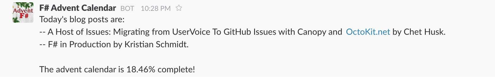

# Using type providers to post slack messages #

*All text and code copyright (c) 2016 by Rachel Reese. Used with permission.*

*Original post dated 2016-12-05 available at http://rachelree.se/using-type-providers-to-post-slack-messages/*

**By Rachel Reese**


Happy F# Advent!

I've been playing around with type providers recently, working on a few articles I have coming out for CODE magazine,
and I thought it would be fun combine a couple type providers to post updates to slack from the F# Advent Calendar.
I didn't want to harass everyone on the F# Software Foundation slack channel (nor did I have the permissions) so this is more a short-and-sweet,
to-be-expanded demo of what could be done. ;-)

So, I'll show you how I was able to display today's blog posts, calculate how far along F# Advent is, and send a DM with that info to my account.
All in just a couple lines of code of course, because type providers.

##Step 1: Get the current day's blog posts

First, I had to do a bit of set up. I'm using the `HtmlProvider` and the `JsonProvider` from `FSharp.Data`,
so I need to reference and open it. I also will often use a keys file for my demos to keep sensitive information, so I load and open that as well.

```fsharp
#r "../packages/FSharp.Data/lib/net40/FSharp.Data.dll"
#load "keys.fs"

open FSharp.Data
open keys
```

After this, I set up the `HtmlProvider` to link to the 2016 Advent Calendar official page, then find the table labeled "F# Advent Calendar in English 2016,"
and return all the rows on that table.

```fsharp
let calendarUrl =
  "https://sergeytihon.wordpress.com/2016/10/23/f-advent-calendar-in-english-2016/"

type AdventCalendar = HtmlProvider<calendarUrl>

let rows = AdventCalendar().Tables."F# Advent Calendar in English 2016".Rows
```

Finding the posts for today means that I need to filter the Date column, so we need to format a date string to match Sergey's formatting.
Then, I refined the text a bit by adding a check in case the post wasn't yet up and folding the array into one string value.

```fsharp
let todaysPosts = 
  rows
  |> Array.filter (fun r -> r.Date = System.DateTime.Now.ToString("MMM dd (ddd)"))
  |> Array.map
    (fun r –>
      if r."Post Title" = "" then
        "Not yet available by " + r.Author + "."
      else r."Post Title" + " by " + r.Author + ".")
  |> Array.fold (fun acc s -> acc + "–– " + s + "\n" ) ""
```


Once I have today's posts, I can reuse `rows` to find all the blog post titles, so that I can make the percent done calculation.

```fsharp
let postTitles = 
  rows
  |> Array.map (fun r -> r."Post Title")
```

## Step 2: Make the calculation

Now I have an array of blog post titles, some of which are empty. The complete ratio value is the non-empty values divided by the total number of posts.
So, I partition the array to find the non-empty values:

```fsharp
let complete = Array.partition (fun n -> n <> "") postNames
```

Then, I find the length of that array and the original `postTitles` array, convert both to floats, and divide. To find the percent complete, I multiply by 100.

```fsharp
let percent = (complete |> fst |> Array.length |> float)/(Array.length postTitles |> float) * 100.
```

Finally, I construct a basic message:

```fsharp
let message =
  sprintf "Today‘s blog posts are:\n%s \nThe advent calendar is %.2f%% complete!"
    todaysPosts percent
```

## Step 3: Integrate with Slack

Integrating with slack was the most fun part of this post. I hadn't really worked with the slack API before,
and it was a pleasure to find out that creating an incoming webhook was basically trivial. I did have to first set up an incoming webhook custom integration
for the team. On the slack web site, browse to `Manage -> Custom integrations -> Incoming Webhooks`.
Click "add configuration" and you'll be walked through the process. This step will give you a URL to which you can post your message.

Now, posting the message is just a matter of rigging up the `JsonProvider` to send it. I set up an example bit of JSON and use that to create a new `WebHook` type.

```fsharp
[<Literal>]
let webhookjson =
  """{"text": "This is a line of text in a channel.\nAnother line."}"""

type WebHook = JsonProvider<webhookjson, RootName="Message">
```

Next, I set up the call.

```fsharp
let newPost = WebHook.Message(message)
```

Finally, I make the request, to the URL that was provided when I set up the incoming webhook for the team.

```fsharp
newPost.JsonValue.Request keys.slackWebHookUrl
```

And voila! I have a private message sent to me:


Slack messages with current F# Advent posts.

Originally, I'd planned to use the SwaggerProvider to call Slack. They have a pretty cool API with a lot of fun options,
but since I ended up making a single call, it just doesn't make sense here. Next post! :-)