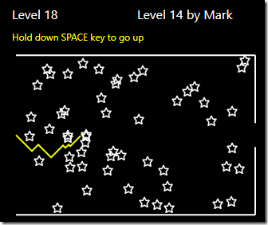
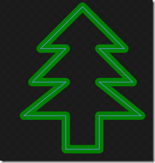
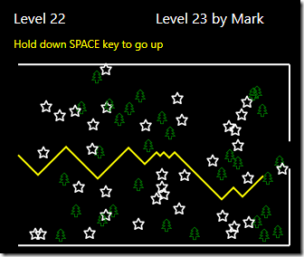

# Asterisk Game in F# and WPF #

*All text and code copyright (c) 2016 by Mark Heath. Used with permission.*

*Original post dated 2016-12-06 available at http://markheath.net/post/asterisk-fsharp*

**By Mark Heath**


For my entry in the F# Advent Calendar we're going to port a simple game to F#.
The game is called "Asterisk", and has very simple mechanics – you must progress through levels, avoiding hitting stars, and you can only go up or down.
With each new level, three more stars appear, until it is impossible to progress any further.

It's based on a game I used to play for hours on my dad's BBC Micro, and I've implemented it a few times in various languages including C# WinForms,
Silverlight and IronPython with WPF. You can find the code for some of these older versions here.



## Port vs Rewrite

To get me started I decided that I would port my IronPython version to F#, since that used WPF for the graphics and collision detection,
which made sense for my F# version to use.

Of course, F# is a very different language to Python. With Python I used lots of dynamic language features and mutable state.
But the F# language encourages us towards strongly typed and immutable code.

Maybe things would have gone more smoothly had I rewritten from scratch in F#, but porting is what I opted for,
so in this post I'll share a few of the things I learned along the way.

## WPF and F# ##

First of all, I needed a basic infrastructure for using WPF and the MVVM pattern in F#. I created a MVVM module to cover this:

```fsharp
module Mvvm
    open System
    open System.Windows
    open System.Windows.Input
    open System.Windows.Markup
    open System.Windows.Media
    open System.ComponentModel

    let checkCollisionPoint (point:Point) (control:UIElement) =
        let transformPoint = control.RenderTransform.Inverse.Transform(point)
        VisualTreeHelper.HitTest(control, transformPoint) <> null

    let loadXaml path =
        let uri = new Uri(path, UriKind.Relative)
        let stream = Application.GetResourceStream(uri).Stream
        XamlReader.Load stream

    let runApp rootElement =
        let app = new Application()
        app.Run rootElement

    type ViewModelBase() =
        let propertyChangedEvent = new DelegateEvent<PropertyChangedEventHandler>()
        
        interface INotifyPropertyChanged with
            [<CLIEvent>]
            member x.PropertyChanged = propertyChangedEvent.Publish

        member x.OnPropertyChanged propertyName = 
            propertyChangedEvent.Trigger([| x; new PropertyChangedEventArgs(propertyName) |])
     
    type DelegateCommand (action:(obj -> unit)) =
        let event = new DelegateEvent<EventHandler>()
        let mutable canExecute = true
        interface ICommand with
            [<CLIEvent>]
            member x.CanExecuteChanged = event.Publish
            member x.CanExecute arg = canExecute
            member x.Execute arg = action(arg)
        member x.SetCanExecute ce = 
            canExecute <- ce
            event.Trigger([|x; EventArgs.Empty|])
```
            
A few things of interest in here. First of all, this code demonstrates some of the techniques you can use to work with
.NET events in F#, using the `[<CLIEvent>]` attribute, and the `Publish` and `Trigger` methods.

In the `loadXaml` function you can see that I decided to make my XAML files into application resources, so I needed to read them in with `Application.GetResourceStream`.

One of the big benefits of WPF for this game is that collision detection comes built in to the framework. We can test a point to see
if it collides with a control on our canvas, which we do in `checkCollisionPoint` using `VisualTreeHelper.HitTest`.

## The Game Area

The `GameArea` module manages the visual part of the game. It draws new levels, and places stars in random positions on the canvas.
Here's the code to generate and place the stars for a new level:

```fsharp
let redrawScreen { canvas = canvas; polyline = polyline; stars = stars } level =
    canvas.Children.Clear()
    drawBorders canvas

    stars.Clear()
    for n in [1..level*3] do
        let star = Mvvm.loadXaml "star.xaml" :?> Path
        stars.Add star
        Canvas.SetLeft(star, float(rand.Next(10, int(width) - 10)))
        Canvas.SetTop(star, float(rand.Next(2, int(height) - 10)))
        canvas.Children.Add star |> ignore

    polyline.Points.Clear()
    canvas.Children.Add(polyline) |> ignore
```
    
The need to use `float` and `int` in the calculations of the star positions highlights how much stricter the F# compiler
is about types compared to C# or IronPython. You can't just mix and match ints and floats; you have to explicitly cast them.

Every time the user needs to move to a new position, we must perform a collision detection. Have they hit any of the stars on the screen,
or have they hit one of the walls? Here's the full collision detection code:

```fsharp
let isCollision stars x y width height =
    if y <= 0.0 || y >= height then
        // we've hit top or bottom
        true
    elif x >= width then
        // we've hit the right edge but missed the gap
        not ((height / 2.0 + 15.0) > y && y > (height / 2.0 - 15.0))
    else
        let isStarCollision star =
            let testX = x - Canvas.GetLeft(star)
            let testY = y - Canvas.GetTop(star)
            let testPoint = Point (testX, testY)
            Mvvm.checkCollisionPoint testPoint star
        stars |> Seq.exists isStarCollision
```
        
## The Main ViewModel

Porting the `MainViewModel` to F# was relatively straightforward except for one circular dependency issue I ran into.
 To illustrate, imagine this simple MVVM Command used by a ViewModel. The code won't compile because we can't reference the `MyCommand` member.
There's no easy way to reorganize these declaration to eliminate the circular references:

```fsharp
type MyCommand(func) =
    let mutable enabled = true
    
    member x.Execute() = func
    member x.Enabled 
        with get () = enabled
        and set (value) = enabled <- value

type MyViewModel() =
    let myFunc() = 
        printfn "Hello"
        MyCommand.Enabled <- false  // won't compile

    let myCommand = MyCommand(myFunc)

    member x.MyCommand 
        with get() = myCommand
```
        
How can we resolve this? Well it turns out there was a simple bit of F# syntax I was unaware of. If we say "as this" in our type declaration,
we are able to use it to reference our class members before their declaration. Simple when you know how:

```fsharp
type MyViewModel() as this =
    let myFunc() = 
        printfn "Hello"
        this.MyCommand.Enabled <- false  

    let myCommand = MyCommand(myFunc)

    member x.MyCommand 
        with get() : MyCommand = myCommand
```

## Making it Functional

Now I didn't want to simply port from IronPython over to F#. Once it was working I wanted to refactor towards a more functional approach.

So first of all, I decided to see if I could eliminate some of the mutable state and change the game so that every time a timer event occurred,
a new game state was created, rather than the existing one being modified.

So I came up with the following basic domain model. The `GameState` stores our current position, the direction we're headed and what level we're on.
And we also model the possible game events that can happen – a timer tick or a keypress resulting in a change of direction.
Whenever a `GameEvent` occurs, we will generate a new `ameState`, but there will also be a `RenderAction` to apply to keep the UI in sync with the `GameState`.

```fsharp
type Direction = Up | Down
type GameState = { xPos:float; yPos:float; direction:Direction; currentLevel:int}
type RenderAction = NewPoint | NewLevel | GameOver
type GameEvent = Tick | ChangeDirection of Direction
```

So our timer tick handler function returns a new game state and a render action. And it needs to be passed a helper collision tester function
(`colTest`) to help it know if the game should end:

```fsharp
let handleTick colTest gs =
    if gs.currentLevel = 0 then
        NewLevel, { currentLevel = 1; xPos = 0.0; yPos = GameArea.height / 2.0; direction = Down }
    else
        let newX = gs.xPos + 1.0
        let newY = gs.yPos + match gs.direction with | Up -> -1.0 | Down -> 1.0

        let crash = colTest newX newY GameArea.width GameArea.height
        if crash then
            GameOver, gs
        else if gs.xPos >= GameArea.width then
            NewLevel, { currentLevel = gs.currentLevel + 1; xPos = 0.0; yPos = GameArea.height / 2.0; direction = Down }
        else
            NewPoint,  { gs with  xPos = newX; yPos = newY } 
```
            
The advantage of this refactoring to a functional approach is that this method is completely unit testable and and agnostic of the
actual presentation technology. We could use this logic with a WinForms or HTML Canvas UI if we wanted.

## Observables

I also wanted to make the code more functional by treating all the game events as a stream of observables. This meant that the game
logic boils down to subscribing to an observable of game events and producing a set of render actions to be handled by the UI.

In F# it's very easy to subscribe to events with `Observable.subscribe`

```fsharp
timer.Tick |> Observable.subscribe onTimerTick
```

But we can go further and filter and map observable events. So for example to filter out all presses of the space bar and turn them into `ChangeDirection Up` commands we can do:

```fsharp
let isSpace (a:KeyEventArgs) = a.Key = Key.Space

xaml.KeyDown |> Observable.filter isSpace |> Observable.map (fun _ -> ChangeDirection Up)
```

I wanted to merge all the events I was interested in into a single stream. There's an `Observable.merge` function that will combine two observables,
so to combine multiple observables we need to use List.reduce. Here's us merging five observables into a stream of `GameEvents`:

```fsharp
[ timer.Tick |> Observable.map (fun _ -> Tick) 
  xaml.KeyDown |> Observable.filter isSpace |> Observable.map (fun _ -> ChangeDirection Up)
  xaml.KeyUp |> Observable.filter isSpace |> Observable.map (fun _ -> ChangeDirection Down)
  xaml.MouseLeftButtonDown |> Observable.map (fun _ -> ChangeDirection Up)
  xaml.MouseLeftButtonUp |> Observable.map (fun _ -> ChangeDirection Down)          
]
|> List.reduce Observable.merge 
|> Observable.subscribe onGameEvent
```


## Making it Christmassy

Finally, since this is the F# Advent Calendar, I did want to make it a bit more Christmassy. Sadly time did not permit for me to add [XAML snow](http://blog.jerrynixon.com/2013/12/you-can-make-it-snow-in-xaml-here-ill.html),
but I did use my incredible ninja graphic design skills to create this XAML Christmas tree:

```
<Path xmlns="http://schemas.microsoft.com/winfx/2006/xaml/presentation"
  Stroke="Green" 
  StrokeStartLineCap="Round" 
  StrokeEndLineCap="Round" 
  StrokeLineJoin="Round" 
  Data="M 8,18 v-4 h -5 l 5,-4 h -4 l 4,-4 h -3 l 5,-5 l 5,5 h -3 l 4,4 h-4 l 5,4 h-5 v4 Z">
    <Path.RenderTransform>
        <ScaleTransform ScaleX="0.8" ScaleY="0.8" />
    </Path.RenderTransform>
</Path>
```

which looks like this:



Now we can randomly select stars or trees and get a more festive looking game:



## Taking it Further 


Now although I did make some efforts to make this game more functional (and more Christmassy), there is certainly still a lot of scope for improvement.
So over to you, whether you're an F# beginner or guru, why not clone my [GitHub repo](https://github.com/markheath/asterisk-fsharp), have a play of the game, and see if you can improve the code or add a new feature.

Happy Christmas, and enjoy the rest of your F# Advent. If you're a regular follower of my blog, you'll know that I've also been attempting
to solve the [Advent of Code](http://adventofcode.com/) challenges in F#. You can [read about my solutions here](http://markheath.net/category/advent+of+code). 

*Video of game: https://youtu.be/UlJctMxK_og*