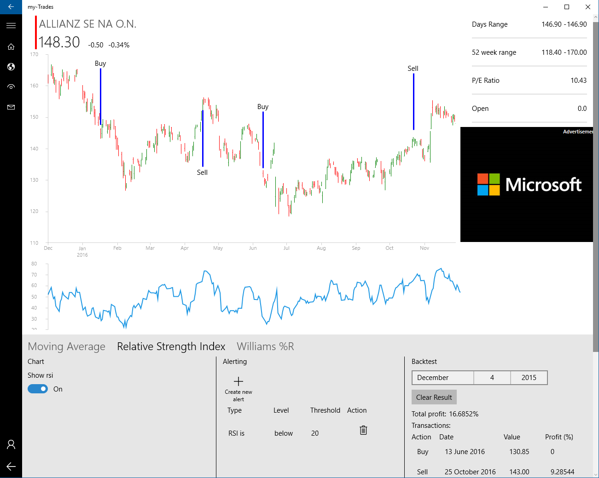



# myTrades.Analytics – a netstandard compatible .NET technical analysis library written in F# #

*All text and code copyright (c) 2016 by Gergely Kalapos. Used with permission.*

*Original post dated 2016-12-09 available at http://kalapos.net/Blog/ShowPost/MyTradesAnalytics-a-netstandard-compatible-technical-analysis-library*

**By Gergely Kalapos**

As a side project I work on a financial stock analysis system. I do this mostly for learning and hacking on things I cannot hack on within my daily job.
The backend is a CoreCLR based application, the frontend is currently a UWP app, which I would like to extend to Xamarin.

Since I work with CoreCLR the number of available libraries is still limited. The first feature I implemented was the ability to do some [technical analysis](https://en.wikipedia.org/wiki/Technical_analysis).
Since I did not find anything for this I thought I will do it myself, so I created an netstandard based F# library which is basically able to calculate different indicators based on past price movement.

I wanted to share this work with the community, so I decided to open-source it. I call it myTrades.Analytics and you can download it from [NuGet.org](https://www.nuget.org/packages/myTrades.Analytics).

The source code can be found [here on GitHub](https://github.com/gregkalapos/myTrades.Analytics).

It currently targets netstandard 1.6. The reason for this is that the F# SDK depends on netstandard 1.6, so this is the lowest version one can currently target in F#.

Warning: The project uses the new fsproj based project system with preview4 version the .net cli tooling, so if you want to build the repo you need [nightly builds](https://github.com/dotnet/cli) from the dotnet SDK. (ATM Privew 3 is the last official release)

You can of course also use it from C#. Currently I focused on a consistence F# API, but I plan to build a nice C# wrapper to have an API which feels more comfortable for C# developers.

To get an idea what you can do with it here is a screenshot from the application, which is powered by this library.



In the rest of the post I will describe the functionality of the library. This is a continuous work and the post only describes the current snapshot of the library. I plan to implement more indicators and more back-testing functionality. If you miss something and want to join feel free to send Pull Requests!

## How to use the library

Everything is in the `MyTrades.Analytics` namespace.

These are these basic types:

```fsharp
type Quote = { Value: decimal; Date: System.DateTime }
type OHCL = { Open: decimal; High: decimal; Close: decimal; Low: decimal }
type OHCLWithDate = { OHCL: OHCL; Date: System.DateTime }
```

Every indicator returns `seq<Quote>`, since an indicator is always a number for every time unit.

The input differs depending on what is needed to calculate the indicator. Indicators which only operate on the closing price take `Quote` as a parameter and indicators,
which operate not only on the closing price, but also on the daily high/low, etc. take OHCLWithDate as parameter.

Currently these indicators are implemented:

* Simple Moving Average (http://www.investopedia.com/terms/s/sma.asp)
* Relative Strength Index (RSI) (http://www.investopedia.com/terms/r/rsi.asp)
* Williams %R (http://www.investopedia.com/terms/w/williamsr.asp)
* Ultimate Oscillator (http://www.investopedia.com/terms/u/ultimateoscillator.asp)
* (and many more to follow)


## Calculate SMA

This is the function definition:

```fsharp
SimpleMovingAverage (stockData: seq<Quote>) forDays
```

The first thing you need is a `seq<Quote>`, the second is the SMA length.

Here is how to calculate a 5 days SMA:

```fsharp
open System
open MyTrades.Analytics
open MovingAverage

[<EntryPoint>]
let main argv =

let prices = [ {Value = 3m  ; Date =new DateTime(2015, 03, 1)};
              {Value = 4m  ; Date =new DateTime(2015, 03, 2)};
              {Value = 5m  ; Date =new DateTime(2015, 03, 3)};
              {Value = 6m  ; Date =new DateTime(2015, 03, 4)};
              {Value = 7m  ; Date =new DateTime(2015, 03, 5)};
              {Value = 6m  ; Date =new DateTime(2015, 03, 6)};
              {Value = 5m  ; Date =new DateTime(2015, 03, 7)};
              {Value = 9m  ; Date =new DateTime(2015, 03, 8)} ];

let smas = SimpleMovingAverage prices 5
```

The return type is also a `seq<Quote>` and in this case it contains 4 items, since for a 5 days SMA of 8 data points you will get SMA value for the last 4 data points.

## Calculate RSI

Similar to the SMA RSI also takes `seq<Quote>` as input:

```fsharp
Rsi (stockData: seq<Quote>) rsiLength
```

And here is how to use it:

```fsharp
open System
open MyTrades.Analytics
open Rsi

[<EntryPoint>]
let main argv =

    let prices  = …//populate prices seq
    let rsi = Rsi.Rsi prices 14;
    ...
``` 

## Calculate William %R

For calculating William %R the closing prices are not enough, therefore it takes `OHCLWithDate` (instead of `Quote`) as input:

```fsharp
WilliamsPR (prices: seq<OHCLWithDate>) nDays
```

Other than this you can use it similar to the other functions:

```fsharp
open System
open MyTrades.Analytics
open WilliamsPR

[<EntryPoint>]
let main argv =

   let prices  = …//populate prices seq
   let williams = WilliamsPR prices 14
   ...
```
   
Again, the result (`williams`) is `seq<Quote>`

 

## Backtesting

Another feature I already started to implement is back-testing. The point of technical analysis is to give buy and sell signals.
The back-testing functions in myTrades.Analytics basically look for buy and sell signals and calculate the return of the transactions created based
on the signals on the input data, which is typically a historical data for a given stock.

Now theoretically you can parameterize these strategies on an infinite way, but currently I implemented all of them with default parameters,
but later I would like to extend it. What I mean by that is that for example for RSI everything below 30 is considered oversold and everything above 70 is considered overbought, but for some stock maybe 25 and 85 would be better. For Williams %R there are even more parameters. Currently some defaults are hardcoded and you cannot change them. But like I said… I will revisit this.

The return type of every back-testing function is:

```fsharp
type BacktestingResult = { Transactions: seq<TransactionQuote>; ResultInPercent: double }
```

where `TransactionQuote` is:

```fsharp
type TransactionQuote =
    | Buy of Quote
    | Sell of Quote * double
```
    
Meaning the `ResultInPercent` stores the overall gain or loss and the the second item of the tuple in the `TransactionQuote`
in `Sell` case stores the result of every sell transaction.

**Backtesting RSI:**

Here is the interface:

```fsharp
BackTestRsiWithPrice (rsiData: seq<Quote>) (price: seq<Quote>)
```

The length of the RSI data passed as the first parameter can be anything. By default, this algorithm buys when the RSI is below 30 and sells when it reaches 70,
then it looks for the next buy signal and repeats this on the whole input data.

Here is a sample:

```fsharp
open System
open MyTrades.Analytics
open MyTrades.Analytics.TestData
open Rsi

[<EntryPoint>]
let main argv =

    let prices = GetBmwQuotes //Get historical data
    let rsiData = Rsi prices 14
    let rsiBackTesingResult = BackTestRsiWithPrice rsiData (prices |> Seq.skip 14)
```
    
Make sure that the data of the first and the second parameter is aligned based on the `Date` field.
(In this case because of the RSI we have to skip the first 14 items in the prices Seq.)

**Backtesting other indicators:**

Similar there are back-testing methods for other indicators with the same parameters and the same return type.

* `BackTestMovingAverageWithPrice`: Buys when SMA is in down trend and Price goes over it from below.
* `BackTestWilliamsPr`: Buys when Williams %R reaches -100 and after 5 days it is still below -85 and sells when it reaches 0 and after 5 days it is still above -15. (This is till WIP)
* `BackTestRsiWithPrice`: (as already discussed) buys when the RSI is below 30 and sells when it reaches 70
 

## The structure of the code on GitHub

The repo currently contains 3 projects:

* `Analytics`: the library itself.
* `Analytics.Test`: Test code based on XUnit.
* `Analytics.Playground`: This is a console application project in order to play with the library. During development it is very useful since currently there is no way to debug under CoreCLR with F# and XUnit cannot do printf output either (see https://github.com/xunit/xunit/issues/718 ).