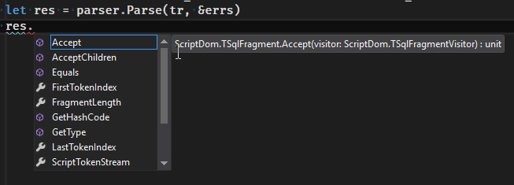
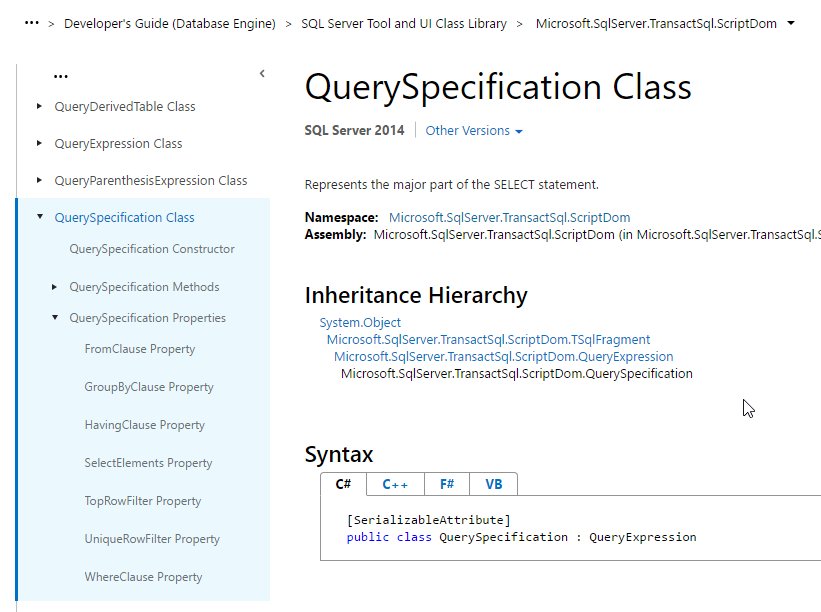
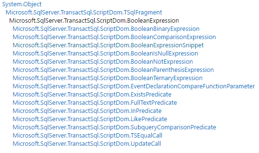
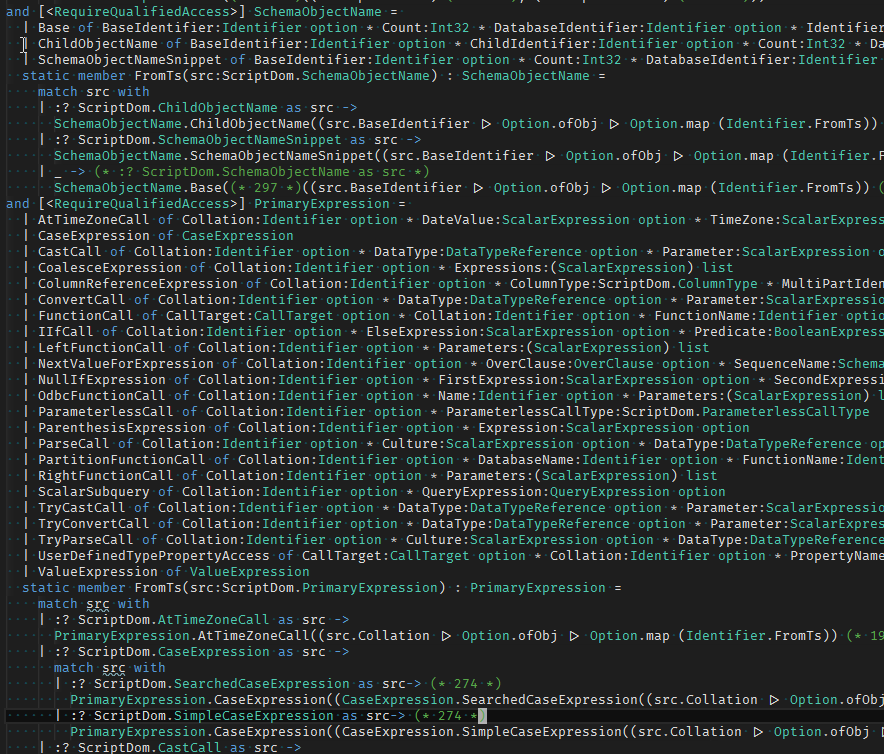
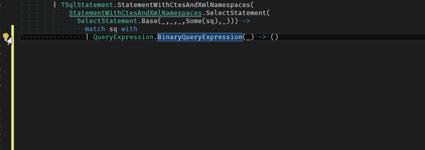



# Working with SQL syntax trees in F# #

*All text and code copyright (c) 2016 by Isak Sky. Used with permission.*

*Original post dated 2016-12-13 available at https://gist.github.com/isaksky/f8c4881bf93c7e57115439af07722ecc*

**By Isak Sky**

If you're using a relational database, as your application grows in size, at some point you may find yourself looking for an SQL parser. This can give you lots of leverage, for example allowing you to:

* Do permission checks on queries before executing them
* Rewrite incorrect or inefficient queries
* Perform query optimizations your database vendor did not consider
* Do queries on your queries 
 * What columns are people asking for?
 * What conditions are common? 
 * How are tables normally joined?
 * etc
 
For those who use MS SQL Server, I have some great news for you: Microsoft already makes their SQL parser available. If you have SQL Server Management Studio installed, you can find it here:

    C:\Program Files (x86)\Microsoft SQL Server\130\SDK\Assemblies\Microsoft.SqlServer.TransactSql.ScriptDom.dll

And the documentation is [here](https://msdn.microsoft.com/en-us/library/microsoft.sqlserver.transactsql.scriptdom.aspx). Let's have a go at making this thing work. 

```fsharp
open System
open System.Collections.Generic
open Microsoft.SqlServer.TransactSql

let sql = "select * from foo"
let parser = ScriptDom.TSql130Parser(false)
```    
    
The parser expects a <code>TextReader</code>, and has a list of errors as an out parameters, so we invoke it like this:

```fsharp
use tr = new StringReader(sql) :> TextReader
let mutable errs : IList<_> = Unchecked.defaultof<IList<_>>
let res = parser.Parse(tr, &errs)
if errs.Count = 0 then
  printfn "Success! Result: %A" res
else 
  printfn "Failure."
```      

If you try this code, you'll get this result:

    Success! Result: Microsoft.SqlServer.TransactSql.ScriptDom.TSqlScript

The parsing was successful, but structural printing does not yield a useful result. This is to be expected, since the library is implemented in C#. Let's see if our editor can help us figure out what we can do with this <code>TSqlScript</code>:



This is not very helpful either. If you look through the suggestion list, you'll see that none of the members are actually useful for getting any information about the query (such as the table name). Let's take a step back and look at how this library is organized. Browsing through, we find the QuerySpecification class, which looks like this:



[*link on MSDN*](https://msdn.microsoft.com/en-us/library/microsoft.sqlserver.transactsql.scriptdom.queryspecification.aspx)

On the left, under "QuerySpecification properties", we see<code>FromClause</code>, <code>SelectElements</code>, <code>WhereClause</code> - now we're talking. How can we get at this information? 

Notice the inheritance hierarchy. <code>QuerySpecification</code> inherits from <code>QueryExpression</code>, which inherits from <code>TSqlFragment</code>. The same pattern is repeated for other types, like search conditions:



What this means is that in order to get any information out of the parse result, we'll first need to cast it into the right type. Manually checking the types of every object and property and casting would obviously get quite tedious, so Microsoft provided another way - using [visitors](https://sourcemaking.com/design_patterns/visitor). Here is an example using a visitor to find all column references in a query. 

```fsharp
module Test = 
  // Helper extension method
  type ScriptDom.MultiPartIdentifier with
    member x.GetName() =
      seq { for id in x.Identifiers do yield id.Value }
      |> String.concat "."

  // Our visitor - just gather up columns
  type ColRefVisitor() =
    inherit ScriptDom.TSqlFragmentVisitor()
    member val ColRefs = ResizeArray() with get
    override x.ExplicitVisit(colRef: ScriptDom.ColumnReferenceExpression) =
      x.ColRefs.Add(colRef)

  let getCols(sql) = 
    let parser = ScriptDom.TSql130Parser(false)
    use tr = new StringReader(sql) :> TextReader
    let mutable errs : IList<_> = Unchecked.defaultof<IList<_>>
    let res = parser.Parse(tr, &errs)
    if errs.Count = 0 then
      let v = ColRefVisitor()
      res.Accept(v)
      for c in v.ColRefs do
        printfn "Found column \"%s\"" (c.MultiPartIdentifier.GetName())
     else 
      printfn "Failure."
```

Lets try this on a simple query:

```fsharp
    > Test.getCols("select foo, bar from mytable");;
    Found column "foo"
    Found column "bar"
    val it : unit = ()
```    
    
Neat, it works. What happens with a more complex query?

    > Test.getCols("select foo, a.bar, myfun(a.baz) from c where x = y");;
    Found column "foo"
    Found column "a.bar"
    Found column "a.baz"
    Found column "x"
    Found column "y"
    val it : unit = ()

Notice that all the columns are included. Even the one ones referenced in a function invocation (<code>a.baz</code>), and the ones referenced in the where clause (<code>x</code> and <code>y</code>). This can be a good thing or a bad thing depending on what we're trying to do, because we do not get any of the surrounding context for each column.

What if we did want some context for each column? For example, maybe we need to be able to distinguish betweem a column reference and one wrapped in a function call. Or a condition in the main where clause, rather than one in a subquery. We could accomplish this with a lot more visitor code, and/or a lot of type checking and casting. But in F#, we have a [better](http://codereview.stackexchange.com/questions/11804/symbolic-derivative-in-c) way to represent syntax trees: Discriminated Unions (DUs). Wouldn't it be nice if we could work with a SQL syntax tree in DUs, lists, etc, so we could just pattern match on it?

I thought so, so I created a library that converts between <code>ScriptDom.TSqlFragment</code> (the base type returned by <code>.Parse</code>) and an F# TSqlFragment. The F# version is generated from a script I made that:

1. Loads the ScriptDom assembly
2. Walks the type hierarchy
3. Create a DU for each level in the hierarchy
4. All leaf C# types become DU cases with the C# properties as DU fields
 1. C# Enums are left as is
 2. IList becomes list
 3. All reference type properties get wrapped in <code>option</code> to protect from <code>null</code>
 
You can find the code [here](https://www.github.com/isaksky/FsSqlDom). To give you an idea, here is what part of the 6000+ LOC library looks like:



To play with this library, let's first create a function that will just print out the parse result:

```fsharp
open FsSqlDom

let parsePrint (sql:string) =
  match Util.parse(sql, false) with
  | ParseFragmentResult.Success(frag) -> 
    Util.getQueryExpr(frag) // use a utility function to pull out a QueryExpression 
    |> sprintf "QE: %A
  | ParseFragmentResult.Failure(errs) -> 
    failwithf "Parse error! %A" errs
```    

To take it for a test drive:

    > parsePrint "select a, b from mytable";;
    val it : string =
      "QE: Some
      (QuerySpecification
         (null,
          Some
            (FromClause
               [TableReferenceWithAlias
                  (NamedTableReference
                     (null,
                      Some
                        (Base
                           (Some (Base (NotQuoted,Some "mytable")),1,null,
                            [Base (NotQuoted,Some "mytable")],null,null)),[],null,
                      null))]),null,null,null,null,
          [SelectScalarExpression
             (null,
              Some
                (PrimaryExpression
                   (ColumnReferenceExpression
                      (null,Regular,Some (Base (1,[Base (NotQuoted,Some "a")]))))));
           SelectScalarExpression
             (null,
              Some
                (PrimaryExpression
                   (ColumnReferenceExpression
                      (null,Regular,Some (Base (1,[Base (NotQuoted,Some "b")]))))))],
          null,NotSpecified,null))"

As you can see, we now have our syntax tree in algebraic data types, instead of a C# type hierarchy. (Note that for some reason, <code>None</code> gets printed out as <code>null</code> by sprintf.) Now that all this structure is in the type system, our editor (VSPT) can also help us enumerate possibilities when we are pattern matching (thanks to a feature added by @OkayX6):



Let's put this to use with a more complicated example. Suppose you have a query like the following:

```sql
select id, dbo.translation(id, 'de'), dbo.translation(id, 'no-nb')
from translations
where id in (@id1, @id2, @id3)
```

Where dbo.translation(...) is a scalar function that tries to get text for a text id in some language, then falls back to english if there is no translation. Let us say it is implemented as follows:

```sql
CREATE FUNCTION [dbo].[translation] (@id int, @lang varchar(10)) RETURNS nvarchar(255)
AS BEGIN
	DECLARE @ret nvarchar(255)

  SELECT TOP 1 @ret = s_title
  FROM translation_texts
  WHERE translation_id = @id AND lang = @lang
	
  IF LEN(ISNULL(@ret, '')) = 0
  BEGIN
  	 SELECT TOP 1 @ret = s_title
  	   FROM translation_texts 
  	  WHERE translation_id = @id and lang = 'en'
  END

  RETURN ISNULL(@ret,'')
END
```

Suppose further that you found that SQL Server does not optimize this scalar function, and you found an alternate way to get the translation that does in fact get optimized:

```sql
select id, (select top 1 text
            from (select text, 0 as trank from translation_texts where translation_id = @id and lang = @lang
	          union all
		  select text, 1 as trank from translation_texts where translation_id = @id and lang = 'en')
            order by trank) as text
           -- leaving out second translation for brevity
from translations
where id in (@id1, @id2, @id3)
```

Let's say you had a lot of code invoking the inefficient scalar function, and you wanted to rewrite queries to use the subselect, which will get optimized. Doing this will require 3 steps:

1. Parsing the query
2. Rewriting the query
3. Printing the new query

The first step is taken care of by ScriptDom and FsSqlDom:

```fsharp
open FsSqlDom

let sql = """
select id, dbo.translation(id, 'en-US'), dbo.translation(id, 'no-nb')
from translations
where id in (@id1, @id2, @id3)
"""

let (ParseFragmentResult.Success(parseResult)) = Util.parse sql

let queryExpr = Util.getQueryExpr parseResult
```

Now for 2), rewriting:

```fsharp
let rec fixTranslationCalls (qexpr:QueryExpression) : QueryExpression =
  match qexpr with
  | QueryExpression.QuerySpecification(forClause, fromClause, groupByClause, havingClause, offsetClause, orderByClause, selectElements, topRowFilter, uniqueRowFilter, whereClause) -> 
    let newSelectElements = List.map fixSelectElement selectElements
    QueryExpression.QuerySpecification(forClause, fromClause, groupByClause, havingClause, offsetClause, orderByClause, newSelectElements, topRowFilter, uniqueRowFilter, whereClause)     
  | _ -> failwith "Not implemented"

and fixSelectElement (sel:SelectElement) =
  match sel with
  | SelectElement.SelectScalarExpression(ident, Some(sexpr)) ->
    SelectElement.SelectScalarExpression(ident, Some(fixScalarExpression sexpr))
  | _ -> sel

and fixScalarExpression (sexpr:ScalarExpression) =
  match sexpr with
  | ScalarExpression.PrimaryExpression(pexpr) ->
    ScalarExpression.PrimaryExpression(fixPrimaryExpr pexpr)
  | _ -> sexpr

and fixPrimaryExpr (pexpr:PrimaryExpression) =
  match pexpr with
  | PrimaryExpression.FunctionCall(FunctionName = Some(Identifier.Base(_, Some "translation")); 
                                   Parameters = [idParam; langParam]) ->
      subQueryWithLang langParam
  | _ -> pexpr
```

Here we're walking to the part of the the syntax tree we want we want to update, looking for calls to the translation function. Once we get to it, we replace it with a `subQueryWithLang`, passing in the `langParam`. How do we implement `subQueryWithLang`? We could build up the syntax tree manually, but that would be pretty tedious. Let's instead take a shortcut, parsing a sql expression that is close, then pretty printing that in the REPL, and using that as a foundation.

```fsharp
let translationSubquerySql = """
(select top 1 txt
 from (select txt, 0 as trank 
       from translation_texts 
       where translation_id = @id and lang = @lang
       union all
       select txt, 1 as trank 
       from translation_texts 
       where translation_id = @id and lang = 'en') T 
 order by trank)
"""

let translationSubquery = 
  match Util.parseExpr(translationSubquerySql) with
  | Choice1Of2(sexpr) -> sexpr
  | _ -> failwith "Parse error"
```

If you run that in the REPL, you will see a huge syntax tree. Now to implement the `subQueryWithLang` function, we'll just copy and paste that into our code, fix the errors (e.g. null, which should be None), and find the part of the syntax tree that needs to be replaced. [Here](https://gist.github.com/isaksky/cdcc9aea0e0d9379242fbb329a155b70) is the finished version (I put it in its own gist, because it is quite long).


Now that we have a rewritten syntax tree, we are ready to print out the syntax tree so we can execute it. To do that, we can just call `Util.render`. So to put everything together:

```fsharp
let updatedQueryExpr = fixTranslationCalls queryExpr.Value
let updatedSql = Util.render updatedQueryExpr
val it : string =
 "select id, (select top 1 txt from (select txt, 0 as trank from translation_texts where translation_id = id and lang = 'en-gb' union all select txt, 1 as trank from translation_texts where translation_id = @id and lang = 'en') T), (select top 1 txt from (select txt, 0 as trank from translation_texts where translation_id = id and lang = 'no-nb' union all select txt, 1 as trank from translation_texts where translation_id = @id and lang = 'en') T) from translations where id  in (@id1, @id2, @id3)"
```

Tada! There is our updated SQL with the function calls converted to subqueries. I hope you found have this post useful. 
