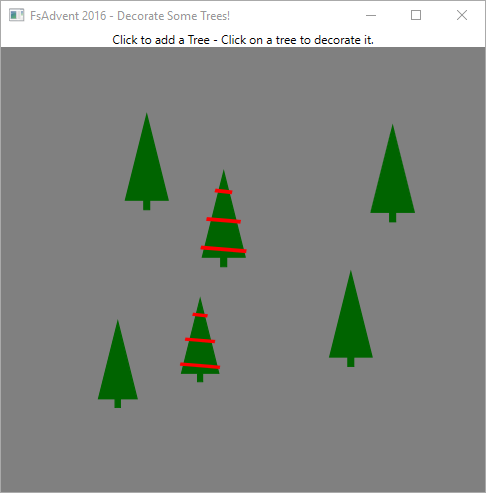
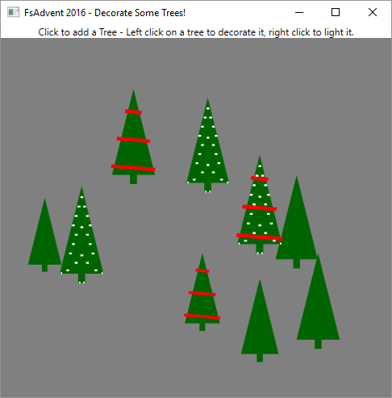




# Christmas Trees in WPF, 2016 Edition #

*All text and code copyright (c) 2016 by Reed Copsey, Jr. Used with permission.*

*Original post dated 2016-12-15 available at http://reedcopsey.com/2016/12/15/christmas-trees-in-wpf-2016-edition/*

**By Reed Copsey, Jr.**


Last year, I wrote about making [Christmas Trees in WPF using FSharp.ViewModule](http://reedcopsey.com/2015/12/09/christmas-trees-in-wpf-using-fsharp-viewmodule/).  At the time, I was excited being able to demonstrate how FSharp.ViewModule could make typical MVVM much more functional feeling.  This year, for my [F# Advent Calendar contribution](https://sergeytihon.wordpress.com/tag/fsadvent/), I want to demonstrate how [Gjallarhorn.Binding](https://github.com/ReedCopsey/Gjallarhorn) can serve as a replacement, and help create a WPF application with a design that is clean, functional, and most importantly, simple.

This post will modernize the [Christmas Tree](http://reedcopsey.com/2015/12/09/christmas-trees-in-wpf-using-fsharp-viewmodule/) application from last year, improving it, and highlighting the differences between a classic MVVM approach to WPF and a more functional approach.  While reading through the post from last year would add context, it’s completely optional.

As always, I’ll begin with a brief introduction to the model.  I’ve taken the model from last year mostly as-is, except simplified it and made it more “idiomatic F#”.  This year, I broke out the model for a Tree into its own file:

```fsharp
// Our tree types
type Location = { X: float; Y: float }
type Tree = { Position : Location ; Height : float ; Decorated : bool }

// Update types allowed on a tree
type TreeMessage = | Decorate

// Module showing allowed operations on an existing tree
[<CompilationRepresentation(CompilationRepresentationFlags.ModuleSuffix)>]
module Tree =
    let private rnd = System.Random()
    let private makeHeight () = 8.0 + rnd.NextDouble() * 4.0

    let create location = 
        { Position = location ; Height = makeHeight () ; Decorated = false }

    let update msg tree =
        match msg with
        | Decorate -> { tree with Decorated = true }
```

The actual Tree type is unchanged – but I’ve created the functions to create a new tree and update an existing tree, and placed them into a module for working with trees.  This isolates the types and logic for dealing with a single tree into its own testable portion of the application, and is simple, easy to follow, and easily extensible.

The model for a Forest has received similar treatment:

```fsharp
// Our main forest model
type Forest = Tree list

// Update types allowed on a forest
type ForestMessage =
    | Add of Location // Add new tree at a location
    | UpdateTree of msg : TreeMessage * tree : Tree // Update an existing tree
    | Prune of maxTrees : int  // Prune the trees

// Module with allowed operations on a forest
[<CompilationRepresentation(CompilationRepresentationFlags.ModuleSuffix)>]
module Forest =
    let private rnd = System.Random()

    let empty : Forest = []
    
    // Prune one tree if we're over the max size
    let private prune max (forest : Forest) : Forest = 
        let l = List.length forest
        if max < l then
            // Remove an "older" tree, from the 2nd half of the list
            let indexToRemove = rnd.Next ( l / 2, l)
            forest 
            |> List.mapi (fun i t -> (i <> indexToRemove, t))
            |> List.filter fst
            |> List.map snd
        else
            forest         

    let update msg forest =
        match msg with
            | Add(location)         -> Tree.create location :: forest    
            | UpdateTree(msg, tree) -> Tree.update msg tree :: List.except [ tree ] forest
            | Prune(maxTrees)       -> prune maxTrees forest
```

The main differences when compared to the version from last year is that the logic is now contained in a module, and the message type for updating a forest is dramatically simplified, and now has three options – it can add a new tree, given a location, prune the existing forest if it’s larger than a given size, and update a tree given a TreeMessage and a Tree.  The logic for these just calls into the Tree module when appropriate, making this far easier to understand and extend in the future.

The code up to this point is completely “pure F#” – no external libraries are required, and everything is self contained, testable, immutable, and easy to reason about.  I have a Forest comprised of a list of Tree records, with functions performing updates that returning a new Forest.

Up to this point, what I have is very similar to what I had [last year](http://reedcopsey.com/2015/12/09/christmas-trees-in-wpf-using-fsharp-viewmodule/), just slightly more organized, with the Tree having its own module isolating its own logic.

However, this is where things start to change.  In order to wire this up to a UI, there are a few options.
I could go with a naive, just “build out the controls and wire up everything in code” style.  This would work, but tends to lead to a mess of spaghetti, lots of brittle event handling for changing the views and pushing back state, and other issues.  It becomes even more of a mess when considering the fact that the model is represented by a collection – hand-wiring events for managing collections is difficult to get correct, and typically requires a lot of code.

I could go with a classic MVVM approach: this would likely require making a “view model” class to represent a forest and another to represent tree, adding logic in the tree for whether it should be decorated, and adding some mechanism, typically either custom events or a messaging service, to notify the main view model that a tree is updated, wiring up the logic to map to and from the (immutable) model classes, and the like.  Realistically, the boilerplate required to do this would be far more code than I’ve written for the actual application so far – with the collections becoming the most difficult aspect.  Libraries like ReactiveUI or DynamicData can simplify this, but it still is effectively copying the model (manually) into a custom collection of view models, managing them, and manually constructing the model back from the results.

My approach last year was to use FSharp.ViewModule’s EventViewModelBase and custom converters to manage some of this complexity.  That worked quite well – and I was happy (mostly) with the approach, but even so, I ended up creating a custom view model class, two MailboxProcessors to manage synchronization, and a lot of care had to be taken to make sure to always marshal back onto the UI thread before touching the collection (or you get exceptions from WPF) and similar “gotchas” that really are completely separate concerns from my core logic.  At its core this approach still uses an MVVM philosophy for its architecture, though it has a much more functional slant which does help tame some of the complexity.

MVVM, while the most common architectural pattern for dealing with WPF, has some fundamental flaws.  At its core, MVVM is about isolating the view and using data binding to wire up changes to a “view model”, where the changes edit properties, and then the view model takes on the requirements of updating the model.  I’ve written about [MVVM in detail](http://reedcopsey.com/2010/01/06/better-user-and-developer-experiences-from-windows-forms-to-wpf-with-mvvm-part-7-mvvm/), and used it quite a bit, but there are a few annoying aspects:

* Everything is based on mutation.  By definition, the View Model layer is going to be mutable, as edits work via (two way) data binding that set values on the properties.
* There’s a lot of boilerplate involved – every view typically ends up needing a complete class written for it to manage its state and logic.
* It can be difficult to reason about, especially when collections are involved.
* The “plumbing” requirements to keep updates within collections can become onerous quickly.  This tends to lead to inappropriate changes being made to the Model, as evidenced by the common arguments like “it’s just easier if I make this model mutable and implement INotifyPropertyChanged”.  Over time, this can make the application far more complex, introduce bugs, and cause a myriad of other problems.

That being said, MVVM does bring some concrete benefits:

* The View stays very isolated, and can be changed without changing the application logic and code at all.
* The Model can be kept “pure”, which allows for easy reuse of the core code in other platforms (though, in practice, this is often broken – see above).

This year, I’ve decided to go with a completely different approach.

At the beginning of 2016, I started playing with ideas of how to break some of the underlying expectations when building WPF (and other data binding based) applications.  This centered around a couple of ideas – rethinking data binding to eliminate mutation at its core and eliminating the need to create classes to make data binding work.  This has evolved into the [Gjallarhorn.Binding project, built on top of Gjallarhorn](https://github.com/ReedCopsey/Gjallarhorn).

In order to build a UI with Gjallarhorn, instead of making classes to support data binding, I create some simple functions, referred to as a “Component” in Gjallarhorn.Bindable.  A Component is defined as:

```fsharp
BindingSource -> ISignal<'TModel> -> IObservable<'TMessage> list
```

The BindingSource type is defined in Gjallarhorn.Bindable, and used to map the model to the view, and events from the view back into messages.  The ISignal<‘a> interface is the core type in Gjallarhorn, and can be thought of as an IObservable<‘a> (which it inherits) that always contains a current value.  Gjallarhorn provides a full set of operations for working with signals, including mapping, merging, filtering, conversion to and from observables and other types, and more.  The Component for mapping the Tree to something usable by data binding is defined as:

```fsharp
// Create binding for a single tree.  This will output Decorate messages
let treeComponent source (model : ISignal<Tree>) =
    // Bind the tree itself to the view
    model |> Binding.toView source "Tree"

    [
        // Create a command that turns into the Decorate message
        source |> Binding.createMessage "Decorate" Decorate 
    ]
```

This function takes the model (the ISignal<Tree>) and binds it directly “to the view” via the name “Tree”.  This effectively creates a one-way “Tree property” the view can data bind into.  I then create a “message source”, which WPF sees as an ICommand.  The Binding.createMessage function returns an IObservable<‘a>. When the command is executed, it will output a Decorate message into the observable stream.

Similarly, I create a Component to manage the Forest type as a whole:

```fsharp
// Create binding for entire application.  This will output all of our messages.
let forestComponent source (model : ISignal<Forest>) =             
    // Bind our collection to "Forest"
    let forest = BindingCollection.toView source "Forest" model treeComponent             

    [
        // Map Decorate messages in the treeComponent to UpdateTree messages
        forest |> Observable.map UpdateTree
        // Create a command that routes to Add messages
        source |> Binding.createMessageParam "Add" Add
    ]
```

This is slightly different – as the Forest is a sequence, I use BindingCollection.toView to bind the entire collection to the view, saying “for each item in the sequence (a Tree), use the treeComponent function to build out the binding for that element, and aggregate all of the messages from those into a single message stream that’s the original message and the individual tree as a tuple.  I then map this in the output stream into UpdateTree message types, and also create a command to add a new tree, which maps the command parameter into the argument of the Add DU case.

Finally, I build the application plumbing.  The one thing I’m not handling at this point is pruning of the forest – which I want to just run continually.  For Gjallarhorn.Bindable, I need to create three functions for the application – a function to create the initial model (the Forest), an init function that runs one time after all of the contexts have been setup, and an update function for the top level model.  These are passed into the Framework.application function, along with the main component, which builds out the “logical application”:

```fsharp
let application = 
    // Create our forest, wrapped in a mutable with an atomic update function
    let forest = new AsyncMutable<_>(Forest.empty)

    // Create our 3 functions for the application framework

    // Start with the function to create our model (as an ISignal<'a>)
    let createModel () : ISignal<_> = forest :> _

    // Create a function that updates our state given a message
    // Note that we're just taking the message, passing it directly to our model's update function,
    // then using that to update our core "Mutable" type.
    let update (msg : ForestMessage) : unit = Forest.update msg |> forest.Update |> ignore

    // An init function that occurs once everything's created, but before it starts
    let init () : unit = 
        // Handle pruning of the forest - 
        // Once per second, send a prune message to remove a tree if there are more than max
        let rec pruneForever max update =
            async {
                do! Async.Sleep 500
            
                Prune max |> update

                do! pruneForever max update
            }

        // Start prune loop in the background asynchronously
        pruneForever 10 update |> Async.Start 

    // Start our application
    Framework.application createModel init update forestComponent 
```

At this point, I have the underlying logic for the entire application defined – and best of all, it’s defined in a portable class library that’s completely reusable as-is between WPF and other data binding platforms – I could use this same project, without changes, to build out a Xamarin Forms Android app, for example.

The WPF project just references this, pulls in FsXaml, and has two files.  First, I define the XAML for the View:

```
<Window 
        xmlns="http://schemas.microsoft.com/winfx/2006/xaml/presentation"        
        xmlns:x="http://schemas.microsoft.com/winfx/2006/xaml"
        xmlns:sys="clr-namespace:System;assembly=mscorlib"
        xmlns:fsx="clr-namespace:FsXaml;assembly=FsXaml.Wpf"
        xmlns:fsxb="clr-namespace:FsXaml;assembly=FsXaml.Wpf.Blend"        
        xmlns:local="clr-namespace:Views;assembly=AdventTrees2016"
        xmlns:i="clr-namespace:System.Windows.Interactivity;assembly=System.Windows.Interactivity" 
        Title="FsAdvent 2016 - Decorate Some Trees!" 
        Name="Win"
        Height="500" 
        Width="500">
    <Window.Resources>
        <local:LocationConverter x:Key="locationConverter" />
        <fsx:BooleanToVisibilityConverter x:Key="boolToVis" />
        <DataTemplate x:Key="TreeTemplate">
            <Canvas>
                <i:Interaction.Triggers>
                    <i:EventTrigger EventName="MouseLeftButtonDown">
                        <fsxb:EventToCommand Command="{Binding Decorate}" />
                    </i:EventTrigger>
                </i:Interaction.Triggers>
                <Path DataContext="{Binding Tree}" Fill="DarkGreen" Stroke="DarkGreen" StrokeThickness="1" Data="M 0 -50 L -15 40 L -2 40 L -2 50 L 2 50 L 2 40 L 15 40 Z" RenderTransformOrigin="0.5,0.5" >
                    <Path.RenderTransform>
                        <TransformGroup>
                            <ScaleTransform ScaleX="0.15" ScaleY="0.1" />
                            <ScaleTransform ScaleX="{Binding Height}" ScaleY="{Binding Height}" />
                            <TranslateTransform X="{Binding Position.X}" Y ="{Binding Position.Y}"/>
                        </TransformGroup>
                    </Path.RenderTransform>
                </Path>
                <Path DataContext="{Binding Tree}" Visibility="{Binding Decorated, Converter={StaticResource boolToVis}}" Fill="Red" Stroke="Red" StrokeThickness="4" Data="M -6 -30 L 6 -28 M -12 0 L 12 3 M -16 30 L 16 34" RenderTransformOrigin="0.5,0.5" >
                    <Path.RenderTransform>
                        <TransformGroup>
                            <ScaleTransform ScaleX="0.15" ScaleY="0.1" />
                            <ScaleTransform ScaleX="{Binding Height}" ScaleY="{Binding Height}" />
                            <TranslateTransform X="{Binding Position.X}" Y ="{Binding Position.Y}"/>
                        </TransformGroup>
                    </Path.RenderTransform>
                </Path>
            </Canvas>
        </DataTemplate>
    </Window.Resources>
    <Grid>
        <Grid.RowDefinitions>
            <RowDefinition Height="Auto" />
            <RowDefinition Height="*"/>
        </Grid.RowDefinitions>
        <TextBlock HorizontalAlignment="Center">Click to add a Tree - Click on a tree to decorate it.</TextBlock>
        <ItemsControl 
            Grid.Row="1" HorizontalAlignment="Stretch" VerticalAlignment="Stretch" 
            ItemsSource="{Binding Forest}" 
            ItemTemplate="{StaticResource TreeTemplate}"
            >
            <ItemsControl.ItemsPanel>
                <ItemsPanelTemplate>
                    <Canvas HorizontalAlignment="Stretch" VerticalAlignment="Stretch" Background="Gray" ClipToBounds="True" >
                        <i:Interaction.Triggers>
                            <i:EventTrigger EventName="MouseLeftButtonDown">
                                <fsxb:EventToCommand Command="{Binding Add}" FilterOptionEventArgs="True" EventArgsConverter="{StaticResource locationConverter}"  />
                            </i:EventTrigger>
                        </i:Interaction.Triggers>
                    </Canvas>
                </ItemsPanelTemplate>
            </ItemsControl.ItemsPanel>
        </ItemsControl>
    </Grid>
</Window>
```

This looks very similar to the XAML from last year, except that I moved the Tree rendering into its own resource, and simplified the event handling.  I no longer need two converters – only a single converter is required (to go from clicking on the Canvas to a Location for adding a tree) – Gjallarhorn.Bindable takes care of mapping the ICommand to a Decorate message without any work being done in the View, but clicking on the Canvas and mapping to a location requires a converter to be written:

```fsharp
module internal MouseConverters =
    // Create a converter from mouse clicks on a Canvas to Some(location), and clicks elsewhere to None
    let locationConverter (args : MouseEventArgs) =
        match args.OriginalSource with
        | :? Canvas ->
            let source = args.OriginalSource :?> IInputElement
            let pt = args.GetPosition(source)
            Some { X = pt.X; Y = pt.Y }
        | _ -> None

// Create our converter from MouseEventArgs -> Location
type LocationConverter() = inherit EventArgsConverter<MouseEventArgs, Location option>(MouseConverters.locationConverter, None)
```

This converter is similar to the one last year – but I’m taking advantage of a newer FsXaml feature that allows us to convert to an option and filter out None results automatically.

Once that’s done, I load the XAML using the FsXaml type provider, and the application entry point becomes nothing but having the WPF specific portion of Gjallarhorn (from the Gjallarhorn.Bindable.Wpf reference) launch the application.  This just requires a single function call – it takes a function to construct an Application (in this case, I’m using the default WPF application), the main Window (from the type provider), and the application from the portable class library:

```fsharp
// Create our Window
type MainWindow = XAML<"MainWindow.xaml"> 

module Main =    
    [<STAThread>]
    [<EntryPoint>]
    let main _ =  
        // Run using the WPF wrappers around the basic application framework    
        Gjallarhorn.Wpf.Framework.runApplication System.Windows.Application MainWindow Program.application
```

That’s it – the entire application.  Every line of source code (other than namespace definitions and open statements) is included.  When I run, I get an improved version of what I had last year.  I can click on the window to add trees, and click on a tree to decorate them.  The main improvement is in the pruning behavior – if I add more than 10 trees, I start to see some disappear one at a time every half second, using some randomness that didn’t exist in the previous version.



I’d like to point out some differences here when compared to last year – The model is completely immutable and pure.  The entire application state is defined in one place, and easily managed.  I just need to provide a mechanism to turn it into a signal (to monitor changes) and to update.  Nowhere in this application do I worry about threading or synchronization, even though the pruning is happening in background threads asynchronously.  I don’t create a single “view model” class for data binding, rather just define simple functions that map from my model to binding targets, and route messages out.  The entire application is simple, easy to reason about, and very clean.

In addition, this application is far easier to modify as requirements change.  For fun, I’m going to add some new functionality.  In addition to decorating the tree, I’m going to add the ability to light a tree.

I’ll modify the Model to allow trees to be decorated and lit. This requires changing the Tree record, adding a new Light message, and modifying the update function:

```fsharp
// Add "Lit"
type Tree = { Position : Location ; Height : float ; Decorated : bool ; Lit : bool }

// Add Light message
type TreeMessage = | Decorate | Light

// In module Tree 
    // Handle new message here
    let update msg tree =
        match msg with
        | Decorate -> { tree with Decorated = true }
        | Light -> { tree with Lit = true }
```

Now I need to add another command to the tree component which generates Light messages:

```fsharp
let treeComponent source (model : ISignal<Tree>) =
    model |> Binding.toView source "Tree"

    [        
        source |> Binding.createMessage "Decorate" Decorate 
        // Add one line here to add a new command that maps to the light message
        source |> Binding.createMessage "Light" Light
    ]
```

Finally, I need to tweak the XAML slightly.  It needs two changes – a way to trigger the new command (I’ll use right mouse to light the tree), and the actual rendering of the lights as another path.  First, I put in the right mouse click EventToCommand:

```
<i:EventTrigger EventName="MouseRightButtonDown">
    <fsxb:EventToCommand Command="{Binding Light}" />
</i:EventTrigger>
```


And then I add a new path for the lights (full xaml not shown), and update the instructions:

```fsharp
<Path Canvas.ZIndex="2" DataContext="{Binding Tree}" Visibility="{Binding Lit, Converter={StaticResource boolToVis}}" Fill="White" Stroke="White" StrokeThickness="2"
```

Now, when I run, I can light and decorate the trees!



This required no major changes to plumbing – I wanted to update how trees work, so a simple addition to the Tree model, and a couple of lines of code, and I’m done.  The [entire set of changes required to add lighting is trivial, and can be seen in this GitHub commit](https://github.com/ReedCopsey/AdventTrees2016/commit/5233549e14980f7706162969337ec99bd010779c).

As always, I’ve put [the code on GitHub](https://github.com/ReedCopsey/AdventTrees2016), so please download, try it out, and enjoy!

And remember to enjoy the rest of the F# content in the 2016 F# Advent Calendar!

----
 
Update on Dec 16th: A new [“blinking” branch](https://github.com/ReedCopsey/AdventTrees2016/tree/blinking) of the repository has been created, showing off submitted improvements, such as making the lights blink on and off!  Definitely worth trying the original and the improved versions.  Thank you Gene Chiaramonte ([@waahhoo](https://twitter.com/waahhoo)) and family!