


# Epic Adventure using F# #

*All text and code copyright (c) 2016 by Kunjan Dalal. Used with permission.*

*Original post dated 2016-12-17 available at http://kunjan.in/2016/12/epic-adventure-using-fsharp/*

**Kunjan Dalal**


This my second post of 2016. Sadly not much of writing this year. So, I need to cover up by this little longish post. So, grab your favorite coffee / tea before getting started.

There is one wonderful coincidence here that both post of 2016 is based on Epic Mahabharata. If anyone interested in poem like things do check out my [another post](http://kunjan.in/2016/04/my-identity/).

## Epic Mahabharata

Many people heard of it but few lucky get chance to read it. Or even fewer know thing in detail about it. As per global source of truth [Wikipedia](https://en.wikipedia.org/wiki/Mahabharata) it is “longest poem ever written” in human history. It has around 1.8 million words in total. It is roughly 10 times the length of Iliad and Odyseey combined.

So, what is there in it? We can say everything. Love stories to stories about war to stories about revenge. Philosophy to military tactics. Policies on tax, rules of espionage, watch over enemies and how to find the most able people and make them ministers. Theory karma which is part of Gita, which is part of Mahabharata. Yog (not to confuse with physical Yoga people do) explained in Mahabharata and so do life, death and life after death. A tale where God not solve problems for you but guide you to solution, enable you face the problems. A story where God is not forefather but a friend who is always there for you.

A story where even God accept curse with due respect given by a mother. A story where story teller him self not only narrate the story but also integral part of it. A tale stays same but meaning of it keep changing to every reader. A story which has spiral of different small stories consisting further different stories. A infinite source of knowledge, wisdom and fun.

I can go on and on; but let’s come back to F#.

## Natural Language Processing

Understanding the human language, words and sentiments always is exciting. Specially using your favourite programming language. Processing old epic books is always fun, as it not only tells about history / mythology but take back to your heritage and culture. So, This part is from my Mentorship program (more details at the end). An article born from home work I got recently.

I don’t know the complexity level of it. It totally depends on reader. But results are indeed too good.

## Let the fun Began

First thing is to find out source in English (As it is easy to compare with data sets.). [Project Gutenberg](https://www.gutenberg.org/) is good place to find some license free text. If you like to do code with this article then get your favourite book from site or you can always download it [from my project](https://github.com/kunjee17/mahabharata/tree/master/txt_data).

That is whole Mahabharata in four text files. So, I did some manual labour to separate the books from it. You can find them [here](https://github.com/kunjee17/mahabharata/tree/master/books). There are total 18 books (sub books are not separated).

Let’s start with simple File IO.

```fsharp
let booknos = [|
			"01";
			"02";
			"03";
			"04";
			"05";
			"06";
			"07";
			"08";
			"09";
			"10";
			"11";
			"12";
			"13";
			"14";
			"15";
			"16";
			"17";
			"18"
			|]

let trms = booknos.[0] |>  (fun x ->
		Path.Combine(__SOURCE_DIRECTORY__, "..", "books/"+ x + ".txt") |> File.ReadAllLines |> String.concat " "
				) |> (fun y -> y.Split ' ')
```

That’s quite a lot terms for small piece of code. Now, we are one step behind to become data scientist.

Let’s find the unique terms and frequency of them.

```fsharp
let uniqtrms = trms |> Array.countBy id
```

see another line and we are done. We are now official data scientists.

Go ahead and try for other books also. If you are feeling lazy you can check out [results here](http://kunjan.in/mahabharata/book-details) or see below.

For Terms:

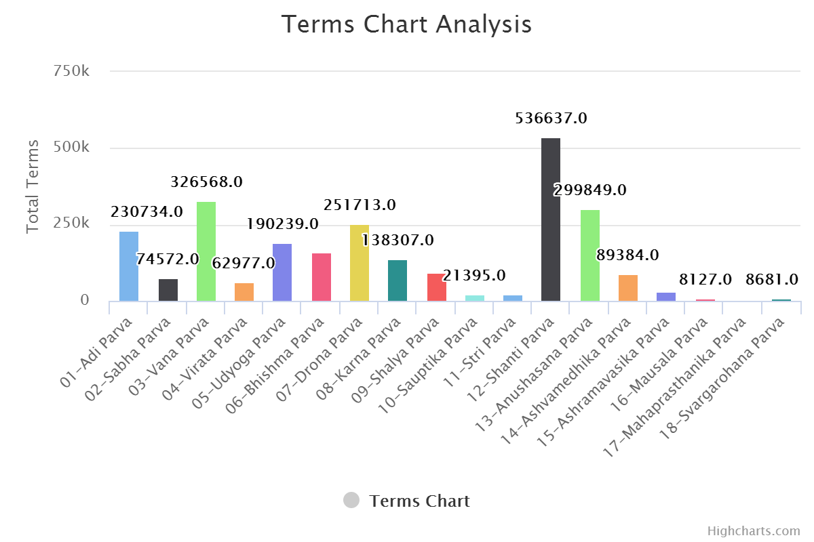

For Unique Terms: 


For Unique Terms per Terms 

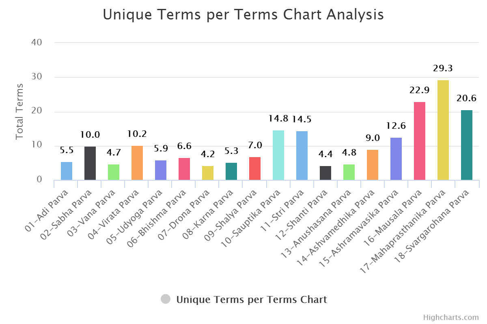

What next? Let’s do the sentiment analysis of all this books and compare them with each others.

## Sentiment Analysis

### Whaaat?

Analysis done to find out the tone of given text. Here we are having books. Basically using this we can find out that books is more joyful to read or tilted towards sadness. How many surprise elements book do have. It is useful to understand conversation, if it is more towards positive end or negative end.

### Coding bits

It will make more sense while comparing.

As everything else in F# here we also start with type and start putting things in it. Let’s call it Book type. Because why not.

```fsharp
type SentimentInNumber = {
	Anger:float
	Anticipation:float
	Disgust:float
	Fear:float
	Joy:float
	Negative:float
	Positive:float
	Sadness:float
	Surprise:float
	Trust:float
	Word: string
}

type Word = {
	Term :string
	Rating : int
}


type Book = {
	Name : string
	Text : string
	UniqueTerms : Set<string>
	Terms : string []
	UniqueTermsWithFrequency : (string * int) []
	SentimentIndex : SentimentInNumber
	WordsRating : Word []
}
```	

Now, for a second keep this aside. We need more details or here data to find out sentiments. Data with which we can compare our book terms. So, we will be using two data sets. For emotions we will be using [this](http://saifmohammad.com/WebPages/NRC-Emotion-Lexicon.htm) and for positive / negative ratings we will be using [this](http://www2.imm.dtu.dk/pubdb/views/publication_details.php?id=6010).

Here are what they look like.

Emotion Lexicon: 

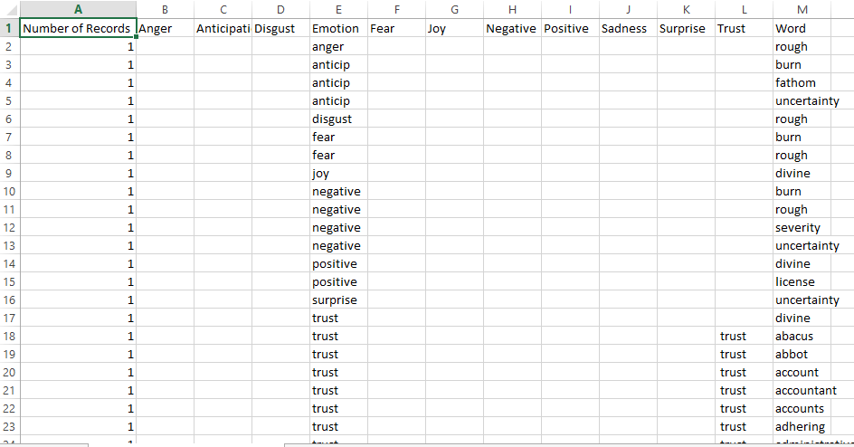

And Word with Ratings: 

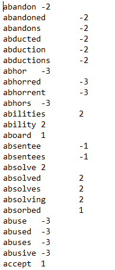

Traditional way to pull data out of CSV file is `for -> for -> for` loops. But we are in F# land, we will be using csv Type Provider. Let’s pull data out of CSV and shape it in types.

```fsharp
let sentimentCSVPath = Path.Combine(__SOURCE_DIRECTORY__, "..","data/Basic_Emotions_(size_is_proportional_to_number_of__data.csv")
type SentimentCsv = CsvProvider< "../data/Basic_Emotions_(size_is_proportional_to_number_of__data.csv">

let SentimentData = SentimentCsv.Load("../data/Basic_Emotions_(size_is_proportional_to_number_of__data.csv")

type SentimentInNumber = {
	Anger:float
	Anticipation:float
	Disgust:float
	Fear:float
	Joy:float
	Negative:float
	Positive:float
	Sadness:float
	Surprise:float
	Trust:float
	Word: string
}

let sentimentCalculate (anger,anticipation, disgust,emotion,fear, joy, negative, positive, sadness, surprise, trust, word) =
	let a = {
		Anger = stringToNum anger
		Anticipation = stringToNum anticipation
		Disgust = stringToNum disgust
		Fear = stringToNum fear
		Joy = stringToNum joy
		Negative = stringToNum negative
		Positive = stringToNum positive
		Sadness = stringToNum sadness
		Surprise = stringToNum surprise
		Trust = stringToNum trust
		Word = word
	}

	match emotion with
	| Anger -> if a.Anger = 0. then {a with Anger = 1.} else a
	| Anticipation -> if a.Anticipation = 0. then {a with Anticipation = 1.} else a
	| Disgust -> if a.Disgust = 0. then {a with Disgust = 1. } else a
	| Fear -> if a.Fear = 0. then {a with Fear = 1.} else a
	| Joy -> if a.Joy = 0. then {a with Joy = 1.} else a
	| Negative -> if a.Negative = 0. then {a with Negative = 1.} else a
	| Positive -> if a.Positive = 0. then {a with Positive = 1.} else a
	| Sadness -> if a.Sadness = 0. then {a with Sadness = 1.} else a
	| Surprise -> if a.Surprise = 0. then {a with Surprise = 1.} else a
	| Trust -> if a.Trust = 0. then {a with Trust = 1.} else a
	| _ -> a

let allSentimentsInNumber =
	SentimentData.Rows
	|> Seq.map (fun row ->
		sentimentCalculate (
				row.Anger,
				row.Anticipation,
				row.Disgust,
				row.Emotion,
				row.Fear,
				row.Joy,
				row.Negative,
				row.Positive,
				row.Sadness,
				row.Surprise,
				row.Trust,
				row.Word
				))
let SentimentWordsSet = allSentimentsInNumber |> Seq.map (fun row -> row.Word) |> set
```

Here is the thing about this data. Emotion column is also specifying the emotion, not always but they are there. So, we need them too. That is reason for that extra calcution we are doing. Here for every emotion found we are adding 1 else it is 0.

If you can see I am not comparing with string but with concrete F# term. It is because in data we are having “anticip” for “anticipation”. Now, in future if we add another data to this collection and they have “anticipation” then it will add extra case for same result. So, it would be better to encapsulate them away. And clean way to do that using Active patterns.

Here is missing piece of code.

```fsharp
//Active Pattern for Sentiments
let (|Anger|_|) input =
	if input = "anger" then Some Anger else None
let (|Anticipation|_|) input =
	if input = "anticip" then Some Anticipation else None
let (|Disgust|_|) input =
	if input = "disgust" then Some Disgust else None
let (|Fear|_|) input =
	if input = "fear" then Some Fear else None
let (|Joy|_|) input =
	if input = "joy" then Some Joy else None
let (|Negative|_|) input =
	if input = "negative" then Some Negative else None
let (|Positive|_|) input =
	if input = "positive" then Some Positive else None
let (|Sadness|_|) input =
	if input = "sadness" then Some Sadness else None
let (|Surprise|_|) input =
	if input = "surprise" then Some Surprise else None
let (|Trust|_|) input =
	if input = "trust" then Some Trust else None
```

As we are having more than 7 cases, we will be using partial Active Patterns and join them in match statement.

Same can be done for word with Positive and Negative ratings.

Here is code for same.

```fsharp
type Word = {
	Term :string
	Rating : int
}

let WordList =
	Path.Combine(__SOURCE_DIRECTORY__, "..", "data/AFINN/"+ "AFINN-111" + ".txt")
	|> File.ReadAllLines
	|> Array.map (fun x ->
					x.Split '\t' |> (fun b -> {Term = b.[0]; Rating = System.Int32.Parse b.[1]})
					)
```
						
Great. Now stage is set to convert books made of terms to books made of numbers. Let’s create for one book and then we will loop it for our array.

```fsharp
let create (bookname:string) (booktext :string) =
	let terms = Terms booktext
	let termsCount = terms.Length |> float
	let termsWithFrequency = UniqueTermsWithFrequency terms
	let uniqueTerms = termsWithFrequency |> Array.map (fun (x,_) -> x)

	{
		Name = bookname
		Text = booktext
		UniqueTerms = uniqueTerms |> set
		Terms = terms
		UniqueTermsWithFrequency = termsWithFrequency
		SentimentIndex =
			let commonEmotions = uniqueTerms |> set |> Set.intersect SentimentWordsSet
			let commonEmotionsCount = termsWithFrequency
										|> Array.filter(fun (x,_) -> commonEmotions.Contains x)
										|> Array.map (fun (_,y) -> y) |> Array.sum |> float
			let commonEmotionsInNumber = allSentimentsInNumber |> Seq.filter (fun x -> commonEmotions.Contains x.Word) |> Seq.toArray
			let r = commonEmotionsInNumber |> Array.fold (SentimentSum bookname) ZeroSentiment

			{ r with
				Anger = (r.Anger/commonEmotionsCount) * 100.
				Anticipation = (r.Anticipation/commonEmotionsCount) * 100.
				Disgust =(r.Disgust/commonEmotionsCount) * 100.
				// Emotion = (r.Emotion)
				Fear = (r.Fear/commonEmotionsCount) * 100.
				Joy = (r.Joy/commonEmotionsCount) * 100.
				Negative = (r.Negative/commonEmotionsCount) * 100.
				Positive = (r.Positive/commonEmotionsCount) * 100.
				Sadness = (r.Sadness/commonEmotionsCount) * 100.
				Surprise = (r.Surprise/commonEmotionsCount) * 100.
				Trust = (r.Trust/commonEmotionsCount) * 100.
			}
		WordsRating =
			let commonWords =
				WordList
				|> Array.map (fun x -> x.Term)
				|> set
				|> Set.intersect (uniqueTerms |> set)
			WordList
			|> Array.filter (fun a -> commonWords.Contains a.Term)
	}
```

Single function and it’s done. That’s it. What we are doing in that? Creating our Book type.

Terms and Unique Terms were extracted away.

```fsharp
let Terms (input:string)=
		input
		|> (fun x -> x.Split ' ')
		|> Array.map (removeSpecialChars >> (fun x -> x.Trim()))
		|> Array.filter (fun x -> x <> "")

let UniqueTermsWithFrequency (input:string[])=
		input
		|> Array.countBy id
```
			
Little bit complicated looking part is where we are trying to find `Sentiment Index` for book. So, first step is clean up the word set. That is the reason we are using unique terms. All terms are not present in data set we are having. So, there is need to take common terms. Again no more loops and conditions. They are two sets we need common terms so just intersect it. One line without performance over head. Now find out Sentiment details for that word and to get for book just fold it and do the sum of it. Done.

```fsharp
let ZeroSentiment = {
	Anger = 0.
	Anticipation = 0.
	Disgust =0.
	Fear = 0.
	Joy = 0.
	Negative = 0.
	Positive = 0.
	Sadness = 0.
	Surprise = 0.
	Trust = 0.
	Word = String.Empty
}

let SentimentSum word a b =
	{
		Anger = a.Anger + b.Anger
		Anticipation = a.Anticipation + b.Anticipation
		Disgust = a.Disgust + b.Disgust
		// Emotion = a.Emotion + b.Emotion
		Fear = a.Fear + b.Fear
		Joy = a.Joy + b.Joy
		Negative = a.Negative + b.Negative
		Positive = a.Positive + b.Positive
		Sadness = a.Sadness + b.Sadness
		Surprise = a.Surprise + b.Surprise
		Trust = a.Trust + b.Trust
		Word = word
	}
```
		
So, we are having all the data in memory. In our case in FSI / REPL.

As we are official data scientist we required that we see things in Graph format. So, first let’s conver things to JSON and write to disk so we can use it.

```fsharp
module Utility =
	let JsonDropPath name =
		Path.Combine (__SOURCE_DIRECTORY__, "..", "docs/js/" + name + ".json")
	let dataToJSONFile (fileName : string)(data :'a) =
		let path = JsonDropPath fileName
		use writer = new StreamWriter(path)
		let txt = data |> Compact.serialize
		writer.WriteLine (txt)
```
			
Here I am using [Fsharplu.Json](https://github.com/Microsoft/fsharplu/wiki/fsharplu.json), do check their [project story](https://blogs.msdn.microsoft.com/dotnet/2016/12/13/project-springfield-a-cloud-service-built-entirely-in-f/).

Now, once JSON is ready we can easily use to show in graph using any graph library.

*Here I did little cheating and wrote some dirty JavaScript. A good practise would be to write code in [Fable](http://fable.io/). So, I will not show code of JavaScript part.*

You can find book wise graphs here and transformed analysis here which is sentiment wise. Or Check out few of them below.

Book Wise:

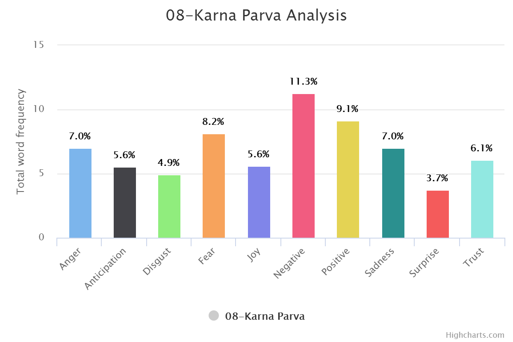

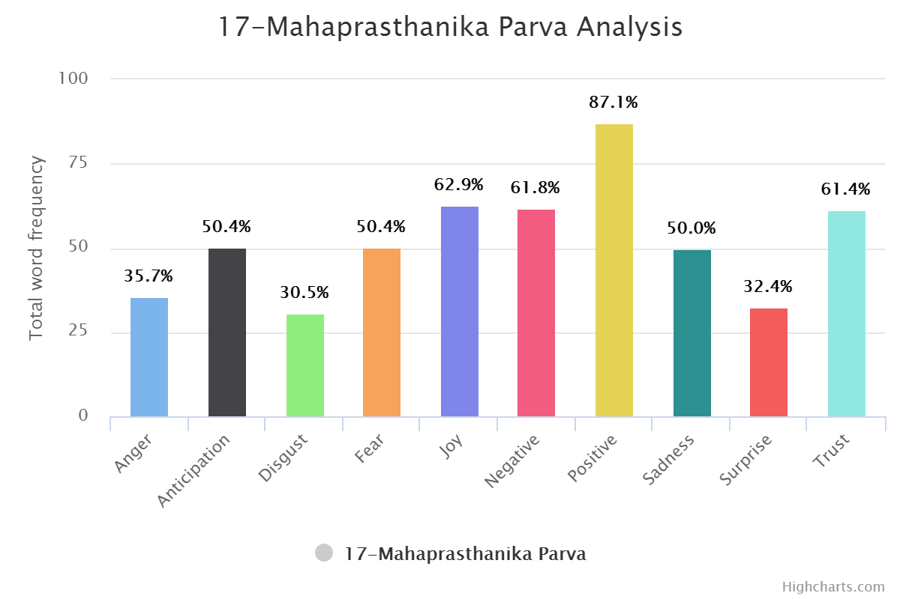

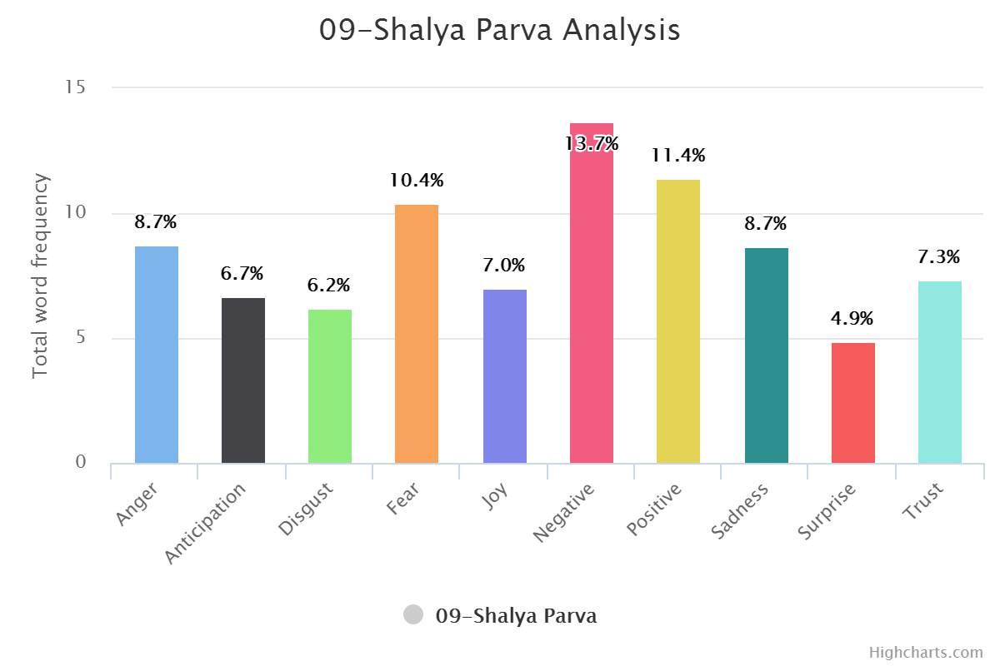

Sentiment Wise:

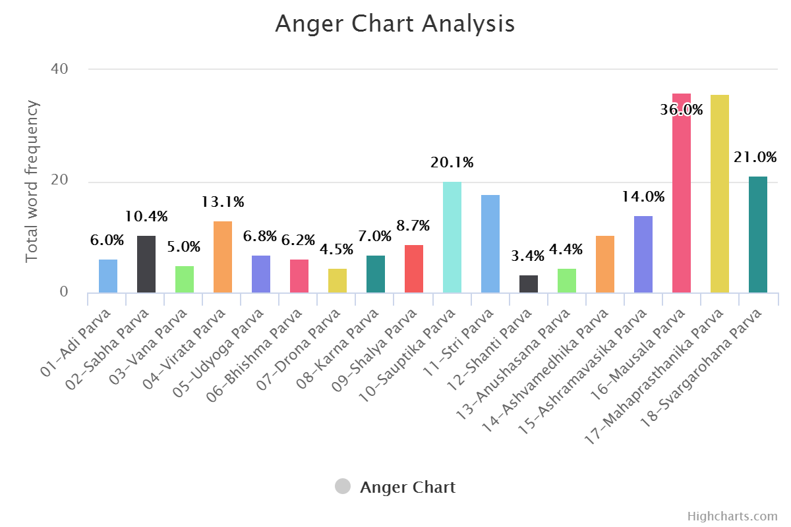


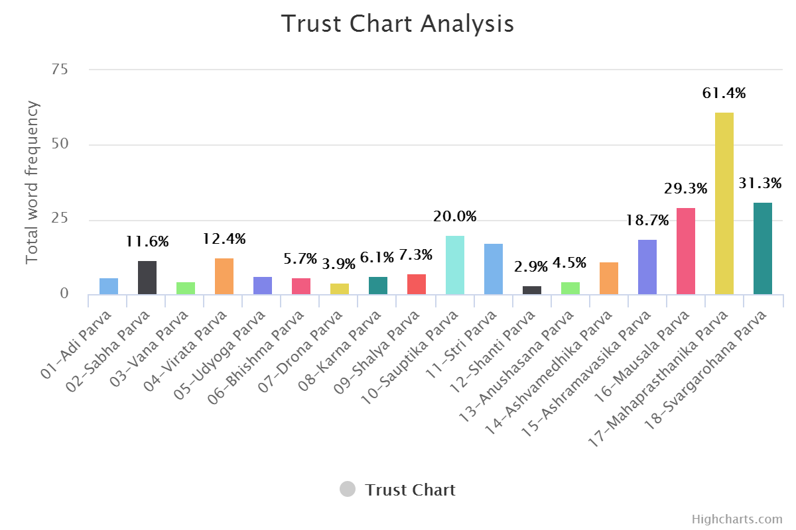


Same can be done for positive and negative word set. (DYI for you.)


## Reading the Graphs & Experience

One thing needed to be understand here. Data set are created by human, code is written by human and code is executed by dumb computer. So, there is and always will be little bit manual tweaking. As language is topic with perception. One need to understand culture / history of those words from where they are coming. Graphs should be read in that context only. Let me put an example here.

Check out word frequency graph [here](http://kunjan.in/mahabharata/word-frequency). Pick any graph. Here I am taking three graphs to compare.

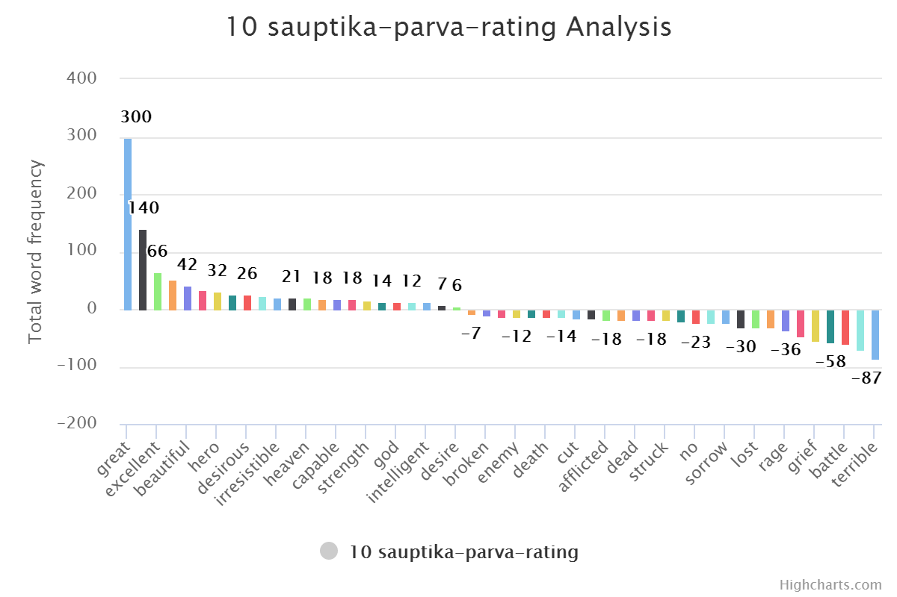

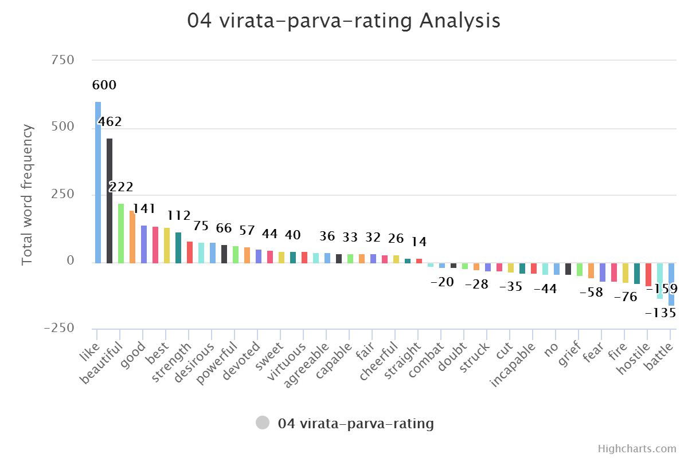

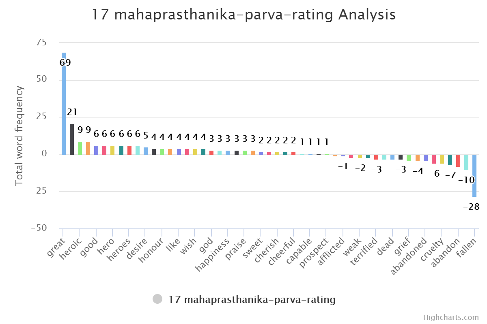


“Great” would be always first. And “Fire” will come in last five always. In normal western literature “Great” word used as adverb for person or thing. But in Indian or Mahabharata context they use it to address someone. Like `"Hey, Great worrier Arjuna"`. A poetic way of saying things. Looks good but also make word totally useless in context of understanding phrase. This issue can be solved with Inverse Document Frequency but again it is an extra effort. Same goes for word “Fire”. It is having negative value in normal context but in this specific context it is not that negative. Fire God and Fire it self (yagna) are positive. It is very much contextual.

But again generating graph is much more data sciencey to explain.

## What’s Next

Next step would be doing more detailed analysis of this Epic. Compare number / analysis with original context of books. Try to push number as near as possible to words. And probably extract some good NLP library from it.

All books are divided in sub-books [telling different stories](http://kunjan.in/mahabharata/index). Wiki links are added in Table list. If you are interested then check them out.

[Complete script file for this article is available over github](https://github.com/kunjee17/mahabharata/blob/master/Mahabharata/Lesson1.fsx).

Download your favourite books and have fun with graphs.

## Thanks Note

Special Thanks to people without whom this project may not exist.

[Rachel Reese](http://rachelree.se/) - For arranging this season of [Mentorship program](http://fsharp.org/mentorship/).

> Mentorship program : In simple words. It is a program where Mentor and Mentee are tagged with each other. And they have hour / week to teach / learn some topic specific to F#. As highly technical people things looks little old school but the effect that flesh and blood can create nothing else can. No books or no recorded videos. 45 - 60 minutes can cover more than one can cover in month or two using deal material. It is always good to have someone there alive in front of you whom you can ask questions. Again that is all my preference and what I like about this program.

[Andrea](http://www.roundcrisis.com/) - For last season of Mentorship program.

**My lovely fiancée for not only allowing me but also encouraging me to give extra time to this.**

[Saheb](https://twitter.com/tirthpandya) to be my phone a friend for any kind of machine learning and data science queries.

[Devdutt](http://devdutt.com/), my current favourite mythologist. Author of two of my favourite books [Jaya](http://devdutt.com/books/jaya-3.html) and [My Gita](http://devdutt.com/books/my-gita.html) in this genre

## Note to my Mentor

Words can’t explain how much grateful I am to have [Evelina Gabasova](http://evelinag.com/) as my mentor or may be guru would make much more sense in current context. After a long time I can have kid’s curiosity and innocence to ask anything and everything to her. And she is always there with answer and ever smiling face. Always pushing extra mile to beat the time zone differences.

In Mahabharata, Krishna narrate Gita to Arjuna in middle of war field; empowering him with eternal knowledge. Just like that,

> Hey, **Great Evelina**, I am no Arjuna but you are always been my Krishne. Guiding my way in the flood of data. It is always good to have you around. Be as mentor and as friend. Please be there always.

## Closing

I like to close with few of my favourite picture describing war moments of Mahabharata

**Krishna narrating Gita to Arjuna**


**Krishna driving Arjuna in war field**


**Krishna, Arjuna and Bhisma three great warriors but helpless in front of time (situation)**

