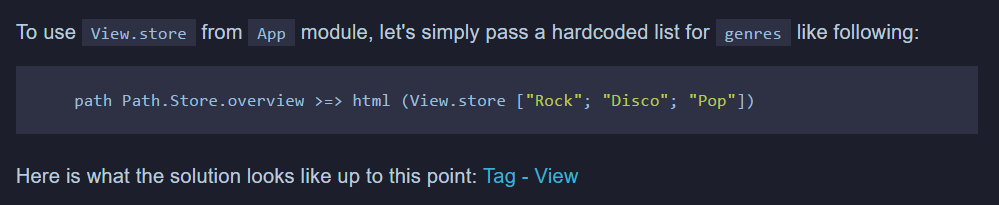
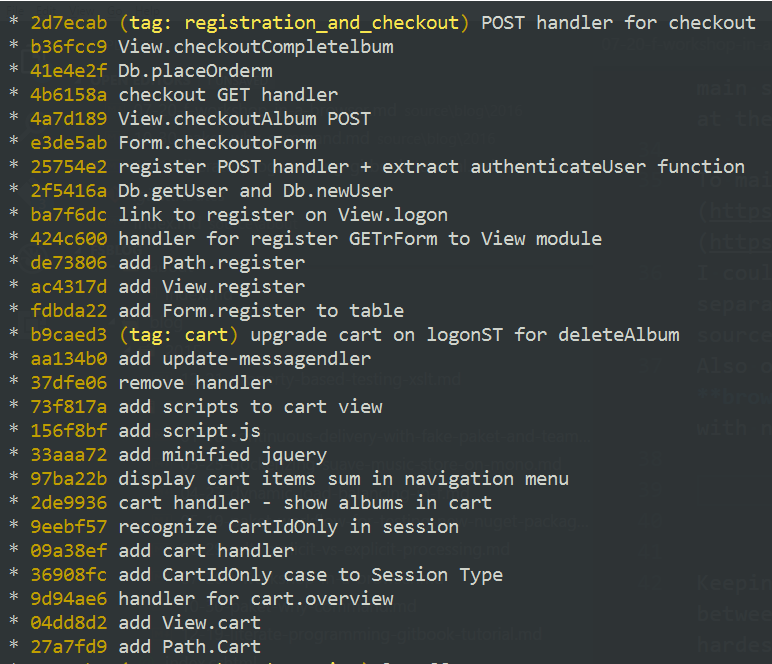
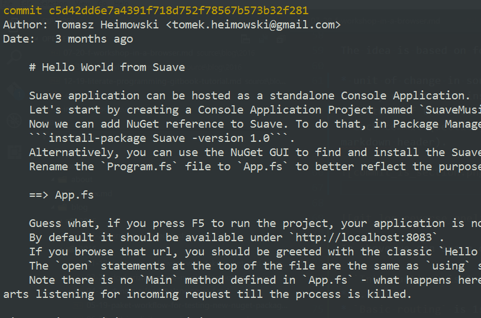
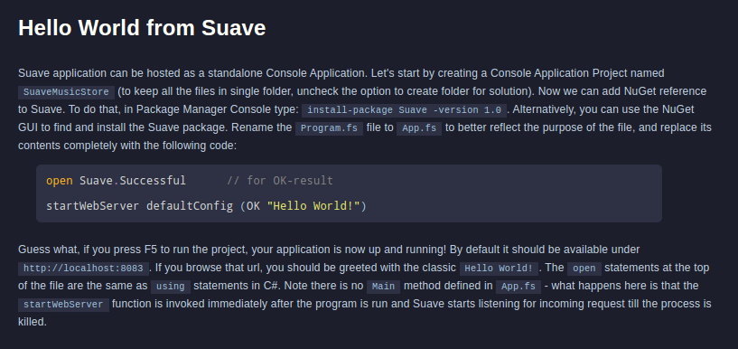
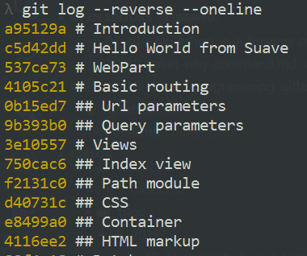
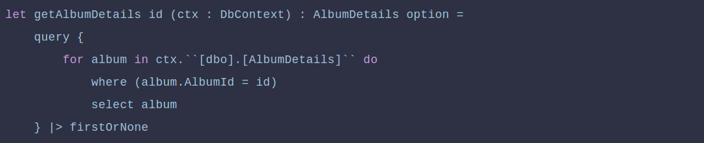
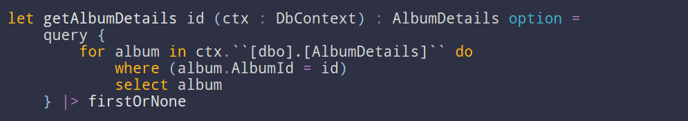
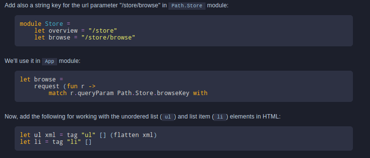
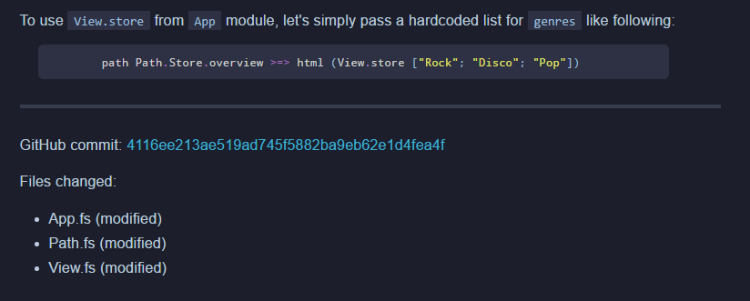
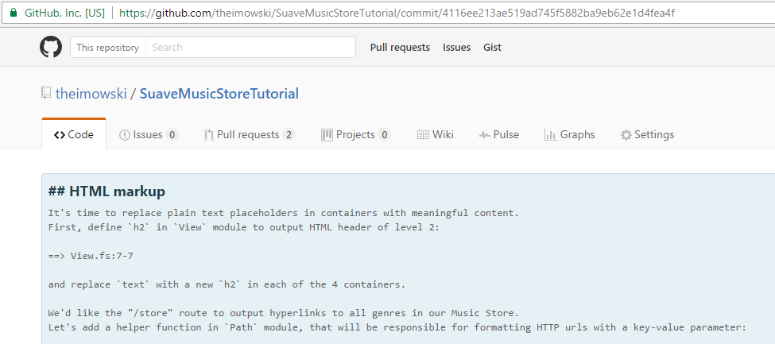




# Creating a tutorial from Git repo #

*All text and code copyright (c) 2016 by Tomasz Heimowski. Used with permission.*

*Original post dated 2016-12-19 available at http://theimowski.com/blog/2016/12-19-creating-a-tutorial-from-git-repo/index.html*

**By Tomasz Heimowski**

What if author of a programming book could maintain his content and related code in the same place? In this entry I'll share with you my experimental idea for code-heavy F# tutorials.

*This post is part of the F# Advent Calendar 2016 initiative - make sure to go check out rest of posts as well. I'd like to thank Sergey Tihon for organising F# Advent. Previous edition of the event gave birth to this blog, encouraging me to write [my first post ever].*

## Motivation

More than a year ago, as part of my master thesis I've written [Suave Music Store tutorial](https://www.gitbook.com/book/theimowski/suave-music-store). To my delight, this [GitBook](https://www.gitbook.com/) turned out to be a pretty good starting point for developers wanting to learn [Suave](https://suave.io/) for web development. As I'm not probably the best technical writer, I was wondering what could have made this resource that successful. I arrived at a conclusion, that what was special about format of this tutorial when compared to other tutorials available on web was the **close connection of source code to content**, which guided step-by-step, change-by-change through the process of creating a web app.

What did this mean in practice? Let's have a look at following example from tutorial:



In addition to thorough explanation of every single change, I included (at the end of each main section) a hyperlink to git tag pointing to GitHub **commit** with state of the codebase at the exact point of tutorial. Thanks to this, the reader could have a look at original sources in case he got stuck during his experiments.

To maintain the tutorial I decided to keep track of two separate repositories: [first](https://github.com/theimowski/SuaveMusicStore) for the source code of the app, and [second](https://github.com/theimowski/SuaveMusicStoreTutorial) for the GitBook tutorial content. I could have probably done the same with a single git repository, however then I'd go for separate branches for source and content so that I could easily make distinction between source and content related changes. Also one of my main goals was to enable the reader go checkout the source repository and **browse through the commit history**, so I had to keep the history as clean as possible, with no junk commits in between.



As seen in above screenshot, git commit history for the source repository was linear, with few changes between commits so that the reader could easily check it out (or `git checkout it` ಠ⌣ಠ).

Keeping sync between those two repos wasn't very convenient. While copying pieces of code between source and content or fixing typos were rather kind of usual activities, one of the hardest issue to deal with was **amending the source code**. To ensure my initial goal of allowing reader to browse through each commit, I had to overwrite remote git history, which meant the (in)famous `git push --force`, as well as recreating proper git tags, so that the hyperlinks pointed to right commit.

I initially based the tutorial on **Suave 0.28.1**, which back then was the latest version. When **Suave 1.0** got released, I wanted to update the content accordingly. I even got [help](https://github.com/theimowski/SuaveMusicStoreTutorial/pull/11) from the OSS community to do so, but then I got back to the problem of sync with source code git history. What I ended up was a new git branch which I **rebased** in [interactive mode](https://git-scm.com/docs/git-rebase#git-rebase---interactive) from the root commit of source code repository. This required quite a lot effort, but I managed to retain my original goal.

Now that **Suave 2.0** is close to its stable release, I'd like to start works on and publish new version of the tutorial. To help me deal with my authoring problems, I figured out a **rather unusual idea**, which I'm going to describe in this entry.

*Note: The idea is still a work in progress, and I'm not even sure where it goes. It might happen that I decide at certain point that the solution isn't as awesome as I thought it could be and drop it completely. Anyways I thought it can be worth sharing with public. Feedback can really do a great job, so feel free to leave your comments.*

## The idea

The idea is based on following assumptions:

* unit of change in sources, a **git commit** maps to a single section (or nested subsection) of tutorial,
* every commit contains only those changes that are described in corresponding (sub)section,
* content of the section is stored in **commit message**, formatted in markdown,
* each commit (section) starts with a header, and the nesting level is determined by count of `#` (which corresponds to markdown header).



Example: "Hello World from Suave" commit



Example: "Hello world from Suave" section

From the above example we can see how "Hello world from Suave" section is a one-to-one mapping of a git commit to tutorial content.



In above we can see a one-line log from the repository showing headers of the sections:

* "Introduction" is 1st level section
* "Hello world from Suave" is 1st level section
* "WebPart" is 1st level section
* "Basic routing" is 1st level section
* "Url parameters" is 2nd level subsection
* "Query parameters" is 2nd level subsection
* ... and so on ...

To prototype this idea, I've extracted couple of sections from the tutorial and tried to recreate them on a separate branch, with earlier assumptions in mind.

A preview of tutorial created in this manner can be viewed [here](https://theimowski.gitbooks.io/suave-music-store/content/v/test/). There are a couple of sections there from the original tutorial (still based on Suave v1.0). I've played around the bits and tried to utilize the fact that I have a fully-fledged Git repository underneath the tutorial.

## Literal Programming

Presented idea might seem related to the concept of Literal Programming. In F# world, Literal Programming is often associated with [FSharp.Formatting](https://tpetricek.github.io/FSharp.Formatting/literate.html) library maintained by [Tomas Petricek](http://tomasp.net/). Indeed, the library can be embraced for providing already well-known syntax highlighting which is better and looks nicer than the standard offered by GitBook website:



Standard GitBook syntax highlighting for F#



FSharp.Formatting syntax highlighting for F#

FSharp.Formatting also includes a capability to display tooltips for F# code snippets, however I haven't yet managed to make them work properly in the preview.

What's more, code snippets **do not have to be manually kept in sync** between tutorial content and the source repositories. Instead, they can be just marked with a placeholder in a git commit:


And later expanded with corresponding lines:



Also, basing on the fact that each section corresponds to a git commit, a link to this specific GitHub commit can be generated at the end of each section. Under the link, there is also a list of files modified within this commit:



Link to specific commit on GitHub



The commit shown on GitHub

## Implementation

Now I'd like to share how the GitBook content is actually generated. For prototyping the idea I've written a FAKE script, which I run from the command line with a few parameters, the main parameter being path to the prepared repository. Eventually, if the prototype turns out successful, the script could be rearranged to a standalone executable to be run from the directory of target repository.

Moving now to the code itself:

```fsharp
let commits = 
    Git.CommandHelper.getGitResult 
        repo 
        ("log --reverse --pretty=%H " + branch)
```
		
To fetch list of commits' hashes, I used `GitHelper` from the FAKE library and pointed to a chosen branch.

```fsharp
let msg = 
    Git.CommandHelper.getGitResult 
        repo 
        ("log --format=%B -n 1 " + commit) |> Seq.toList
let firstLine = msg |> Seq.item 0
let level = max 0 (firstLine.LastIndexOf("#"))
let title = firstLine.Substring(level + 1).Trim()
```

Then for each commit, I extracted the title (first line of message), as well as rest of the message.

```
git config core.commentChar ";"
```

By default Git uses `#` character for marking a comment line within a git commit, so I've changed it to semicolon, so that I could use `#` for markdown headers.

```fsharp
msg
|> insertSnippets commit
|> insertGithubCommit commit
|> insertGitDiff commit
```

The rest of commit message gets enriched with a couple of helper functions.

```fsharp
let fileContentsAt commit file = 
    Git.CommandHelper.getGitResult repo (sprintf "show %s:%s" commit file) 

let insertSnippet (commit : string) (line : string) =
    if line.StartsWith "==> " then
        let contents, snipId = 
        match line with
        | Regex "^==> ([\w\.]+):(\d+)-(\d+)$" [file;Int32 lstart;Int32 lend] ->
            fileContentsAt commit file 
            |> Seq.skip (lstart - 1)
            |> Seq.take (lend - lstart + 1)
            |> Seq.toList, line.Substring("==> ".Length)
        | Regex "^==> ([\w\.]+)$" [file] ->
            fileContentsAt commit file 
            |> Seq.toList, line.Substring("==> ".Length)
        | _ -> 
            failwithf "invalid format '%s'" line

        // do magic with FSharp.Formatting and return formatted string
    else
        line    

let insertSnippets commit code = List.map (insertSnippet commit) code
```

To insert code snippets, I replaced all occurrences of lines starting with `==>` to the corresponding code in given file.

```fsharp
let insertGithubCommit commit code = 
    sprintf "GitHub commit: [%s](https://github.com/%s/%s/commit/%s)"
            commit
            githubAccount
            githubRepo
            commit
    |> List.singleton
    |> List.append ["";"---";""]
    |> List.append code
```
	
Given the commit hash was given, it was very easy to add a link to GitHub with that commit.

```fsharp
let numStat line =
    let split = function
    | Regex "^(\w)\s+(.*)$" [status; name] -> status,name
    | _ -> failwithf "split cannot parse: %s" line

    let human = function
    | "A" -> "added"
    | "D" -> "deleted"
    | "M" -> "modified"
    | x -> failwithf "human: %s" x

    let (stat,name) = split line
    sprintf "* %s (%s)" name (human stat)


let insertGitDiff commit code =
    let filesChanged =
        Git.CommandHelper.getGitResult 
            repo 
            (sprintf "diff %s^..%s --name-status" commit commit)
        |> Seq.toList
    
    if filesChanged = List.empty then 
        code
    else
        filesChanged
        |> List.map numStat
        |> List.append ["";"Files changed:";""]
        |> List.append code
```
		
And finally insert a list of modified source files within a single commit.

The code is available on GitHub. For lack of a better name I've named it [experimental-gitbook](https://github.com/theimowski/experimental-gitbook).

## Downsides

While the whole idea looks good, there are a few issues which make less promising:

* Any amends, be it source code or tutorial content require rebasing Git history and rewriting it on remote (which is not recommended in general),
* First bullet in turn means that there would be no easy way to contribute to the repository, as any new commit would imply a new section,
* There's no support for multi language book (commit message is currently only in English), which is really a shame taking into account fact that the tutorial has already been translated to Japanese

## Summary

In this entry I've shared with you my pre-release idea for maintaining GitBook based tutorials. Plans for nearest future are to polish the script and then use it to prepare tutorial for Suave v2.0. However, as stated above, I'm not really sure where this approach leads me to. What I'm hoping is that the idea could help me maintain the tutorial, as well as creating awesome tutorials for other F# libraries / components.

Not all the details have been shared, and I apologize for a bit of speeding (I bet you can point out a lot of quirks in above text), but I really wanted to deliver this post on time for F# Advent :-)

Till next time!