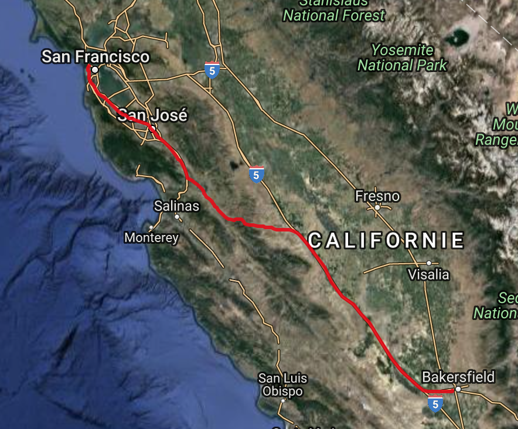
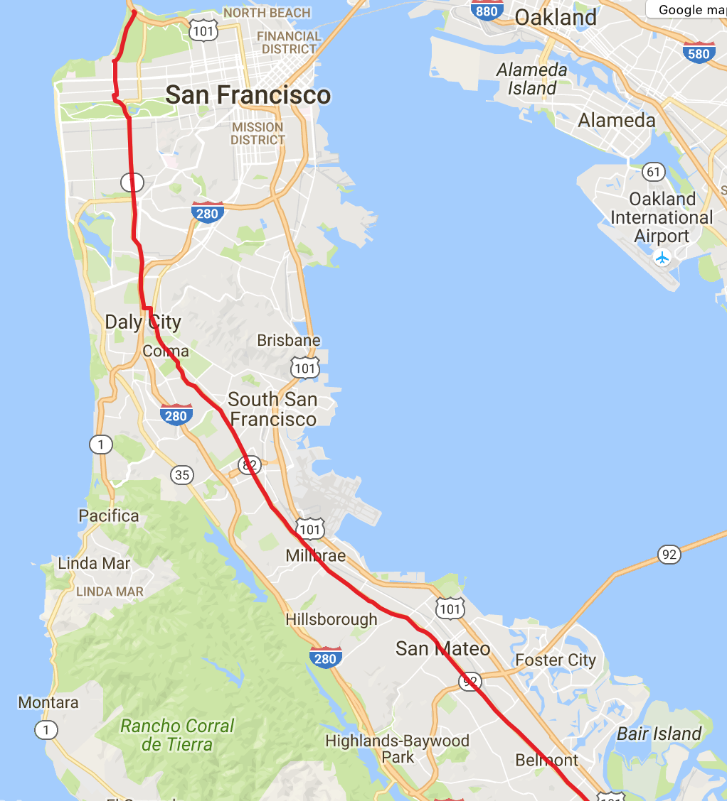
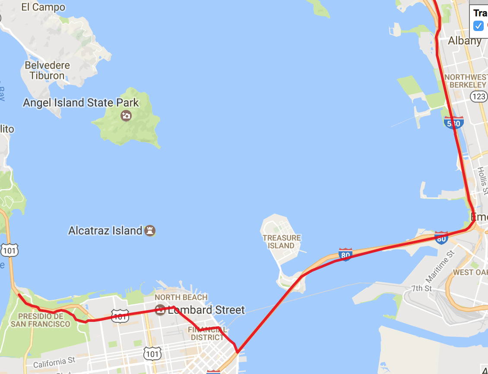




# Data structures and algorithms – helping Santa Claus find his road to San Francisco #

*All text and code copyright (c) 2016 by Tomasz Jaskula. Used with permission.*

*Original post dated 2016-12-19 available at http://jaskula.fr//blog/2016/12-19-data-structures-and-algorithms-helping-santa-claus-find-his-road-to-san-francisco/index.html#*

**By Tomasz Jaskula**

It's almost a Christmas time and very soon Santa Claus will pull out his sleigh along with the herd of reindeers. But how his gonna find his way to all the places he is supposed to visit? Well, asuming his not going to buy any GPS device we will try to help him out writing the shortest path algorithm from scratch with the underlying data structures. The goal of this article is to understand the nitty-gritty details about the algorithms and underlying data structures and not how to write code in functional style. That's why I'm not going to use the functional data structures and style (most of the time) but bear with me, this is just to set everyone one on the same page and give the basic understanding of the topic. I want also to give some intuition about the choices that has been made in terms of running time and space complexity.

I mentioned Santa Claus but what about San Francisco? To check the correctness of my algorithm I wanted to run it against the real datasets with millions of nodes and edges. I googled for some public datasets and found the ["9th DIMACS Implementation Challenge - Shortest Paths"](http://www.dis.uniroma1.it/challenge9/competition.shtml) California and Nevada large road networks datasets. Perfect for the task at hand. So let's say Santa Claus has to find his way to Golden Gate Bridge in San Francisco from any point in California and Nevada. Of course following the roads on his sleigh (yeah, this kills the whole magic).

## The shortest path algorithm (part I)

The road network can be seen as the big graph of nodes connected by the edges. As many of you know, the most popular algorithm to find the shortest path between two nodes in a graph is Dijkstra algorithm. The algorithm exists in many variants; Dijkstra's original variant found the shortest path between two nodes, but a more common variant fixes a single node as the "source" node and finds shortest paths from the source to all other nodes in the graph. This is the approach I'm going to use in this article.

Let's look at the example from [Dijkstra algorithm](https://en.wikipedia.org/wiki/Dijkstra's_algorithm) wikipedia page:


From the animated image above we see that the "source" node **a (1)** is fixed and distances are calculated to each node in the graph. The shortest path to the destination node **b (5)** is calculated and is equal to 20. It passes through the nodes **3** and **6** which is the shortest path indeed.

### The pseudo code

The pseudo code of Dijkstra algorithm looks something like this:

```
initialize graph
initialize Q // some structure to store the grpah nodes
Q.insertAll(graph.getVertices())

while (pq is not empty)
  node = Q.extract_minimum() // this determines the speed of the algorithm
  edges = node.getEdges()

  for all edges {
    destination = edge.getDestination()
    newDistance = edge.getLength() + node.getDistance()
    if (newDistance < destination.getDistance()) {
      destination.setShortestDistance(newDistance)
      Q.decrease_key(destination) // this also determines the speed of the algorithm
```
	  
When inserting the graph into the structure `Q` the starting node's shortest distance is set to `0.0` while the other nodes' shortest distances are set to `infinity`. Remove from the `Q` the min element and explore all of it's edges. Compare the shortest distances with all adjacent nodes and if any distance is less than the shortest distance on the current node, update adjacent node shortest distance inside the `Q`. Continue until `Q` is not empty. Nodes which got no edges will finish with the shortest distance of infinity because it is not possible "get to them" from the starting node. However, they will be still removed from the `Q`.

### The running time

The original variant of the algorithm uses **linked list** or an **array** to store all the nodes of the graph. The **extract_minimum** operation is simply a linear search through all nodes (vertices) in `Q` and in that case the running time is *O(|V|<sup>2</sup>)* where *|V|* is the number of nodes (vertices).

Depending on how `Q` is implemented the running time can be *O(|E|·T<sub>dk</sub> + |V|·T<sub>em</sub>)* where T<sub>dk</sub> and T<sub>em</sub> are the complexities of the **decrease_key** and **extract_minimum** operations in `Q` respectively.

Now that we have a basic understanding on how the Dijkstra shortest path algorithm works we need to implement our data structure `Q`. One of the approaches of speeding up the algorithm is to use a "Priority Queue" and that is what I'm going to implement next.

## Priority Queue

What is a Queue? A queue is an abstract data type supporting two operation `Enqueue` to the rear of the collection of elements and `Dequeue` from the front of the collection of elements. This makes it a FIFO data structure, the first element added to the queue will be the first one to be removed.

What is a Priority Queue? A priority queue is a generalization of a queue where each element is assigned a priority and elements come out in order by priority.

Typical uses cases are:

* Scheduling jobs
* Dijkstra’s algorithm: finding a shortest path in a graph
* Prim's algorithm: constructing a minimum spanning tree of a graph
* Huffman's algorithm: constructing an optimum prefix-free encoding of a string
* Heap sort: sorting a given sequence

Supported operations:

* `Insert(p)` adds a new element with a priority p.
* `Extract()` extracts an element with the minimum or maximum priority (depending if it's a Min or Max priority queue)

For simplicity I'm using in my code `Enqueue` and `Dequeue` respectively.

Additionally other operations like `TryDequeue()`, `Delete(element)` and `ChangePriority(p)` can be implemented.

### Naive implementation considerations

If the priority queue is implemented with **unsorted array/list**, what are the costs of different operations?

* `Enqueue(e)` adds `e` to the end. Running time *O(1)*
* `Dequeue()` scans the array/list for the min/max element. Running time *O(n)*

If the priority queue is implemented with **sorted array**, what are the costs of different operations?

* `Enqueue(e)` finds a position for `e`  *O(logn)* by using binary search, shift all elements to the right of it by 1 *O(n)*, insert `e` *O(1)*. Running time *O(n)*
* `Dequeue()` Extracts the last element. Running time *O(1)*

If the priority queue is implemented with **sorted list**, what are the costs of different operations?

* `Enqueue(e)` finds a position for `e` *O(n)* cannot use binary search, insert `e` *O(1)*. Running time *O(n)*
* `Dequeue()` Extracts the last element. Running time *O(1)*

Is there a better data structure? Yes, **binary heap**

* `Enqueue(e)` Running time *O(logn)*
* `Dequeue()` Running time *O(logn)*

### Priority Queue with Binary Heap

Binary max-heap is a binary tree (each node has zero, one, or two children) where the value of each node is at least the values of its children. In other words, for each edge of the tree, the value of the parent is at least the value of the child. Binary min-heap is the other way round.

My implementation should support the following operations

* `TryDequeue()` Returns the root element without removing the node. Running time *O(1)*
* `Enqueue e` Attach a new node to any leaf. This however my violate the heap property. To fix this we let the new element to `siftUp`.
* `private siftUp i` it swaps the problematic node (indexed `i`) with its parent until the property of the heap is satisfied. Invariant: heap property is violated on at most one edge. This edge gets closer to the root while sifting-up. Running time *O(H)* where *H* is the height of the tree.
* `Dequeue()` replace the root with any leaf but again this may violate the heap property. To fix it, we let the problematic node siftDown.
* `private siftDown i` it swaps the problematic node with larger child until the heap property is satisfied. We swap with the larger child which automatically fixes one of the two bad edges. Running time *O(H)* where *H* is the height of the tree.

As most of the operations works in time *O(H)* where *H* is the height of the tree, we definitely want a tree to be shallow.

How to keep a tree shallow? Making it a complete binary tree. A binary tree is complete if all its levels are filled except possibly the last one which is filled from left to right. *	**The first advantage** is that a complete binary tree with *n* nodes has height at most *O(log⁡n)*. The **second advantage** is that it can be easily stored as array. How to find the **parent**, **leftChild** and **rightChild** of the node stored in array? This is the simple formulas for 0-based indexed array:

```fsharp
let parent i = (i - 1) / 2
let leftChild i = 2 * i + 1
let rightChild i = 2 * i + 2
```

This is the mutable implementation of priority queue using `System.Collections.Generic.List<'T>` (which is baked by an array):

```fsharp
type PriorityQueue<'T when 'T : comparison>(values: seq<'T>, isDescending: bool) =
    let heap : System.Collections.Generic.List<'T> = System.Collections.Generic.List<'T>(values)

    let isGreater x y =
        if isDescending then x > y else x < y

    let isLower x y = not (isGreater x y)

    let mutable size = heap.Count

    let shrinkHeap() =
        let shouldShrink = size < heap.Count / 2
        if shouldShrink then heap.RemoveRange(size, heap.Count - size - 1)

    let parent i = (i - 1) / 2
    let leftChild i = 2 * i + 1
    let rightChild i = 2 * i + 2

    let swap i maxIndex =
        let temp = heap.[i]
        heap.[i] <- heap.[maxIndex]
        heap.[maxIndex] <- temp

    let siftUp i =
        let mutable indx = i
        while indx > 0 && isLower heap.[parent indx] heap.[indx] do
            swap (parent indx) indx
            indx <- parent indx

    let rec siftDown i =
        let l = leftChild i
        let r = rightChild i
        let maxIndexLeft = if l < size && isGreater heap.[l] heap.[i] then l else i
        let maxIndex = if r < size && isGreater heap.[r] heap.[maxIndexLeft] then r else maxIndexLeft
        if i <> maxIndex then
            swap i maxIndex
            siftDown maxIndex
        else ()

    let build() =
        for i = size / 2 downto 0 do
            siftDown i

    do build()

    new (values) = PriorityQueue<'T>(values, true)
    new () = PriorityQueue<'T>([], true)

    member this.IsEmpty = size = 0

    member this.Count = size

    member this.Dequeue() =
        if this.IsEmpty then raise (new Exception("No more elements to dequeue"))
        let result = heap.[0]
        heap.[0] <- heap.[size - 1]
        // we limit the boundary but the last element stays in memory
        // we could use heap.Remove but it's O(n) operation so too slow
        size <- size - 1
        shrinkHeap()
        siftDown 0
        result

    member this.Enqueue p =
        if heap.Count = size then
            heap.Add(p)
        else
            heap.[size] <- p
        size <- size + 1
        siftUp (size - 1)
```

All the operations are described above. As you can see it is very simple and straightforward. The resulting implementation is:

* **Fast**: all operations work in time *O(logn)*
* **Space efficient**: elements are stored in the list. Parent-child connections are not stored but are computed on the fly.
* **Easy to implement**: just few lines of code.
* **Not functional friendly**: mutable structures can be sometimes useful, but this implementation doesn't help with functional style and immutability.

The interesting bits are the `build()` function which allows to turn an array into the heap. We repair the heap property going from bottom to top. Initially, the heap property is satisfied in all the leaves (i.e., subtrees of depth 0) then start repairing the heap property in all subtrees of depth 1. When we reach the root, the heap property is satisfied in the whole tree. Running time is *O(nlogn)* since we call `siftDown` for *O(n)* nodes. If node is already close to the leaves than sifting it down is fast.

### Benchmarking the running time

I used [BenchmarkDotNet](https://github.com/dotnet/BenchmarkDotNet) to measure the performance of my implementation and I compared it to the `FSharpx.Collections.PriorityQueue` which is a full functional data structure.

This is the test I used:

```fsharp 
let rng = Random()
let max = pown 10 9

type PriorityQueue () =
    let mutable list  : int list = []

    [<Params (2000, 20000, 200000, 2000000)>]
    member val public Length = 0 with get, set

    [<Setup>]
    member self.SetupData() =
        list <- [for i in 2..self.Length -> rng.Next(1, max)]

    [<Benchmark>]
    member self.MaxPriorityQueue () = PriorityQueue<int>(list)

    [<Benchmark>]
    member self.MaxPriorityQueueInsertingFromStart () = 
        let pq = PriorityQueue<int>()
        list |> List.iter pq.Enqueue

    [<Benchmark>]
    member self.FSharpxPriorityQueueInsertingFromStart () = 
        let pq = PriorityQueue.empty true
        let rec insertIntoPriorityQueue xs (q: IPriorityQueue<IComparable>) =
            match xs with
            | [] -> ()
            | h::tail -> insertIntoPriorityQueue tail (q.Insert(h))
        insertIntoPriorityQueue list pq

[<EntryPoint>]
let main argv = 
    (BenchmarkSwitcher[|typeof<PriorityQueue>|]).Run argv
    |> string |> printfn "%s"
    0
```
	
And here are the results:

```
BenchmarkDotNet=v0.10.1, OS=Microsoft Windows NT 6.2.9200.0
Processor=Intel(R) Core(TM) i7-3720QM CPU 2.60GHz, ProcessorCount=4
Frequency=2533316 Hz, Resolution=394.7395 ns, Timer=TSC
  [Host]     : Clr 4.0.30319.42000, 32bit LegacyJIT-v4.6.1586.0
  DefaultJob : Clr 4.0.30319.42000, 32bit LegacyJIT-v4.6.1586.0
```

  
| Method | Length | Mean | StdDev | Allocated | 
| ---- | ---- | ---- | ---- | ---- | 
| MaxPriorityQueue | 2000 | 568.6416 us | 10.9266 us | 107.1 kB |
| MaxPriorityQueueInsertingFromStart | 2000 | 687.4757 us | 1.7271 us | 123.5 kB |
| FSharpxPriorityQueueInsertingFromStart | 2000 | 423.1923 us | 10.4438 us | 167.92 kB |
| ---- | ---- | ---- | ---- | ---- | 
| MaxPriorityQueue | 20000 | 5,646.1750 us | 13.7735 us | 1.16 MB |
| MaxPriorityQueueInsertingFromStart | 20000 | 7,006.6801 us | 21.8178 us | 1.35 MB |
| FSharpxPriorityQueueInsertingFromStart | 20000 | 4,854.3166 us | 19.2608 us | 1.68 MB |
| ---- | ---- | ---- | ---- | ---- | 
| MaxPriorityQueue | 200000 | 57,873.1854 us | 302.7054 us | 11.14 MB |
| MaxPriorityQueueInsertingFromStart | 200000 | 72,939.0291 us | 573.1936 us | 13.06 MB |
| FSharpxPriorityQueueInsertingFromStart | 200000 | 104,380.8573 us | 1,036.8847 us | 16.8 MB |
| ---- | ---- | ---- | ---- | ---- | 
| MaxPriorityQueue | 2000000 | 596,396.9013 us | 3,905.1761 us | 107.11 MB |
| MaxPriorityQueueInsertingFromStart | 2000000 | 747,160.8772 us | 26,935.2538 us | 126.29 MB |
| FSharpxPriorityQueueInsertingFromStart | 2000000 | 1,537,904.5511 us | 62,809.3363 us | 168 MB |

My implementation seems to be fastest starting from 200000 elements and with 2 millions is twice as fast as `FSharpx.Collections.PriorityQueue` for enqueueing elements.

Now that I have my working implementation of priority queue, I can finally implement the shortest path Dijkstra algorithm

## The shortest path algorithm (part II)

I need some basic data structures to represent my graph of nodes. I need an `Edge`, a node that I called `Vertex` and the `Graph`.

*Note: in my implementation I use the name 'vertex' instead of 'node' but this is the same*

```fsharp
type Edge = { DestinationVertexId: int; Distance: double }

[<CustomComparison; StructuralEquality>]
type Vertex = { Id: int; ShortestDistance: double; Edges: Edge list; Path: int list }
                interface IComparable<Vertex> with
                        member this.CompareTo other =
                            compare this.ShortestDistance other.ShortestDistance
                interface IComparable with
                    member this.CompareTo(obj: obj) =
                        match obj with
                        | :? Vertex -> compare this.ShortestDistance (unbox<Vertex> obj).ShortestDistance
                        | _ -> invalidArg "obj" "Must be of type Vertex"

type Graph = { Vertices: Vertex list }
```

The `Edge` points to the destination `Vertex` and has also a `Distance`. The `Vertex` has a list of edges and the `ShortestDistance` label which will be calculated and updated according to the "source" `Vertex`. Note that the implementation of `IComparable` interface is made on that label which is logical because when dequeuing elements from the min priority queue we want to explore nodes with the shortest distance first. The `Graph` is just a list of nodes.

Let's start with the implementation following the pseudo code that I showed before. This looks something like that in F# (I'm sorry for not following the functional style but I care more about the steps of the algorithm) :

```fsharp 
let shortestPath graph destinationId =

 let pq = PriorityQueue<Vertex>(graph.GetVertices(), false)

 while not pq.IsEmpty do
    let vertex = pq.Dequeue()
    printfn "Visiting node %i - value %f" vertex.Id vertex.ShortestDistance
    for edge in vertex.Edges do
        let destinationId = edge.DestinationVertexId
        match pq.TryFind (fun e -> e.Id = destinationId) with
        | None -> ()
        | Some(indx, destination) ->
            let newDistance = edge.Distance + vertex.ShortestDistance
            if newDistance < destination.ShortestDistance then
                let newDestination = { destination with ShortestDistance = newDistance }
                pq.Update indx newDestination
            else ()
```

What is interesting that at line 15 I need to update the queue `pq.Update indx newDestination` with the new calculated `ShortestDistance` for the node. This is an operation *O(1)* because I have an index retrieved at line 10 with `pq.TryFind`. To find the index of the node in the queue I need to traverse the whole tree which is *O(|V|)* operation. Watch out, but this may cause the serious performance problems.

### Test drive on wikipedia example

Before trying my algorithm on the real world data, let's check if it's correct on wikipedia example (see the image above in "The shortest path algorithm (part I)"). We need to find the path between the node **a (1)** and **b (5)**. The value should be 20.

Running the algorithm produces the following output

```
Visiting node 1 - value 0.000000
Visiting node 2 - value 7.000000
Visiting node 3 - value 9.000000
Visiting node 6 - value 11.000000
Visiting node 5 - value 20.000000
Visiting node 4 - value 20.000000
```

The node 5 has a value of 20 which is correct. We can move to more serious step.

### Real world example: Santa Claus way to San Francisco (FAIL)

The next step is to try it on the real world data. After some googling I found interesting data used by [9th DIMACS Implementation Challenge - Shortest Paths](http://www.dis.uniroma1.it/challenge9/competition.shtml). I used California and Nevada datasets with the following properties:

* # of nodes 1 890 815
* # of edges 4 657 742

This will be more challenging that 6 node example from wikipedia. Before running the sample I made a small change to my algorithm to ease the data conversion from the data set files. I'm not using my `Graph` type but a simple `Dictionary<int, Vertex>`.

The dataset file has the following format

```
a 1 1048577 456
a 1048577 1 456
a 2 1048578 2389
a 1048578 2 2389
a 3 1048579 358
```

We can drop the first column (letter a). The second column is the starting nodeId, next column is the destination nodeId and the last column is the distance.

Here is the script loading the data from the file and converting it to the `Dictionary<int, Vertex>`.

```fsharp
let readLines filePath = System.IO.File.ReadLines(filePath)

let lines = readLines "USA-road-d.CAL.gr"

let graphMap =
    lines
    |> Seq.map (fun l -> let a = l.Split()
                         (int a.[1], int a.[2], float a.[3])) // we drop the first column
    |> Seq.groupBy (fun (f, t, d) -> f)
    |> Seq.map (fun (key, values) -> (key, values |> Seq.map (fun (k, v, z) -> z, v) |> Seq.toList))
    |> Map.ofSeq

let roadNetwork = graphMap
                    |> Map.map makeVertex
                    |> Map.fold (fun (graph: Dictionary<int, Vertex>) 
                    		_ v -> graph.Add(v.Id, v); graph) (Dictionary<int, Vertex>())
```
							
Note that all of the nodes has the `ShortestPath` set to `positiveInfinity`. Then we need to set the starting node by setting it's shortest distance to `0`.

```fsharp
let start = roadNetwork.[1215934]
roadNetwork.[1215934] <- {start with ShortestDistance = 0.0 }
```

The node number **1215934** is the following address **512 Partridge Ave, Bakersfield, CA 93309, USA**.
The destination is the node number **1598609** at the address **US-101, San Francisco, CA 94129, États-Unis Golden Gate Bridge**

Let's run the algorithm.

**Well, after maybe 30 minutes I killed the FSI because nothing happened, it was stuck somewhere and maybe the algorithm would never finish.**


Let's try to find out why. If you remember the running time of the algorithm is *O(|E|·T<sub>dk</sub> + |V|·T<sub>em</sub>)* where T<sub>dk</sub> and T<sub>em</sub> are the complexities of the **decrease_key** and **extract_minimum** operations in `Q` respectively. The `Q` is my priority queue `pq`, the **decrease_key** is the `pq.TryFind` and `pq.Update indx newDestination` all together. **Extract_minimum** is `pq.Dequeue()` but I know that this operation works in O(1) so it's not a problem. The `pq.TryFind` uses the pre-order traversal of the tree which is O(|V|). Too bad, because the running time of the algorithm is something like O(|E|·|V|+|V|). With almost 5 millions of edges and 2 millions of nodes, I'm not surprised that the algorithm has never finished.

Can we do better? Yes. It's time for the optimization

### Real world example: Santa Claus way to San Francisco (SUCCESS)

What can be improved? After some thinking here are some ideas:

1. The graph is connected so after the node has been explored we can mark it as visited and when other nodes will point to it, we simple can ignore it. So the idea is to not visit already visited nodes.
1. There may be nodes which we don't want to explore because they won't be reachable at all. Their `ShortesDistance` will be `positiveInfinity` when dequeuing so we can simply ignore it.
1. Another improvement would be to get rid of the costly `pq.TryFind` function. Why not to store nodes in a dictionary and priority queue at the same time? The dictionary would allow to fast lookup of the node and the priority queue would ensure to get the minimum node with the `ShortestDistance`. What we need is just to `pq.Enqueue newDestination` node and update it in the dictionary at the same time for further retrieval. This would be a double space complexity but that's a tradeoff
1. Another nice feature will be to track all visited nodes so we could draw a path for the Santa Claus.

Here are some improvements:

```fsharp 
let shortestPath (graph: Dictionary<int, Vertex>) destinationId =

let pq = PriorityQueue<Vertex>(graph.Values, false)
let mutable dest = Option<Vertex>.None
let visited = Dictionary<int, Vertex>()

while not pq.IsEmpty do
    let vertex = pq.Dequeue()
    if vertex.ShortestDistance <> Double.PositiveInfinity && not (visited.ContainsKey(vertex.Id)) then
        if vertex.Id = destinationId then
            dest <- Some(vertex)

        for edge in vertex.Edges do
            let destinationId = edge.DestinationVertexId
            if not (visited.ContainsKey(destinationId)) then
                let newDistance = edge.Distance + vertex.ShortestDistance
                let destination = graph.[destinationId]
                if newDistance < destination.ShortestDistance then
                    let newDestination = { destination with ShortestDistance = newDistance; Path = destination.Id :: vertex.Path }
                    pq.Enqueue newDestination
                    graph.[destinationId] <- newDestination
                else ()
            else ()
        visited.Add(vertex.Id, vertex)
dest
```

As you can see the graph is now represented with `Dictionary<int, Vertex>`. This is our structure allowing finding nodes in O(1) time. At line 9 and 15 we check that the node is not already visited, this should save some time. Also on line 9 we ignore all the nodes with **positiveInfinity**. Then on the line 20, if the shortest distance was calculated for the node, we enqueue it in the priority queue so it will be explored before nodes with **positiveInfinity** and we update on the line 21 the dictionary of nodes, so it will be easily retrieved the next time. On the line 18 when creating the `newDestination` record I'm adding to the `Path` containing all the visited nodes, the current `destination.Id` of the node. This is our tracking system of the shortest path.

Let's run the algorithm again we those improvements. We will hopefully calculate the path from Bakersfield CA to San Francisco Golden Gate Bridge!

The algorithm finished!

```
Real: 00:00:18.985, CPU: 00:00:18.968, GC gen0: 14, gen1: 13, gen2: 0
```

It's a very good improvement, from never finishing run to 18 seconds. I know that 18 seconds is maybe much for a GPS device but it's a very good start to improve. The running time is *O(|E|+|V|)* which is a way better than before.

How to know if the algorithm is correct? Well, we have tracked all the intermediate nodes (1415 nodes) on the shortest path. I have retrieved their lon lat coordinates and draw it on the google map. Here is what I have:



It's maybe not the fastest way to get from Bakersfield to San Francisco Golden Gate bridge but it seems that this can be the shortest path indeed.

Let's look more closely:



And the destination point:


Let's try a longer way. The destination point will be always the Golden Gate Bridge in San Francisco but the starting point will be **1385 US-93, Jackpot, NV 89825, USA**

The algorithm has finished!

```
Real: 00:00:18.658, CPU: 00:00:18.531, GC gen0: 14, gen1: 13, gen2: 0
```

This is similar running time as before. Cool. It produces the shortest path of 2210 nodes. Let's check on the map:


It seems like the algorithm is working. Let's look at the starting point:


and the arrival:



This may be not following exactly the roads but it seems the coordinates from the datasets.

## Conclusion

The goal of this article was to show how with few lines of code and F# you can write a simple mutable data structure and algorithm that operates on millions of node and edges to calculate the shortest path from one point on the map to another. The code doesn't follow the functional style and mutability is everywhere but the goal was to understand the underlying implementation. The next time I focus on the same problem but this time writing a fully functional data structure and algorithm. This is a toy example but in the real world algorithms have to take into account the weights on the edges, traffic data and so on, and should run much more quicker than this one. The best implementation from 9th DIMACS Implementation Challenge that I used the datasets from, have query times expressed in **microseconds**. Note that these are not simply Dijkstra's algorithms, of course, as the whole point was to get results faster.

The script used for this blog is [here](https://github.com/tjaskula/BlogSupport/blob/master/DataStructures/PriorityQueue.fsx). The priority queue implementation with performance tests is [here](https://github.com/tjaskula/FSharpz).

## References

Here are some references used in this article:

* [Dijkstra's algorithm](https://en.wikipedia.org/wiki/Dijkstra's_algorithm)
* [9th DIMACS Implementation Challenge - Shortest Paths datasets](http://www.dis.uniroma1.it/challenge9/download.shtml)
* [FSharpx.Collections](https://github.com/fsprojects/FSharpx.Collections)


