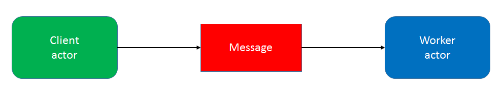
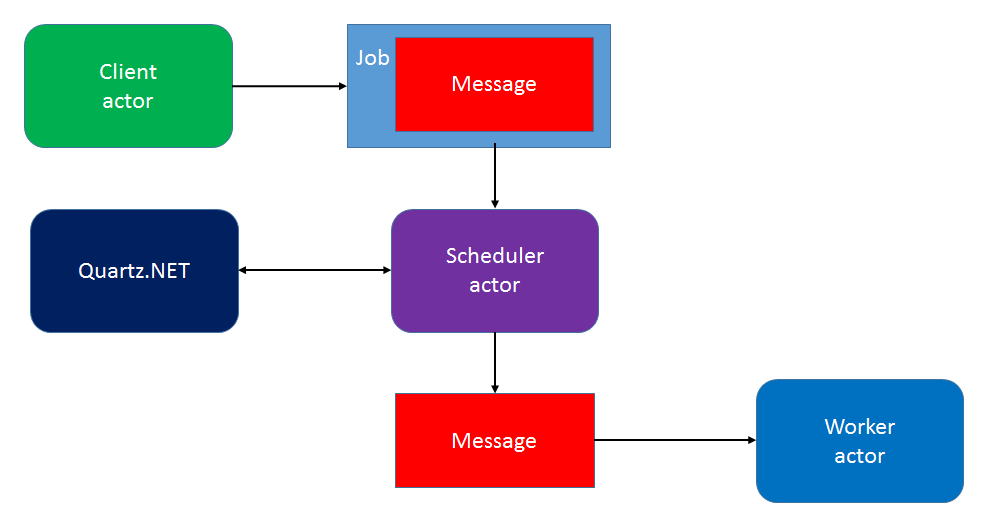




# reF#actoring: rewriting an actor in F# #

*All text and code copyright (c) 2016 by Vagif Abilov. Used with permission.*

*Original post dated 2016-12-20 available at https://miles.no/blogg/refactoring-rewriting-an-actor-in-f*

**By Vagif Abilov**


*If you are keen on actor model, Akka and functional programming, this article shows how to rewrite an existing C# actor in F# making your code more terse and easier to maintain.*


Last time I checked, Akka.NET NuGet package had almost 100K downloads – I am pretty sure when you are reading this article it will pass this number. The package for Akka.NET F# API has much more modest use: less than 10K downloads at the time of writing. Some of these downloads are from our team – a small development group writing a media distribution engine at NRK (Norwegian Broadcasting Corporation).

Akka.NET is an actor model framework, and actors are building blocks of our system. All of them – with exception of system actors – are written by us. However, recently we found an open source actor that provided functionality we were looking for. We started using it but soon decided that for our needs it will be better to write a similar one in F#. This article summarizes our rewriting experience.

## Quartz.NET and Akka.Quartz.Actor

While Akka.NET provides an in-memory scheduler, there is no support for persistent message scheduling out of the box. It’s not hard to roll up your own, but unless you have very special needs, you should be fine with some of third-party libraries. One of the popular choices is [Quartz.NET](http://www.quartz-scheduler.net/) (port from a Java project), and it even has an [Akka.NET actor](https://github.com/akkadotnet/Akka.Quartz.Actor)! We didn’t have to look further.

Here's how standard communication between actors look:



Adding a scheduling actor changes message flow as shown below:




We ran some tests, and everything worked as it should. However, besides the main functionality there were a couple of things we wanted to have differently. First one was minor – at that time Akka.Quartz.Actor didn’t have a NuGet package. It would mean we had to treat it differently from the rest of our external dependencies which is either part of .NET or installed from NuGet.org. What was more significant in our eyes is that the Quartz.NET actor didn’t fully encapsulate Quartz.NET details, so not only the scheduling actor itself but every client that needed to schedule a message execution had to add a reference to Quartz.NET dll (and installing its NuGet package automatically added a file job-scheduling-data2-0.xsd to each referencing project). We inspected the Akka.Quartz.Actor source code, and it was so small (and clear written) that we decided to port the code to F# and at the same time eliminate client dependency on Quartz.NET.

The next section is about changes that we did in F# version, but before going further I want to emphasize again that our decision to write our own version was rather special, and in case you need a scheduling actor for Akka.NET, Akka.Quartz.Actor is definitely a way to go (and now it has a NuGet package!)

## Decorating Quartz.NET job trigger with F# discriminated union

The reason for Akka.Quartz.Actor to require a client to reference Quartz.NET is that the client itself builds an instance of Quartz.NET trigger object (that implements ITrigger interface). So a client typically contains code like this:

```fsharp
TriggerBuilder.Create().WithCronSchedule("*0/10 * * * * ?").Build();
```

... or if you want less cryptic syntax, you can use fluent DSL:

```fsharp
TriggerBuilder.Create().StartAt(startTime).Build()
```

Removing client dependency on ITrigger interface required introducing a new type that would act like a DSL. Discriminated unions in F# provide powerful means for DSL definitions. For our purpose we didn't need to cover all scheduler varieties provided by Quartz.NET. In fact we only needed to send deferred messages once, but to better illustrate F# DSL definitions using discriminated unions we will cover more scenarios in this article:

```fsharp
type JobSchedule =  
| Once of DateTimeOffset  
| RepeatForever of TimeSpan  
| RepeatForeverAfter of DateTimeOffset * TimeSpan  
| RepeatWithCount of TimeSpan * int  
| RepeatWithCountAfter of DateTimeOffset * TimeSpan * int  
```

In the scheduler actor implementation we needed to write adapter code:

```fsharp
let createTriggerBuilder (jobSchedule : JobSchedule) =
    let builder = TriggerBuilder.Create()
    match jobSchedule with
    | Once startTime ->
        builder.StartAt(startTime)
    | RepeatForever interval ->
        builder.StartNow().WithSimpleSchedule(
            fun x -> x.WithInterval(interval).RepeatForever() |> ignore)
    | RepeatForeverAfter (startTime, interval) ->
        builder.StartAt(startTime).WithSimpleSchedule(
            fun x -> x.WithInterval(interval).RepeatForever() |> ignore)
    | RepeatWithCount (interval, count) ->                    
        builder.StartNow().WithSimpleSchedule(
            fun x -> x.WithInterval(interval).WithRepeatCount(count) |> ignore)
    | RepeatWithCountAfter (startTime, interval, count) ->                    
        builder.StartAt(startTime).WithSimpleSchedule(
            fun x -> x.WithInterval(interval).WithRepeatCount(count) |> ignore)
```
			
If our actor had to have support for all Quartz.NET schedules, having such adapter code (and corresponding JobScheduler discriminated union) would probably become cumbersome, but as I mentioned earlier, we only needed to support trivial schedulers, so for us having such extra code was better than seeing job-scheduling-data2-0.xsd added to every client (developers are often sensitive about such little details, aren't they?)

## Porting commands and events

The Akka.Quartz.Actor project is under active development, so I will refer to the version built for Akka.NET 1.1.1 (committed on August 5th, 2016). The original project contained 10 source files in C#: 3 command definitions (1 of them is interface), 5 event definitions (also 1 of them is interface), 1 file with the implementation of QuartzJob (implements IJob interface) and the actual actor implementation QuartzActor. In total: 10 files (2 interfaces + 8 classes), 321 lines of code (267 lines without comments). F# code is typically more compact (much more compact) than C#, so it was interesting to see what the metrics for the ported code would be.

We started with commands and events placing them in a single file (instead of the original 8). Here's what we ended up with:

```fsharp
open System
open Akka.Actor

type JobMessage = obj
type JobId = obj

type JobCommand =
| CreateJob of IActorRef * JobMessage * JobSchedule
| RemoveJob of JobId

type JobCommandResult =
| Success of JobId
| Error of JobId * Exception
```

Alas, that was it. In the original C# project these 10 lines of code (including namespace references) were represented with 8 files and 141 lines (without comments). How was this possible? Well, let's check for example C# CreateJob definition (comments removed):

```csharp
using Akka.Actor;
using Quartz;

namespace Akka.Quartz.Actor.Commands
{
    public class CreateJob : IJobCommand
    {
        public CreateJob(IActorRef to, object message, ITrigger trigger)
        {
            To = to;
            Message = message;
            Trigger = trigger;
        }

        public IActorRef To { get; private set; }
        public object Message { get; private set; }
        public ITrigger Trigger { get; private set; }
    }
}
```

And there is of course an interface. Always interface in OOP!

```csharp
namespace Akka.Quartz.Actor.Commands
{
    internal interface IJobCommand
    {
    }
}
```

In case you wonder whether it was fair to remove marker interfaces from F# code, you should question the need for their presence when shifting the paradigm from OOP to FP. What makes a good programming style in OOP doesn't necessarily belong to functional programming, so we got rid of most of interfacees with a good conscience.

## Porting actor code

Now we had to write code for the new F# actor. Akka.NET has dedicated F# API, so the original QuartzActor (inheriting from ActorBase) had to be replaced with an F# function with the following signature:

```fsharp
let scheduleActor props (mailbox: Actor<_>) = ...  
```

Props would be the same as the original QuartzActor props: a NameValueCollection that is passed to a new instance of StdSchedulerFactory to obtain a Quartz scheduler. Here's the code for F# actor:

```fsharp
let scheduleActor props (mailbox: Actor<_>) =

    let scheduler =
        match props with
        | Some props -> StdSchedulerFactory(props).GetScheduler()
        | None -> StdSchedulerFactory().GetScheduler()

    scheduler.Start()
    mailbox.Defer (fun _ -> scheduler.Shutdown())

    let rec loop () =
        actor {
            let! message = mailbox.Receive ()
            match message with
            | CreateJob (actor, message, jobSchedule) ->
                match (actor, jobSchedule) with
                | (null,_) -> mailbox.Sender() <! Error (null, new ArgumentNullException("CreateJob actor is null"))
                | _ -> 
                    let builder = createTriggerBuilder jobSchedule
                    let trigger = builder.Build()
                    try
                        let job = QuartzJob.CreateBuilderWithData(actor, message)
                                    .WithIdentity(trigger.JobKey)
                                    .Build()
                        scheduler.ScheduleJob(job, trigger) |> ignore
                        mailbox.Sender() <! Success trigger.JobKey
                    with ex ->
                        mailbox.Sender() <! Error (trigger.JobKey, ex)

            | RemoveJob (jobKey) ->
                try
                    match scheduler.DeleteJob(jobKey :?> JobKey) with
                    | true ->
                        mailbox.Sender() <! Success jobKey
                    | false ->
                        mailbox.Sender() <! Error (jobKey, new InvalidOperationException("Job not found"))
                with ex ->
                    mailbox.Sender() <! Error (jobKey, ex)

            return! loop ()
        }

loop ()
```

Logically it is not very much different from its C# counterpart, but it's also more compact, although not as much as command/event definitions.

You may notice that the actor code refers to QuartzJob that we needed to define (it must implement IJob interface) and place prior the actor definition:

```fsharp
type private QuartzJob () =

    static let MessageKey = "message"
    static let ActorKey = "actor"

    interface IJob with
        member this.Execute (context : IJobExecutionContext) =
            let jdm = context.JobDetail.JobDataMap
            if jdm.ContainsKey(MessageKey) && jdm.ContainsKey(ActorKey) then
                match jdm.[ActorKey] with
                | :? IActorRef as actor -> actor <! jdm.[MessageKey]
                | _ -> ()

    static member CreateBuilderWithData (actorRef : IActorRef, message : obj) =
        let jdm = new JobDataMap()
        jdm.AddAndReturn(MessageKey, message).Add(ActorKey, actorRef)

JobBuilder.Create<QuartzJob>().UsingJobData(jdm)
```

That's it! We have ported the Quartz.NET scheduling actor to F#. All resulting code is put in a single file (Scheduler.fs), 106 lines. 23 of those lines are used on code decorating ITrigger (type JobSchedule and function createTriggerBuilder). If we managed to shut up our aesthetical alter ego and live with copies of job-scheduling-data2-0.xsd scattered around the solution, we could reduce the code size to less than 90 lines. Still the code reduction is about 60%. You can check out [the resulting project at GitHub](https://github.com/object/SchedulerActor).

## Testing and akkling

Unit testing an actor typically consist of sending it a message with given content and asserting on messages generated by that actor in response. Akka.NET has a test kit for this purpose that includes a special test actor that can be validated for receival of certain messages within the given time. However, for the sake of F# tests it's advisable to have an extra validation written as F# function and expressions, not based on interop with C#. One of Akka.NET developers Bartosz Sypytkowski has a spinoff project [Akkling](https://github.com/Horusiath/Akkling) that contains such validation functions, only written for his version of Akka F# API. I took a liberty of porting code from his Akkling test kit, so I could write unit tests for actors in idiomatic F#. Here is a couple of test examples (tests are also included in [the GitHub project](https://github.com/object/SchedulerActor).):

```fsharp
[<Fact>]
let ``Should deliver message with short delivery time`` () : unit = testDefault <| fun tck -> 

    let scheduler = spawn tck "scheduler" <| scheduleActor None

    let schedule = Once <| DateTimeOffset.Now.AddSeconds(1.)
    scheduler <! CreateJob (tck.TestActor, 1, schedule)

    expectMsgFilter tck <| validateResult |> ignore
    expectMsg tck 1 |> ignore

[<Fact>]
let ``Should not deliver message with long delivery time`` () : unit = testDefault <| fun tck -> 

    let scheduler = spawn tck "scheduler" <| scheduleActor None

    let schedule1 = Once <| DateTimeOffset.Now.AddSeconds(10.)
    scheduler <! CreateJob (tck.TestActor, 1, schedule1)

    let schedule2 = Once <| DateTimeOffset.Now.AddSeconds(1.)
    scheduler <! CreateJob (tck.TestActor, 2, schedule2)

    expectMsgFilter tck <| validateResult |> ignore
    expectMsgFilter tck <| validateResult |> ignore
    expectMsg tck 2 |> ignore 
```
	
## CONCLUSION

This article focused on how to rewrite an Akka.NET actor in F#, so you probably didn't expect from it an introduction to new technique or methods. But I believe code metrics comparison demonstrated that writing code in F# has a clear advantage of compactness and readability, so one thing I hope can be taken away is considering F# to become a main language for your next project, whether it will be using actor model or not. And if it is - you already have an actor giving you support for persistent schedules.

Finally, I would like to thank Akka.NET team for doing fantastic job with bringing Akka to .NET platform, Maxim Salamatko - for writing an actor for Quartz.NET and Bartosz Sypytkowski - for his Akkling project.

