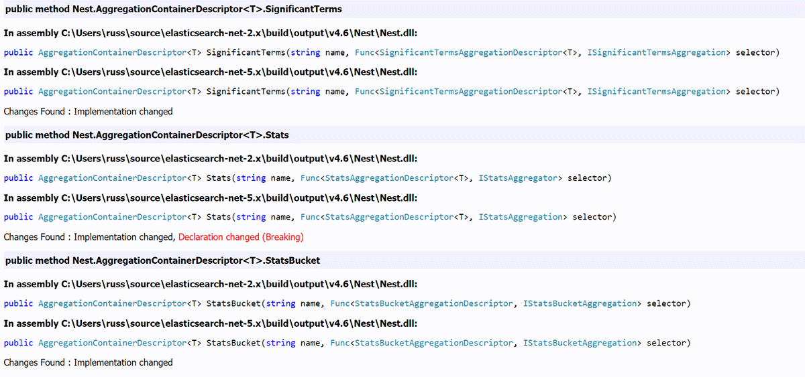




# Solidifying Releases with FAKE (F# MAKE) #

*All text and code copyright (c) 2016 by Elastic Inc. Used with permission.*

*Original post dated 2016-12-21 available at https://www.elastic.co/blog/solidifying-releases-with-fsharp-make*

**By Russ Cam • Martijn Laarman • Greg Marzouka**

It's no secret that we're big fans of [FAKE](http://fsharp.github.io/FAKE/) and [Paket](https://fsprojects.github.io/Paket/) here in the Microsoft team at Elastic, and F# in general; It's our Windows build tool of choice for the [Elasticsearch .NET clients](https://github.com/elastic/elasticsearch-net) and [Windows Installers](https://github.com/elastic/windows-installers), and we [like to speak about it](https://github.com/russcam/paket-fake-talk) whenever we get the chance.

For this F# Advent Calendar post, we'd like to highlight a few things that we do when we release a new version of the .NET client library, and also introduce a new helper that we hope will benefit other .NET open source projects in documenting breaking changes in new releases. Ultimately, we hope you'll find this post inspiring enough to give FAKE a try and add some polish your own build processes.

## Current Pipeline

### Scripting the build

As with all dependencies in our .NET projects, the dependencies for our build pipeline are handled with Paket. Taking advantage of groups within the paket.dependencies file, all the dependencies for the build are installed in to a build directory within the packages directory

```
group build
    source https://www.nuget.org/api/v2
    nuget FAKE
    nuget FSharp.Data
    nuget GitLink prerelease
```
    
The [build pipeline is split out into several F# scripts](https://github.com/elastic/elasticsearch-net/tree/master/build/scripts) that live under `build/scripts`, each with a core function. Each script can easily reference our build dependency assemblies. For example, referencing FAKE

```fsharp
#I @"../../packages/build/FAKE/tools"
#r @"FakeLib.dll"
open Fake
```

With this referenced, we have the full breadth of the [FAKE API](http://fsharp.github.io/FAKE/apidocs/index.html) at our disposal. Any build system worth its salt ships with tons of pre-baked solutions to common build problems, so this is not really a unique selling point for using FAKE. What is then?

* F# simply is the best ~~scripting~~ language, with great tooling and an interactive REPL. There is something immensely liberating about having intellisense in your build scripts. Editor support is excellent in Visual Studio, Xamarin Studio Visual Studio for Mac and Ionide for Visual Studio for Mac and Visual Studio Code.
* F# offers enough terseness to get out of your way. The drive for a level of terseness has, in the past, driven a good portion of Open Source .NET projects to take a dependency on Ruby just to be able to use [Rake](http://rake.rubyforge.org/)! [ScriptCS](http://scriptcs.net/) and some C# based build systems such as [CAKE](http://cakebuild.net/) try to do the same but lack editor integration, although ScriptCS's [OmniSharp](http://www.omnisharp.net/) integration is making a comeback. And, if powershell is your thing, [PSake](http://psake.readthedocs.io/en/latest/) might rock your fancy. However...
* F# has an amazing type system. Builds can be inherently complex and trying to make sense of them in a dynamic language or worse, a declarative language will soon feel all kinds of wrong.

An example of where this type system helps is through [modelling projects as types](https://github.com/elastic/elasticsearch-net/blob/master/build/scripts/Paths.fsx#L12). This looks similar to

```fsharp
module Projects = 
    type DotNetFrameworkIdentifier = { MSBuild: string; Nuget: string; DefineConstants: string; }
    type DotNetFramework = 
        | Net45 
        | Net46 
        | NetStandard1_3
        static member All = [Net45; Net46; NetStandard1_3] 
        member this.Identifier = 
            match this with
            | Net45 -> { MSBuild = "v4.5"; Nuget = "net45"; DefineConstants = "TRACE;NET45"; }
            | Net46 -> { MSBuild = "v4.6"; Nuget = "net46"; DefineConstants = "TRACE;NET46"; }
            | NetStandard1_3 -> { MSBuild = "netstandard1.3"; Nuget = "netstandard1.3"; DefineConstants = "TRACE;DOTNETCORE"; }
```

With this setup, we can document in code the behavioural constraints for each project, for example, whether it should be built for .NET core, packaged and published to Nuget, and so on.

### Build all the things

Long before the [FAKE API](http://fsharp.github.io/FAKE/apidocs/index.html) had helpers for calling the [dotnet CLI](http://fsharp.github.io/FAKE/apidocs/fake-dotnetcli.html) to build cross platform .NET assemblies, there was the now deprecated DNX/DNU/DNVM set of command line tools to perform this task. With users wishing to use the Elasticsearch .NET clients cross platform, integrating this toolchain into our build pipeline was easy thanks to FAKE. Here's an example of the now defunct tooling we had in place

```fsharp
type DotNetRuntime = | Desktop | Core | Both
type DnxTooling(exe) =
    member this.ExecWithTimeout runtime failedF workingDirectory arguments timeout =
        match (runtime, hasClr, hasCoreClr) with
        | (Core, _, Some c) ->
            let proc = c.Process exe
            execProcessWithTimeout proc arguments timeout
        | (Desktop, Some d, _) ->
            let proc = d.Process exe
            execProcessWithTimeout proc arguments timeout
        | (Both, Some d, Some c) ->
            let proc = d.Process exe
            let result = execProcessWithTimeout proc arguments timeout
            if result <> 0 then failwith (sprintf "Failed to run dnx tooling for %s args: %A" proc arguments)
            let proc = c.Process exe
            execProcessWithTimeout proc arguments timeout
        | _ -> failwith "Tried to run dnx tooling in unknown state"
        |> ignore
let Dnu = new DnxTooling("dnu.cmd")
let Dnx = new DnxTooling("dnx.exe")
```

[The script probed the machine to determine if there were Desktop CLR and Core CLR DNX runtimes installed](https://github.com/elastic/elasticsearch-net/blob/bd3316900f53eb46d038622e8d0d36439689b572/build/scripts/Paths.fsx#L191-L308), and used this information to determine what could be built. Thankfully, this can now be replaced with

```fsharp
DotNetCli.Build
  (fun p -> 
       { p with 
            Configuration = "Release" 
       })
```
       
The more we can leverage the tooling, the less we need to maintain ourselves! We currently use both dotnet CLI and MSBuild via FAKE, to compile assemblies targeting .NET 4.5, 4.6 and NetStandard 1.3.

### Stepping through Code

[GitLink](https://github.com/GitTools/GitLink) (based on [SourceLink](https://ctaggart.github.io/SourceLink/)) allows developers to debug and step through your code when it's hosted on GitHub, without the need to mess with Symbols Servers, by patching the [PDB files](https://en.wikipedia.org/wiki/Program_database) with links to the GitHub source from which the release is built.

```fsharp
type BuildTooling(path) =
    member this.Path = path
    member this.Exec arguments = execProcessWithTimeout this.Path arguments (TimeSpan.FromMinutes 30.)
let GitLink = new BuildTooling(Paths.Tool("gitlink/lib/net45/gitlink.exe"))
```

Now, when running a release build, the PDBs are patched using GitLink and bundled as part of the Nuget packages

```fsharp
type Build() = 
    // snip, for brevity
    static let gitLink() =
        DotNetProject.AllPublishable
        |> Seq.iter(fun p ->
            let projectName = (p.Name |> directoryInfo).Name
            let link framework = 
                let branch = environVarOrNone "GITBRANCH"
                let commit = environVarOrNone "GITCOMMIT"
                let args = Seq.empty
                           |> match branch with
                              | Some b -> Seq.append ["-b"; b] 
                              | None -> Seq.append Seq.empty
                           |> match commit with
                              | Some c -> Seq.append ["-s"; c] 
                              | None -> Seq.append Seq.empty
                           |> Seq.append ["."; "-u"; Paths.Repository; "-d"; (Paths.ProjectOutputFolder p framework); "-include"; projectName]
                GitLink.Exec ["."; "-u"; Paths.Repository; "-d"; (Paths.ProjectOutputFolder p framework); "-include"; projectName]
                |> ignore
            DotNetFramework.All 
            |> Seq.iter link
        )
    static member Compile() = 
        compileDesktop "Rebuild"
        if runningRelease then compileCore()
        if not isMono && runningRelease then gitLink()
```
        
All our .NET releases are patched with GitLink, making it easier to understand the behaviour of the client by stepping through it, line by line.

### Canary Builds

In addition to putting out releases to Nuget, we also [publish canary builds to MyGet](https://myget.org/gallery/elasticsearch-net-next), meaning you don't need to wait for the next nuget release to get that bug fix that just went into the `master` branch that's holding you up.

Supporting Canary builds, similarly to releasing new versions, is a case of patching the Assembly Information and project.json files, to update version numbers

```fsharp
type Versioning() = 
    // snip, for brevity
    static member PatchAssemblyInfos() =
        let assemblyVersion = Versioning.AssemblyVersion
        let fileVersion = Versioning.FileVersion
        !! "src/**/AssemblyInfo.cs"
        |> Seq.iter(fun f -> 
            let name = (directoryInfo f).Parent.Parent.Name
            let projectName = DotNetProject.TryFindName name
            let assemblyDescription =
                match projectName with
                | Some "Nest" -> "NEST - official high level elasticsearch client"
                | Some "Elasticsearch.Net" -> "Elasticsearch.Net - official low level elasticsearch client"
                | _ -> ""
            CreateCSharpAssemblyInfo f [
                Attribute.Title name
                Attribute.Copyright (sprintf "Elasticsearch %i" DateTime.UtcNow.Year)
                Attribute.Description assemblyDescription 
                Attribute.Company "Elasticsearch"
                Attribute.Configuration "Release"
                Attribute.Version assemblyVersion
                Attribute.FileVersion fileVersion
                Attribute.InformationalVersion fileVersion
            ]
        )
    static member PatchProjectJsons() =
        !! "src/**/project.json"
        |> Seq.iter(fun f -> 
            regexReplaceFirstOccurrence 
                "\"version\"\\s?:\\s?\".*\"" 
                (sprintf "\"version\": \"%s\"" fileVersion) 
                (new System.Text.UTF8Encoding(false)) f
            RegexReplaceInFileWithEncoding 
                "\"releaseNotes\"\\s?:\\s?\".*\"" 
                (sprintf "\"releaseNotes\": \"See https://github.com/elastic/elasticsearch-net/releases/tag/%s\"" fileVersion) 
                (new System.Text.UTF8Encoding(false)) f
        )
    static member ValidateArtifacts() =
        let assemblyVersion = Versioning.AssemblyVersion
        let fileVersion = Versioning.FileVersion
        let tmp = "build/output/_packages/tmp"
        !! "build/output/_packages/*.nupkg"
        |> Seq.iter(fun f -> 
           Unzip tmp f
           !! (sprintf "%s/**/*.dll" tmp)
           |> Seq.iter(fun f -> 
                let fv = FileVersionInfo.GetVersionInfo(f)
                let a = GetAssemblyVersion f
                traceFAKE "Assembly: %A File: %s Product: %s => %s" a fv.FileVersion fv.ProductVersion f
                if (a.Minor > 0 || a.Revision > 0 || a.Build > 0) then failwith (sprintf "%s assembly version is not sticky to its major component" f)
                if (fv.ProductVersion <> fileVersion) then failwith (sprintf "Expected product info %s to match new version %s " fv.ProductVersion fileVersion)
           )
           DeleteDir tmp
        )
```
        
With this process, [a new release on Nuget](https://www.nuget.org/packages/Nest) also points to the [release notes on GitHub](https://github.com/elastic/elasticsearch-net/releases) and in addition, nuget packages are checked to ensure they contain the correct versions, and assemblies are signed with the expected key. It may seem overly cautious to have these checks in place but trust me when I say they have helped a number of times in the last year, as the build toolchain has changed over time.

### Client Documentation

We've talked about our documentation generation process briefly before as part of [our blog post announcing the release of NEST 2.0](https://www.elastic.co/blog/ga-release-of-nest-2-0-our-dot-net-client-for-elasticsearch). All of the client documentation on the Elastic website is generated from source code, to ensure that it remains up to date with changes in the client. A console application takes care of parsing source code files with Roslyn, extracting the relevant sections out of each file, and constructing an [asciidoc](http://asciidoc.org/) file as the output. An asciidoc processor then parses this output to add additional elements such as reference links and section titles. This process is executed as part of the build

```fsharp
module Documentation = 
    let Generate() =
        let generator = "build/output/v4.6/DocGenerator/DocGenerator.exe"
        ExecProcess (fun p ->
            p.WorkingDirectory <- Paths.Source "CodeGeneration/DocGenerator"
            p.FileName <- generator
          ) 
          (TimeSpan.FromMinutes (1.0)) |> ignore
```
          
with the resulting asciidoc files being picked up by an existing doc process that converts them to HTML.

## Breaking Changes between Releases

Within the .NET clients, we support backwards binary compatability within each major version, meaning the public API cannot be changed in a way that would break another assembly compiled against the same major version. Supporting this provides stability for anyone to build against a major version, knowing that each minor and patch release of the same major version will still be compatible, allowing those new releases to be utilized.

But what happens when someone wants to upgrade to the next major version of Elasticsearch and thus, the .NET clients? In adherence with [Semantic Versioning](http://semver.org/), major versions can have breaking changes in them, which can be both good and bad from a consumer perspective; Good in that deprecated components can be removed, existing method signatures changed for the better and new features can be added, but bad in that it can break the public API and may require changes in application code to update to the newer version. All of this requires planning and being aware of all of the breaking changes upfront means being better prepared when the time comes.

[With the release of NEST 5.0](https://www.elastic.co/blog/nest-5-0-released), we documented all of the breaking changes between [NEST 2.5.0](https://github.com/elastic/elasticsearch-net/blob/master/docs/5.0-breaking-changes/nest-breaking-changes.md) and [Elasticsearch.Net 2.5.0](https://github.com/elastic/elasticsearch-net/blob/master/docs/5.0-breaking-changes/elasticsearch-net-breaking-changes.md), the latest 2.x releases, and the 5.0.0 releases by generating a file of the differences between the compiled assemblies using [BitDiffer](https://github.com/grennis/bitdiffer), a GUI and command line tool built for this purpose.

We think this is such a useful tool to have as part of a build process that we've written a FAKE helper to incorporate it into our current build pipeline.

## Introducing BitDifferHelper

With [BitDifferHelper](https://github.com/russcam/FAKE/blob/0d1369975ce628c930b53d1d2b062bafed726509/src/app/FakeLib/BitDifferHelper.fs), it's easy to generate the differences between two assemblies. Simply point the helper at the two assemblies with an Assemblies record and pass this to the Generate method

```fsharp
#I @"../../app/FAKE/bin/Debug/"
#r @"FakeLib.dll"
open Fake
open Fake.BitDifferHelper
open System
let assemblies = Assemblies {
    FirstPath = @"C:\Users\russ\source\elasticsearch-net-2.x\build\output\v4.6\Nest\Nest.dll"
    SecondPath = @"C:\Users\russ\source\elasticsearch-net-5.x\build\output\v4.6\Nest\Nest.dll"
}
BitDifferHelper.Generate(assemblies, fun p -> 
{ 
    p with 
        ToolPath = @"C:\temp\BitDiffer.Console.exe"
        OutputFile = @"C:\temp\diff.html"    
})
```

this outputs a HTML report similar to the following



The directories containing each targeted assembly need to contain the referenced assemblies, with the exception of those that can be loaded from the [Global Assembly Cache](https://msdn.microsoft.com/en-us/library/yf1d93sz(v=vs.110).aspx) (GAC).

The accessibility of members that should be included in the report as well as the types of changes (breaking, non-breaking, etc.) can be controlled with the options argument

```fsharp
BitDifferHelper.Generate(assemblies, fun p -> 
{ 
    p with 
        ToolPath = @"C:\temp\BitDiffer.Console.exe"
        OutputFile = @"C:\temp\diff.xml"   
        ExcludeInternal = true
        ExcludePrivate = true
        // Don't report changes in implementations
        IgnoreMethodsAndProperties = true
        Format = Xml 
})
```

### Diffing Multiple Directories

Diffing multiple assemblies can be achieved by passing a `Directories` record

```fsharp
let directories = Directories {
    FirstDir = @"C:\Users\russ\source\elasticsearch-net-2.x\build\output\v4.6\Nest"
    SecondDir = @"C:\Users\russ\source\elasticsearch-net-5.x\build\output\v4.6\Nest"
    Recurse = false
}
BitDifferHelper.Generate(directories, fun p -> 
{ 
    p with 
        ToolPath = @"C:\temp\BitDiffer.Console.exe"
        OutputFile = @"C:\temp\diff.html"    
})
```

Which provides the option to see the changes to both NEST and Elasticsearch.Net in one report.

### Diffing Nuget Packages

Being able to diff assemblies and directories on the filesystem is very useful but it can also be beneficial to be able to diff assemblies that have already been distributed in nuget packages. BitDifferHelper can help here too

```fsharp
let nuget = Nuget {
    Package = "NEST"
    TempDir = @"c:\temp\bitdiffer"
    FirstVersion = "2.5.0"
    SecondVersion = "5.0.0"
    FrameworkVersion = "net45"
    Sources = []
}
BitDifferHelper.Generate(nuget, fun p -> 
{ 
    p with 
        ToolPath = @"C:\temp\BitDiffer.Console.exe"
        OutputFile = @"C:\temp\diff.html"  
})
```

Since BitDiffer needs referenced assemblies either in the same directory as the target assembly, or to be passed a semi-colon separated string of directories in which the references can be found, the helper tries to make diffing packages easier by copying all referenced assemblies in the package dependencies into the same directory as the target assembly. The resolution of compatible framework versions is very primitive at right now, but works for the simple cases. We'll further improve this in the future.

### Diffing GitHub Commits

We've saved the best 'til last! BitDifferHelper is able to diff the built output of two GitHub commits

```fsharp
#I @"../../app/FAKE/bin/Debug/"
#r @"FakeLib.dll"
open Fake
open Fake.BitDifferHelper
open System
let commit = {
    Commit = ""
    // command consists of: file name, arguments, function to locate the output from repository root
    CompileTarget = Command("cmd.exe", ["/c"; "build.bat"; "skiptests"], fun o -> o @@ @"build\output\v4.6\Nest")
    OutputTarget = "Nest.dll"
}
let github = GitHub {
    Url = new Uri("https://github.com/elastic/elasticsearch-net")
    TempDir = @"c:\temp\bitdiffer2"
    FirstCommit = { commit with Commit = "2.5.0" }
    SecondCommit = { commit with Commit = "5.0.0" }
}
BitDifferHelper.Generate(github, fun p -> 
{ 
    p with 
        ToolPath = @"C:\temp\BitDiffer.Console.exe"
        OutputFile = @"C:\temp\diff.html"  
})
```

This will

* pull down the .NET client GitHub repository
* checkout the first commit
* use the commit target to determine how to build the repository (more on this in a second)
* locate the build output and move it to a temporary location, ready for the diff process
* repeat steps 2 - 4 for the second commit
* Diff the build outputs of the two commits

It's possible that the build process for a repository changes over time, so the commit target is able to be built in a number of different ways

```fsharp
/// The github project compilation target
type GitHubTarget =
    | ProjectOrSolution of string
    | Command of string * string list * (string -> string)
    | Solution
```
    
Here's an example with a different GitHub repository to demonstrate

```fsharp
let github = GitHub {
    Url = new Uri("https://github.com/russcam/asciidocnet")
    TempDir = @"c:\temp\bitdiffer2"
    FirstCommit =  {
                     Commit = "1.0.0-alpha4";
                     CompileTarget = ProjectOrSolution("AsciiDocNet/AsciiDocNet.csproj")
                     OutputTarget = "AsciiDocNet.dll";
                   }
    SecondCommit = {
                     Commit = "1.0.0-alpha5";
                     CompileTarget = Command("cmd.exe", ["/c"; "build.bat"; "skiptests"], fun o -> o @@ @"build\output\v4.5\AsciiDocNet");
                     OutputTarget = "AsciiDocNet.dll";
                   }
}
BitDifferHelper.Generate(github, fun p -> 
{ 
    p with 
        ToolPath = @"C:\temp\BitDiffer.Console.exe"
        OutputFile = @"C:\temp\diff.html"   
})
```

## Summary

We'll open a PR to include BitDifferHelper as part of FAKE in the future, to allow other projects to create version diffs and give back to the open source community that has provided us with great tooling to work with.

Happy Holidays to all!


