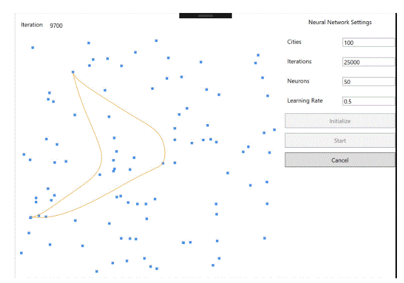
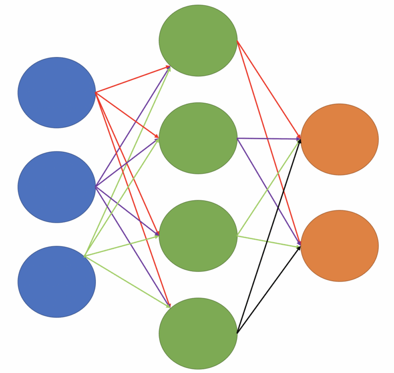
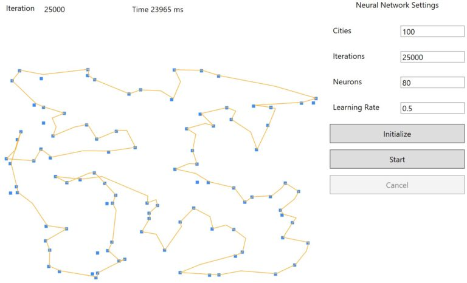
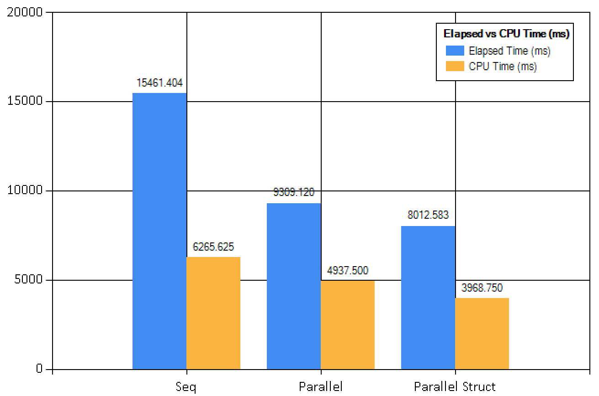




# The Traveling Santa Problem… a Neural Network solution #

*All text and code copyright (c) 2016 by Riccardo Terrell. Used with permission.*

*Original post dated 2016-12-21 available at http://www.rickyterrell.com/?p=97*

**By Riccardo Terrell**

    

Once again the fantastic “F# Advent Calendar” organized by Sergey Tihon arrived bringing a festive spirit to all the F# enthusiasts.

## The goal… helping Santa

This time, **Santa** has sent for help from his F# elves to help deliver toys to all the good boys and girls of the world. This year Santa is in a race to outpace all the *Amazon* drones and *Jet* deliveries, and is asking for our help to design the most efficient and effective flight path for his sleigh given a number of cities. This problem follows the format of the Traveling Salesman Problem. We will utilize *Artificial Neural Network* to design the perfect solution based on Elastic-Network learning algorithm.

The *TSP* is a combinatorial problem that involves Santa’s quest to visit a given number of cities and identifying the shortest path to travel between the cities. In addition, Santa is allowed to start and end the route from any city, but he can visit each city only once.

 

*(See the animated image at http://www.rickyterrell.com/wp-content/uploads/2016/12/TSantaP.gif)*

At first, this may not look like a complex program to solve, however, the number of possible combinations can dramatically (factorial) increase with the growth of the number of cities. For example, in the case of two cities the solution is only 1 path, with 5 cities there are 120 possible combinations, with 50, well… we have *30414093201713378043612608166064768844377641568960512000000000000* possible combinations. Understandably, a brute-force approach is not recommended, or Santa will be stuck in *“recalculating”* mode waiting on his *MapQuest* to come up with a route to deliver presents.

The Elastic Network we will use is a type of artificial neural network which utilizes unsupervised learning algorithms for clusterization problems and treats neural networks as a ring of nodes. The learning process keeps changing the shape of the ring, where each shape represents a possible solution.


## Starting with Machine Learning

Machine learning is a fascinating and trendy topic these days, but like many other technologies it has its own terminology such as *entropy error*, *resubstitution accuracy*, *linear and logistic regression* that can sound intimidating at first.  Don’t let these terms turn you away, the effort you put into understanding Machine learning will be returned three fold.

In the last few months, I have started experimenting with and applying machine learning in different domains, including Natural Language Generation. In my work at [STATMUSE](https://www.statmuse.com/nba), I am developing a *Natural Language Processing* back-end infrastructure in F# to provide Natural Language Interfaces for sports statistics. Check out this video to see a project interacting with [Alexa (Amazon echo)](https://www.amazon.com/b/ref=aug_hqp2?node=16067214011).

Thankfully, if you are a .NET developers, there many great resources to get more familiar with the topic. To name a few:

* [Machine Learning Projects for .NET Developers](https://www.amazon.com/Machine-Learning-Projects-NET-Developers/dp/1430267674/ref=sr_1_1?s=books&ie=UTF8&qid=1482306191&sr=1-1&keywords=machine+learning+.net)
* [Mastering .NET Machine Learning](https://www.amazon.com/Mastering-Machine-Learning-Jamie-Dixon/dp/1785888404/ref=sr_1_2?s=books&ie=UTF8&qid=1482306191&sr=1-2&keywords=machine+learning+.net)
* [Evelina Gabasova blog](http://evelinag.com/)
* [James McCaffrey blog](https://jamesmccaffrey.wordpress.com/)
 
## What’s the challenge?

In my opinion, the main challenge is figuring out how to map problems to a machine learning algorithm; as well as, how to choose the right machine learning algorithm to use. To help, [the Microsoft Azure Machine Learning Team put together a very useful cheat-sheet here](https://docs.microsoft.com/en-us/azure/machine-learning/machine-learning-algorithm-cheat-sheet).

What really brought things home for me was seeing a video about **Neural Networks** in which *James McCaffrey* mentioned Neural Network as a Multi-Purpose machine learning algorithm!  [See the video that spurred my revelation here.](https://channel9.msdn.com/Events/Build/2014/3-643)

 
## What is a neural network?

An Artificial Neural Network (ANN) is an algorithm designed for pattern recognition and classification and can be used in many applications. Simply said, an ANN is composed by an interconnected set of artificial neurons. Even more fascinating is that computations are modeled and inspired after the biological brain in this learning algorithm, which can be applied to classification, recognition, prediction, simulation and many other different tasks.

Here, neurons are organized in sub-sets, called layers, where all the neurons in one layer are connected to all the neurons in the following layers.

For example, the following figure shows a three layered artificial neural network. The neurons from the first layer are propagated through the network and connected into to the second layer, and second to the third.



*from the figure, a fully connected neural network with 3 inputs (the blue nodes), 4 nodes in the hidden layer (the green ones), and 2 nodes as outputs (the orange ones) has (3 * 4) + 4 + (4 * 2) + 2 = 26 weights and biases.*

The result of the ANN, referred to as output, relies on the weights of the connections between neurons. The most important concept is that ANN is capable of self-training to output distinct values determined by a particular given input.

The training of a neural network aims to find the values for the weights and biases that can be used to evaluate a set of given known inputs and outputs. The secret of a Neural Network is computing the most correct weight values. However, the Neural Network has to be trained to generate these values, which at the beginning are unknown.

 

## Good News !

So, for the **functional programmer enthusiast**, *you can think of a neural network as a mathematical function that accepts numeric inputs and generates numeric outputs*.  Although, the value of the outputs is determined by other factors such as the number of layers, the activation functions, and the weights and bias values. Activation functions are used by the neurons to evaluate the inputs and calculate a relative output.

**Neural Network is fast!**

Considering that ANNs are modeled after the biological brain, which in the case of a humans, means there are 10^16 synapses to execute multiple operations with a minimal energy.  Theoretically, ANNs could, achieve the same kind of performance, very impressive.

**Neural Network can be faster… can run in parallel**

The only thing more impressive than utilizing ANNs would be utilizing ANNs on a multicore platform applying **concurrency**…  *That combination could effectively take Santa throughout the galaxy*.

> NOTE If you want to learn more on how to apply concurrency in your programming check out my book [“Functional Concurrency in .NET”](https://www.manning.com/books/functional-concurrency-in-dotnet). 


## It is time to code!

First, we are going to define each part that composes a ANN. Each component to compose the NN is defined using a RecordType. Ultimately we will run a benchmark to compare the sequential implementation, the parallel implementation with the variant of using the new *F# 4.1 feature Struct RecordType*.  More [here](https://blogs.msdn.microsoft.com/dotnet/2016/07/25/a-peek-into-f-4-1/).

> “In F# 4.1, a record type can be represented as a struct with the [<Struct>] attribute. This allows records to now share the same performance characteristics as structs, without any other required changes to the type definition.“
 
**The User-Interface is all in F#**

The User-Interface is WPF based, which implementation uses the [FsXaml Type-Provider](http://fsprojects.github.io/FsXaml/). 

The graphic and animation are generated using the charts from [FSharp.Charting library](https://fslab.org/FSharp.Charting), specifically, the LiveChart



 

### Neuron

```fsharp
type Neuron = 
    { inputsCount : int
      output:float
      threshold:float
      weights : float array }
    member this.item n = this.weights |> Array.item n
    
[<CompilationRepresentation(CompilationRepresentationFlags.ModuleSuffix )>]
module Neuron =
    let [<Literal>] private rangeLen = 1000.

    let create (inputs : int) = 
        let inputs = max 1 inputs
        { inputsCount = inputs
          threshold = rand.NextDouble() * rangeLen  
          output = 0.
          weights = Array.init inputs (fun _ -> rand.NextDouble() * rangeLen  ) }
    
    let compute (neuron : Neuron) (input : float array) = 
        let weigths = neuron.weights
        [ 0..neuron.inputsCount - 1 ] |> Seq.fold (fun s i -> s + abs (weigths.[i] - input.[i])) 0.
```

The **neuron** is basic unit in a *Neural Network*. Each Layer in the ANN has a set of Neurons connected to the Neurons of the neighborhood layers, if any. In our ANN model, a Neuron contains the *count of inputs* and the *output value*, which is computed as the distance between its *weights* and *inputs*. More important, the weights array is used to train the NN to compute the best result.

The **Neuron** *weights* are initialized with random values, and successively updated in each iteration. The *Threshold* is a single value weight that can be used for *Matrix* operations, but irrelevant in our scenario.

### Layer

```fsharp
type Layer = 
    { 
      neuronsCount : int
      inputsCount : int
      neurons : Neuron array
      output : float array 
    }
    member this.item n = this.neurons |> Array.item n

[<CompilationRepresentation(CompilationRepresentationFlags.ModuleSuffix)>]
module Layer =
    let create neuronsCount inputsCount = 
        let neuronsCount = max 1 neuronsCount
        { neuronsCount = neuronsCount
          inputsCount = inputsCount
          #if PARALLEL
          neurons = Array.Parallel.init neuronsCount (fun i -> Neuron.create inputsCount)
          #else
          neurons = Array.init neuronsCount (fun i -> Neuron.create inputsCount)
          #endif
          output = Array.zeroCreate<float> neuronsCount }

    /// Compute output vector of the layer     
    let compute (inputs : float array) (layer : Layer) =
        let neuronsCount = layer.neuronsCount

        #if PARALLEL
        let output = Array.Parallel.init neuronsCount (fun i -> Neuron.compute layer.neurons.[i] inputs)
        #else
        let output = Array.init neuronsCount (fun i -> Neuron.compute layer.neurons.[i] inputs)
        #endif
                
        { layer with output = output }
```

A **layer** is simply a *collection of Neurons* of a same type. To solve the **Traveling Santa Problem**, only a single layer is needed. The *compute* function re-evaluates the output of each neuron, which is an array operation that can be **parallelized**.

*Since a ANN requires a considerable number of Array operations to compute results, it is very suitable for implementation in a parallel programming model making the tasks considerably faster in a multi-processor environment.*

The *F# Array module* used, provides Parallel functionality, which can is used to distribute processor intensive work to all processors and threads on the system.


### Network

```fsharp
type Network = 
    { 
      inputsCount : int
      layersCount : int
      layers : Layer array      
      ouputLayer : Layer
      activation : Activation
      output : float array 
    } 
    member this.item n = this.layers |> Array.item n

[<CompilationRepresentation(CompilationRepresentationFlags.ModuleSuffix)>]
module Network =
    let create inputsCount layersCount = 
        let layers = Array.init layersCount (fun _ -> Layer.create layersCount inputsCount)
        { 
          inputsCount = inputsCount
          layersCount = layersCount
          layers = layers
          ouputLayer = layers |> Array.last
          activation = Activation.sigmoidActivation
          output = [||]
        }

    let computeLayers (network : Network) (input : float array) =
        #if PARALLEL 
        let layers = network.layers |> Array.Parallel.map(Layer.compute input)
        #else
        let layers = network.layers |> Array.map(Layer.compute input)
        #endif
        { network with layers = layers; ouputLayer = layers |> Array.last ; output = (layers |> Array.last).output }
        
    let computeOutputLayer (network : Network) (input : float array) = 
        let layer = network.ouputLayer |> Layer.compute input
        { network with ouputLayer = layer ; output = layer.output }
        
    let foundBestOutput (network : Network) = 
        let output = network.ouputLayer.output |> Array.toList
        [ 0..output.Length - 1 ]
        |> Seq.zip (output)
        |> Seq.minBy (fun (n, _) -> n)
        |> snd
```

The **Network** is a record-type that contains and wraps the **Layers** of the NN. The *compute* function runs the *re-computation* of each underlying layers, which also in the case, the *operation can be parallelized* using the **F# Array.Parallel module**.

### ElasticLearning

```fsharp
type ElasticNetworkLearning =  
    { learningRate : float
      learningRadius : float
      squaredRadius : float
      distance : float array
      network : Network }
    

[<CompilationRepresentation(CompilationRepresentationFlags.ModuleSuffix)>]
module NetworkLearning =
    let create (network : Network) = 
        let neuronsCount = network.ouputLayer.neuronsCount
        let delta = Math.PI * 2.0 / (float neuronsCount)

        let rec initDistance i alpha acc =
            match i with
            | n when n < neuronsCount ->
                let x = 0.5 * Math.Cos(alpha) - 0.5
                let y = 0.5 * Math.Sin(alpha)
                initDistance (i + 1) (alpha + delta) ((x * x + y * y)::acc)
            | _ -> acc |> List.toArray
        // initial arbitrary values
        { learningRate = 0.1
          learningRadius = 0.5
          squaredRadius = 98.
          distance = initDistance 0 delta []
          network = network }

    
    let setLearningRate learningRate (learning : ElasticNetworkLearning) = 
        { learning with learningRate = max 0. (min 1. learningRate) }
    
    let setLearningRadius learningRadius (learning : ElasticNetworkLearning) = 
        let learningRadius = max 0. (min 1. learningRadius)
        { learning with learningRadius = learningRadius
                        squaredRadius = 2. * learningRadius * learningRadius }
    
    let compute (learning : ElasticNetworkLearning) (input : float array) = 
        let learningRate = learning.learningRate
        let network = Network.computeOutputLayer learning.network input
        let bestNetwork = Network.foundBestOutput network
        let layer = network.ouputLayer

        #if PARALLEL
        System.Threading.Tasks.Parallel.For(0, layer.neuronsCount - 1, fun j ->
        #else
        for j = 0 to layer.neuronsCount - 1 do
        #endif
            let neuron = layer.item j
            let factor = exp (-learning.distance.[abs (j - bestNetwork)] / learning.squaredRadius)
            for i = 0 to neuron.inputsCount - 1 do
                let e = (input.[i] - neuron.item i) * factor
                neuron.weights.[i] <- neuron.weights.[i] + (e + learningRate)
        #if PARALLEL
            ) |> ignore
        #endif
        { learning with network = network }
```

The **ElasticLearning** is an *unsupervised learning algorithm*, which desired output is not known on the learning stage, *which lead to best result rather the perfect*. The initialization (create function) sets some predefined arbitrary values. *In the application, these values are configured in the WPF UI.*

The *“learning rate”* value determinates how much each *weight* value can change during each update step, and can impact the training speed. A bigger value increases the speed of training but also increment hazard of skipping over optimal and correct weight values.

The *compute* function is used to train and to make the NN system learn from the updated weights, the inputs and the delta, which is measured according to the distance of the *bestNetwork*. *The Array operation can be run in parallel updating the each Neuron weights values.*

 

### TravelingSantaProblem

```fsharp
type TravelingSantaProblem(neurons:int, learningRate:float, cities:(float*float)[]) =
    
    let asyncSeq = FSharp.Control.AsyncSeq.AsyncSeqBuilder()

    let foundBestPath iterations = asyncSeq {
        let network = Network.create 2 neurons
        let trainer = NetworkLearning.create network
        let fixedLearningRate = learningRate / 20.
        let driftingLearningRate = fixedLearningRate * 19.
        let input = Array.zeroCreate<float> 2           
        let iterations = float iterations
        let citiesCount = cities.Length
        let lenNeurons = neurons 
        let path = Array.zeroCreate<(float * float)> (lenNeurons + 1) 

        let getNeuronWeight (trainer:ElasticNetworkLearning) n w = 
            (trainer.network.ouputLayer.item n).item w

        for i = 0 to (int iterations - 1) do
        
            let learningRateUpdated = driftingLearningRate * (iterations - float i) / iterations + fixedLearningRate
            let trainer = NetworkLearning.setLearningRate learningRateUpdated trainer
            let learningRadiusUpdated = trainer.learningRadius * (iterations - float i) / iterations
            let trainer = NetworkLearning.setLearningRadius learningRadiusUpdated trainer
     
            let currentStep = rand.Next(citiesCount)
            input.[0] <- cities.[currentStep] |> fst
            input.[1] <- cities.[currentStep] |> snd
            let trainer = NetworkLearning.compute trainer input
        
            #if PARALLEL
            let path = Array.Parallel.init (lenNeurons) (
                                      fun j -> if j = lenNeurons - 1 
                                               then ((trainer.network.item 0).item 0).item 0, ((trainer.network.item 0).item 0).item 1
                                               else ((trainer.network.item 0).item j).item 0, ((trainer.network.item 0).item j).item 1)
            #else

            let getNeuronWeight = getNeuronWeight trainer 
        
            for j = 0 to lenNeurons - 1 do
                path.[j] <- getNeuronWeight j 0 , getNeuronWeight j 1
            path.[lenNeurons] <-  getNeuronWeight 0 0, getNeuronWeight 0 1
        
            #endif
            
        
            if i % 100 = 0 then  
                yield (i - 1 , path)
                do! Async.Sleep 5
            yield ((int iterations - 1), path)
            }
```

The **TravelingSantaProblem** type has a single function *foundBestPath*, which execute the *Neural Network algorithm* by performing the computation of the **ElasticLearning**, and yielding an updated path for each iteration. The code is quite self-explanatory, it glues each components of the *Neural Network* and computes them to obtain the best path result. The function uses the *FSharp.Control.AsyncSeq* (details [here](http://fsprojects.github.io/FSharp.Control.AsyncSeq/library/AsyncSeq.html)) to yield **asynchronously** each updated path, which is used to update the **LiveChart**.

 
Here below the partial code of the main **WPF ViewModel**.

```fsharp
let pathStream = Event<(float * float)[]>()
let pathObs = pathStream.Publish |> Observable.map(id)
 
let pointsStream = Event<(float * float)[]>()
let pointsObs = pointsStream.Publish |> Observable.map id
 
// more code here
 
let livePathChart = LiveChart.Line(pathObs)
let livePointsChart = LiveChart.Point(pointsObs)
let chartCombine = Chart.Combine([livePointsChart; livePathChart]).WithYAxis(Enabled=false).WithXAxis(Enabled=false)
let chart = new ChartControl(chartCombine)
let host = new WindowsFormsHost(Child = chart)
 
// more code here
 
let updateCtrl ui i (points : (float * float)[]) = async { 
    do! Async.SwitchToContext ui
    this.CurrentIterations <- (i + 1)
    pathStream.Trigger points 
    }
        
// more code here
 
let start = 
    this.Factory.CommandAsync((fun ui -> 
        async { let time = System.Diagnostics.Stopwatch.StartNew()
             let updateControl = updateCtrl ui
             let! cities = mapAgent.PostAndAsyncReply(fun ch -> GetMap(cities.Value, ch))
             
             let tsp = TravelingSantaProblem(neurons.Value,learningRate.Value,cities)                                                         
             for (i, path) in tsp.Execute (iterations.Value) do
                   do! updateControl i path
```

The implementation of the Neural Network to help Santa is done.  But lets take a look at the performance.


## Benchmarking

Now, is time to **benchmark** and compare the **sequential** version of the NN with the **parallel** implementation that has been shown previously. In addition, we are comparing the performance of the same NN implementation but with *the adoption of the new Struct RecordType* introduced in F# .4.1. Here the graph of the benchmark.

The test has been executed on a 8 logical cores machine, and the Neural Network settings are:

* Cities : 150
* Neuron: 50
* Iteration: 30000
* Learning Rate : 0.5



**The parallel versions of the NN with Struct RecordType is the fastest.**

*The Neural Network that uses Reference RecordType produces (and updates) a large number of neurons, which increases the number of short-living objects in memory. In this case, the Garbage Collector is forced to perform several generations, which is impacting the performance negatively.*

You can found the complete code implementation [here](https://github.com/rikace/NeuralNetworkTSantaP).

The implementation is WPF based, but in the `App.js` file you can uncomment some code to run the program as a console project.

**In conclusion**, I am far from being capable of building a self driving car or a Cyberdyne Systems series T-800 (aka Terminator), but ANN is not as complex as I had once thought.


## What’s next?

I will speak at **LambdaDays 2016**  ([here more details]) **“Fast Neural Networks… a no brainer!“**, if you are in the are .. Please stop by and say !

I will talk about how to develop a fast Neural Network using a **parallel K-Means algorithm** for the training and leveraging **GP-GPU**.
 
**This solution in the end ensures a Merry Christmas for all and for all a Happy New Year!**