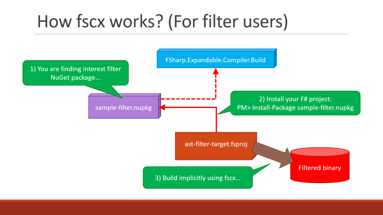
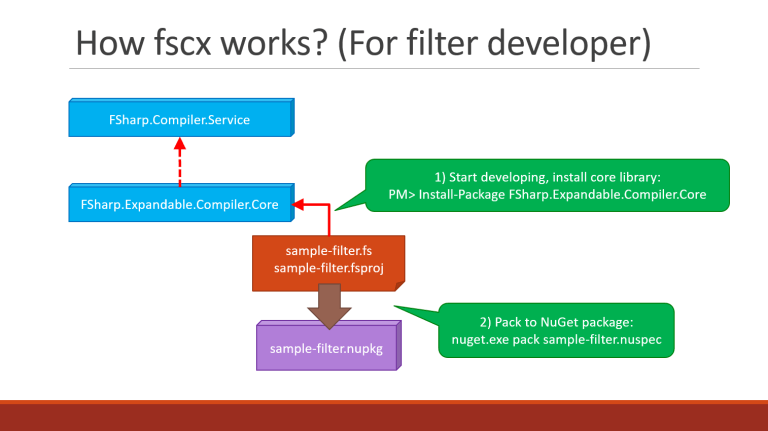




# About Expandable F# Compiler project #

*All text and code copyright (c) 2016 by Kouji Matsui. Used with permission.*

*Original post dated 2016-12-23 available at http://www.kekyo.net/2016/12/23/6305*

**By Kouji Matsui**

For Japanese post: (http://www.kekyo.net/2016/12/23/6263)

Hi, all F#er!! My name is Kouji Matsui, I live in Japan and I’m architect/developer.

I’m interesting to C#, LINQ, F#, IL and metaprogramming. I know about what/how asynchronosly execution between user mode .NET handler and kernel-mode driver DPC/hardware interruption. Titled Microsoft MVP for VS and DevTech. Holds CSM, CSPO. And bicycle hobby rider. I’m already released [“F# FusionTasks.”](https://github.com/kekyo/FSharp.Control.FusionTasks)

If you want contact to me, please use [twitter: @kekyo2](https://twitter.com/kekyo2) or [gitter: kekyo/public](https://gitter.im/kekyo/public)

* *Sorry I have poor English, this post is very challenging for me :)*

Currently, I’m developing an alternate compiler for F#. This is not meaning I’m compiler specialist :) This project uses the [“F# Compiler Service.”](http://fsharp.github.io/FSharp.Compiler.Service/index.html)

F# Compiler Service is likely “Roslyn” under C#. That’s parsing for F# source code and output AST (Abstract syntax tree). Then can compile and output to executable binary from ASTs. Another usage, F# Compiler Service have capability of interactive interpreter for F# (backend for fsi).

I try to write this project’s background: **Why do I develop alternate compiler for F#?**

## Expandable F# Compiler project (fscx)


[“Expandable F# Compiler (fscx)” is an open source project on GitHub](https://github.com/fscx-projects/fscx). Current version is 0.6.14, not reached official release. This post’s details will be implicitly changing :)

We can replace standard F# compiler (fsc.exe) to fscx. fscx’s goals are:

* I want to auto translate the F# source codes – We can translate source codes by text-based (For example use by regular expressions). But this project not uses text-based translate. I’m designing for use F# Compiler Service and get ASTs, then translate ASTs directly. Because try with text-based translates then broken codes easier. AST based approach will not break and safe (But it’s very difficult for me, see below section :)
* This auto translate library called “Filter library” and I want to can be extendable and expandable for non limitation – For example, a filter library can handles for insert another code fragments to before/after method body (by uses AST translate. likely AOP) Sure this is example, we can handle ANYTHING by AST translations.
* Better easier installation – NOT customize for compiler executable path, NOT require install VSIX plugin. fscx is packaging by NuGet, we can use fscx on target F# project, require only fscx install via NuGet, simply then enables fscx. This senario already examine how to effect for building system by MSBuild (Post: [“How to intercept for building system by NuGet,”](http://www.kekyo.net/2016/12/23/6305) In Japanese)

## Structure viewed from the filter library user



For fscx users, fscx uses not directly. We are implicitly using for fscx depended from the “Filter library” via NuGet. We can select filter library from the purpose. If installed fscx then auto replace the F# compiler (fsc.exe) to fscx.

For example, this slide identicate the box “sample-filter.nupkg.” This is packaged filter library on NuGet. We download and install this package via NuGet. NuGet client auto install depended packages include fscx named “FSharp.Expandable.Compiler.Build.” And ready for auto translate ASTs by filter library and fscx. Then compile and output translated binary.

Example in this code fragment:

```fsharp
module SampleModule =
  let format (a: int) (b: int) (c: string) =
    System.String.Format("{0} = {1}", a + b, c)
```
    
If “sample-filter.nupkg” contains AST translator implementation for: “Insert logging codes on function entry point:”

```fsharp
module SampleModule =
  let format (a: int) (b: int) (c: string) =
    // Auto inserted logging code below:
    System.Diagnostics.Trace.WriteLine("Log: format {0} {1} {2}", a, b, c)
    System.String.Format("{0} = {1}", a + b, c)
```
    
This translation executes at compile time. Sure no text-based translation. Then we can effect this translation for only installing filter library via NuGet.

Very important at this point: Users don’t know about filter implementation details. I’m designing for fscx to do in transparents.

## Structure viewed from the filter library developer



More complex for filter library side.

Filter library must use F# Compiler Service’s AST types, so library has assembly reference to F# Compiler Service and the fscx core library too. fscx core library package is naming for “FSharp.Expandable.Compiler.Core.” This package install to filter library project via NuGet.

Ready for can develop filter implemens, but…

## How to implement filter library

You can choice “Visitor patterns” on the helper library:

* The legacy OOP based visitor pattern – This is most known technics for recursive tree structure on OOP. This approach likely .NET LINQ’s [“ExpressionVisitor class,”](https://msdn.microsoft.com/en-us/library/system.linq.expressions.expressionvisitor(v=vs.110).aspx) named “AstInheritableVisitor class.” Why do we use AstInheritableVisitor instead ExpressionVisitor? Because F#, C# or any other languages (include .NET Expression-tree) different expression nodes smaller and larger. (You are already known things if you are using for F# Compiler Service or/and Roslyn :)
* F# Compiler Service not provides standard visitor pattern infrastructures – Because we can implement visitor pattern with both the functional programming (FP) technics and pattern matching. But code fragments must has frequently recursive calls. So I developed visitor pattern helper functions on FP-based contains recursive callers.
For example, How to do using for OOP based visitor class:

```fsharp
type InsertLoggingVisitor() =
  inherit AstInheritableVisitor()
 
  override __.VisitExpr_Quote(context, operator, isRaw, quoteSynExpr, isFromQueryExpression, range) =
    // DEBUG
    printfn "%A" operator
    base.VisitExpr_Quote(context, operator, isRaw, quoteSynExpr, isFromQueryExpression, range)
 
  override this.VisitExpr_App(context, exprAtomicFlag, isInfix, funcExpr, argExpr, range) =
    match funcExpr with
      // ...
```
      
How to do using for FP based helper functions:

```fsharp
let outerVisitor
   (defaultVisitor: (NoContext * SynExpr -> SynExpr),
    context: NoContext,  // (Non custom context type)
    expr: SynExpr) : SynExpr option =
 
  match expr with
  | SynExpr.Quote(operator, _, _, _, _) ->
    // DEBUG
    printfn "%A" operator
    None  // (None is default visiting)
 
  | SynExpr.App(exprAtomicFlag, isInfix, funcExpr, argExpr, range) ->
    match funcExpr with
      // ...
 
  | _ ->
    None  // (None is default visiting)
```
    
Which choice of better technics? There is both merits and demerits which is desirable. If you use OOP based, you can receive all AST nodes at visit timing but more complex and difficult for how to identicates structurable-nested AST nodes. If you use FP based, can easier structurable-nested AST nodes (by pattern matching) but you can receive only “SynExpr” nodes at visit timing.

These helpers are totally not depended on fscx. I separate visiter pattern helpers from fscx and construct standalone package for [“FSharp.Compiler.Service.Visitors.”](https://github.com/fscx-projects/FSharp.Compiler.Service.Visitors) If you are thinking about how to apply visitor pattern for your application, try to use this package.

* *This package fixed for the most part in version 0.7.1. Maybe not change for public declarations.*

## What is difficult for AST translations?

The AST translation code has cool things (Maybe ;)

But AST translation always most difficult technics in real story. You are the man of always designing for F# Compiler Service/Roslyn’s AST everydays :) So you are understand it’s really difficult for meaning and knowning. F# ASTs are likely Expression-tree classes, but translation is difficult more than ExpressionVisitor experience…

* If you want more informations about Expression-tree, read these posts: [Second half of Advent LINQ 2013 (In Japanese)](http://www.kekyo.net/linq) and/or [“Final LINQ Extensions III” (In Japanese)](http://www.kekyo.net/2015/08/30/5259).

We are trying to implement the “sample-filter” above: We need knowns about what realize AST structures and where AST nodes appearance for? And how to translate AST nodes?

AST nodes constructs for recursivility. So if you identicate AST nodes by rough technics, results are broken easier. (OK, F# Compiler Service find invalid AST structures and report errors at compile time. The world maybe safe :)

This example illustrated for how different AST structures on source code by small different:

```fsharp
// The standard .NET method signature (Tupled arguments)
let output1 (a: int, b: string, c: double) =
  System.Console.WriteLine("output1: {0}:{1}:{2}", a, b, c)
 
// F# function (Curryable arguments)
let output2 (a: int) (b: string) (c: double) =
  System.Console.WriteLine("output2: {0}:{1}:{2}", a, b, c)
```
  
“output1” method is most popular standard .NET method. “output2” function is F# friendly the “Function.” If you write to call these members:

```fsharp
// Call the standard .NET method signature (Tupled arguments)
// (int * string * double) -> unit
output1 (123, "ABC", 456.789)
 
// Call the F# function (Curryable arguments)
// int -> string -> double -> unit
output2 123 "ABC" 456.789
```

The “Tupled arguments” method different for “Curryable arguments” function. We are finding for differents in AST nodes. Tupled arguments realize for SynExpr.Tuple AST node. But curryable arguments realize for nested SynExpr.App AST nodes.

It’s difficult that different on ASTs. I want to see AST structures. So [I make smaller tool for dump AST nodes by F# Compiler Service](https://github.com/fscx-projects/DumpUntypedAST) (This tool for smaller hacks, very rough quality.)

This is output (Only contains interested fragments):

```fsharp
// For output1 method:
Ast.SynExpr.App( (* expr1 *)          // App - output1(...)
  ExprAtomicFlag.NonAtomic (* exprAtomicFlag *),
  false (* isInfix *),
  Ast.SynExpr.Ident( (* funcExpr *)
    output1 (* Item *)),
  Ast.SynExpr.Paren( (* argExpr *)    // Paren --> Tuple : Tupled arguments
    Ast.SynExpr.Tuple( (* expr *)
      [ (* exprs *)                   // Arguments declaring by list
        Ast.SynExpr.Const( (* [0] *)
          Ast.SynConst.Int32( (* constant *)
            123 (* Item *)));
        Ast.SynExpr.Const( (* [1] *)
          Ast.SynConst.String( (* constant *)
            "ABC" (* text *)));
        Ast.SynExpr.Const( (* [2] *)
          Ast.SynConst.Double( (* constant *)
            456.789 (* Item *)))],
      [ (* commaRanges *)]),
    range>.Some( (* rightParenRange *)))),
 
// For output2 function:
Ast.SynExpr.App( (* expr2 *)          // App - Apply 456.789
  ExprAtomicFlag.NonAtomic (* exprAtomicFlag *),
  false (* isInfix *),
  Ast.SynExpr.App( (* funcExpr *)     // App - Apply "ABC"
    ExprAtomicFlag.NonAtomic (* exprAtomicFlag *),
    false (* isInfix *),
    Ast.SynExpr.App( (* funcExpr *)   // App - Apply 123 for output2
      ExprAtomicFlag.NonAtomic (* exprAtomicFlag *),
      false (* isInfix *),
      Ast.SynExpr.Ident( (* funcExpr *)
        output2 (* Item *)),
      Ast.SynExpr.Const( (* argExpr *)
        Ast.SynConst.Int32( (* constant *)
          123 (* Item *)))),
    Ast.SynExpr.Const( (* argExpr *)
      Ast.SynConst.String( (* constant *)
        "ABC" (* text *)))),
  Ast.SynExpr.Const( (* argExpr *)
    Ast.SynConst.Double( (* constant *)
      456.789 (* Item *))))),
```
      
It’s contains too many verbose fragments so ugly (sorry). That means output1’s arguments declarates by list, output2’s arguments declarates by nested “SynExpr.App” (Apply argument).

That is the “Curryable arguments,” means:

```fsharp
// Call the F# function (Curryable arguments)
// int -> string -> double -> unit
output2 123 "ABC" 456.789
 
// It's meaning for expression:
((output2 123) "ABC") 456.789
 
// Split expressions:
let f1 = output2 123  // f1 is higher order function
let f2 = f1 "ABC"     // f2 is higher order function
f2 456.789
```

The AST structure different for smaller on original source codes. So we are sensitive for analyse by visitor pattern. This is just difficult…

* *I have an idea from these things. I have a session for [“You will be assimilated. Resistance is futile.”](http://www.slideshare.net/kekyo/documents-you-will-be-assimilated-resistance-is-futile) on “NGK2016B” LT conference (This is joke session :)*

## The filter’s middleware

So we can do anything by filter library AND implementation are very hard work. Then I’m thinking about how to do easier it…
I’m trying to design the helper library: “FSharp.Expandable.Compiler.Aspect.”

Will we have what intercept anything (by fscx)? This library is “Middleware” for fscx, we can safe implements for insert custom code between enter and leave function points. Today, we are calling the “AOP (Aspect oriented paradigm)” for this technics.

If we use this helper library by develop filter library in this case, our filter code are simple, safe and more easier.

For example below:

```fsharp
// This is "Aspect context" class
type SampleAspectContext internal (body: string) =
  // Finish aspect (trigger are leaved method with return value)
  member __.Leave(result: 'T) : 'T =
    Console.WriteLine("Leave: " + body)
    result
  // Finish aspect (trigger are leaved method with exception)
  member __.Caught(ex: exn) : unit =
    Console.WriteLine("Caught: " + body + ": " + ex.ToString())
 
// This is "Aspect" class
type SampleAspect() =
  // Start aspect (trigger are entered method)
  static member Enter(methodName: string, fileName: string, line: int, column: int, args: obj[]) =
    let body =
      String.Format
        ("{0}({1}, {2}): {3}({4})",
         fileName,
         line,
         column,
         methodName,
         String.Join(", ", args |> Seq.map (sprintf "%A")))
    Console.WriteLine("Enter: " + body)
    new SampleAspectContext(body)
```
    
This sample codes (Called “Aspect code”) are printing to console for function call message between enter and leave (include caught exception). “SampleAspect.Enter(…)” method is calling from before function call and “SampleAspectContext.Leave(…)” or “Caught(…)”
methods are calling from after function called.

“Enter(…)” method received the method name, source code file name, line/column number and will be calling with arguments. This sample codes prints these information to Console and create instance for “SampleAspectContext” class and return.

“Leave(…)” or “Caught(…)” handles to print leave messages. “Leave(…)” can receive for function called result. “Caught(…)” can receive for exception instance.

These aspect codes are truly “Duck-typed.” fscx will be identicate and not require any base classes and any interfaces. Because if request these types, we have .NET assembly referencing problem and fix this problem for very hard on packaging by NuGet :(

Ready for aspect named “SampleAspect” class. Next step, how to identicate this aspect for “FSharp.Expandable.Compiler.Aspect?” :

```fsharp
// This is declaring for aspect: "SampleAspect" class.
// Class name is free.
[<Sealed>]
type SampleAspectLoggerDeclaration() =
  // Construct with aspect class name. This is duck-typed naming (by string.)
  inherit DeclareFscxInjectAspectVisitor("SampleAspectLogger.SampleAspect")
```
        
Totally aspect tips: Aspect codes and this declaration requests loose types, so we can write aspects by C#.

This declaration contains on filter library, fscx can find and translate:

* If fscx is targeting for a function, fscx insert custom AST nodes before calling function. Call to “SampleAspect.Enter(…)”
* And fscx insert custom AST nodes after called function. Call to “SampleAspectContext.Leave(…)” or “Caught(…).” Leave with called function result value, Caught with exception instance by (inserted) try-with block.

This sample code fragment:

```fsharp
let f11 (a: int, b: string, c: int) =
  output1(a + c, b, 123.456)
```
  
Translate to:

```fsharp
let f11 (a: int, b: string, c: int) =
  let __arg_0 = a + c
  let __arg_1 = b
  let __arg_2 = 123.456
  let __context =
    SampleAspectLogger.SampleAspect.Enter
      ("f11", "SampleCode.fs", 2, 3, [|__arg_0, __arg_1, __arg_2|])
  try
    __context.Leave(output1(__arg_0, __arg_1, __arg_2))
  with
  | ex ->
    __context.Caught(ex)
    reraise()
```
    
This sample code declare “f11(…)” by tupled arguments method, sure can translate for function by curryable arguments.

Totally at this point: We have only the aspect classes “SampleAspect, SampleAspectContext” and aspect declaration “SampleAspectLoggerDeclaration”. These are contains no AST translation codes… Oh I made it! :)

Currently, I’m developing “FSharp.Expandable.Compiler.Aspect” now and not finish, because how to set where insert aspects to the target function.

## Conclusion

fscx is challenging project for me. This project has several points:

* fscx is easy-usage (by install NuGet) for any filter users.
* We can develop any auto translation by ASTs (but very difficult).
* We can develop easier any AOP based senarios by using fscx’s middleware.
* All filter libraries can deploy by NuGet packaged.

The myth: We write OOP based codes by F# that’s hassle. Because if we become to FP, a little bit tired for declare many class and/or interface word elements. (It’s myth! don’t make seriously :)

We often write for UI codes, for example how to implement “INotifyPropertyChanged.” fscx is capable for can filtering auto-implement this interface, these senarios capsule to the middleware and running this code by no runtime cost. Finally we can construct ecosystem for filter libraries.

Acknowledgments: Thanks cooperation for [On the road corporation](http://otr-jp.com/) and [Mr. bleis](https://twitter.com/bleis).

Thank you for reading, welcome any comments! Happy Christmas!!

