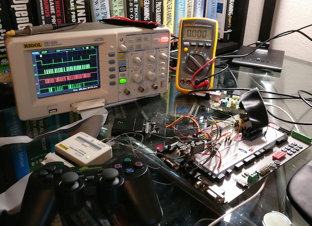
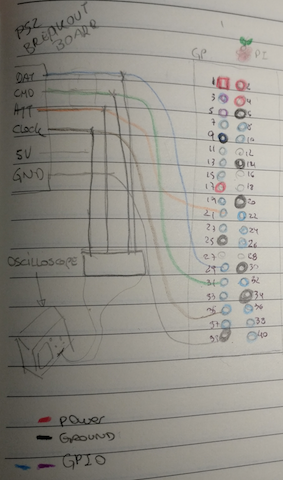
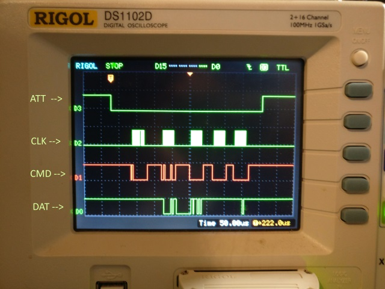
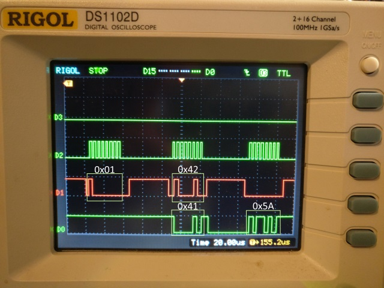
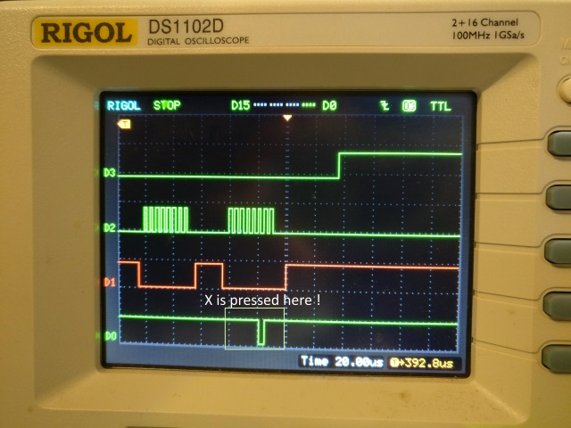
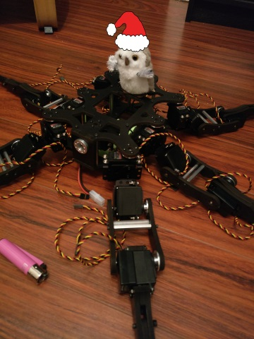




# When Playstation meets F\#, PSX |> Pi #

*All text and code copyright (c) 2016 by Ross McKinlay + Andrea McAts. Used with permission.*

*Original post dated 2016-12-23 available at https://github.com/ChipmunkHand/ChipmunkHand/blob/master/blog/psx.md*

**By Ross McKinlay + Andrea McAts**




##Introduction

This post and work herein is by both [Andrea](https://twitter.com/silverSpoon) and [Ross](https://twitter.com/pezi_pink), but will be written in an odd first/third person style because reasons :D. This post is part of the [F# advent calendar 2016](https://sergeytihon.wordpress.com/2016/10/23/f-advent-calendar-in-english-2016/) you can also read it in [book form](https://www.gitbook.com/book/swlaschin/fsadvent-2016/details) thanks to [Scott Wlashin](https://twitter.com/ScottWlaschin/status/811611881123102721)'s efforts.

In our current super-secret yet not-very-secret but as-of-yet-mostly-not-announced hardware project, we have a requirement to use a controller.  We are currently using a Raspberry Pi 2 and would like to write most of the software, for the time being, in F#.  Now, Ross' blog already has some details on [using a NES pad](http://pinksquirrellabs.com/post/2013/07/04/Last-Fi.aspx), but for this project we are going to need way more buttons and analogue sticks, to this end, we settled on the wireless Playstation 2 Controller (henceforth known as PSX)

##Detectives

Sony never officially released the protocol specifications for their controller (of course not, that would be too easy). A quick search around the internet will yield various incomplete, conflicting documentation on how it works.  The top level concepts can be loosely explained as follows.

* There is a master / slave relationship with the Playstation (Server) obviously being the master
* The clock signal used to synchronise the two systems runs at a frighteningly fast pace,somehwere between 250khz-500khz (or maybe this is the difference between the PS1 and PS2, who knows)
* Data is full duplex, this means the master and slave both send data to each other on the same clock cycle on two different lines
* The controller has the capability to enter a configuration mode where you can tell it switch stuff on and off, such as the analogue sticks, the button pressure sensors and the rumble motors.

##Yakception

Let's talk about speed quickly (see what we did there, ha!). The clock cycle to keep the devices in sync is somewhere between 250 to 500 kilohertz. One hertz is one cycle per second, this means a rate of 500 kilohertz is equal to about 1 cycle every 4 microseconds(!).  Unfortunately being in a managed language on top of an operating system makes this rather difficult, the CLR only lets us delay at 1 millisecond at most, and even that is not guaranteed due to the operating system scheduler. Thankfully, using The Pi, we have access to a bunch of functions on the chip including a microsecond delay function, which is also not guaranteed to do what you tell it to (that would also be too easy) and you might be lucky to get a delay lower than 80 microseconds.

Well, let's give it a go anyway. We are using a Lynxmotion wireless PSX controller, here is a schematic on how we hooked up the Pi to the PSX.



The general format of communications goes as follows

* Server pulls the ATT (Attention!) line LOW.  This tells the controller that the server is about to initialize communications with it
* Server begins the clock cycle by pulling CLK LOW for 4us then HIGH for 4us and so on
* As the clock goes LOW, each device loads its next bit onto the relevant line.  The master sends data on the CMD line, whilst the slave sends data on the DAT line.  When the clock line goes HIGH, each side reads the bit they were sent, and the process continues
* The Server pulls the ATT line HIGH again once it has finished.

Now, since we have to send data out bit-by-bit we are going to need to write some functions to convert a byte to and from a sequence of HIGH/LOW (1/0, true/false) values.

```fsharp
let convertToBits n =
    let mutable mask = 0b00000001
    [for i in 0 .. 7 do
        let r =  n &&& mask
        mask <- mask <<< 1
        yield (if r > 0 then 1uy else 0uy)]

let convertToNumber (xs: byte list) =
    xs
    |> List.fold (fun (acc, (counter:byte)) x  ->
                        let bitShiftedValue = (x <<< (int counter)) 
                        ( acc ||| bitShiftedValue, counter + 1uy)) (0uy, 0uy)
    |> fst  
```


Note we chose to use a byte of 0 or 1 to represent a bit, rather than a bool, simply because space is not an issue and converting between bools and bytes all the time gets ~tiring~

And of course we need a way to send and receive a byte by exchanging 1 bit at a time via the clock cycle as outlined above.

```fsharp
let pulse() = delayUs 4UL

let sendByte (b:byte) =
    let bits = convertToBits (int32 b)
    [for x in bits do
        // pull clock low
        write CLK false 
        // send a HIGH or LOW depending on current bit
        write CMD (x = 1uy)            
        // wait 4us
        pulse()    
        // pull clock high   
        write CLK true
        // read the received bit
        let v = if read DAT then 1uy else 0uy
        // wait 4 us
        pulse()
        yield v]
    |> convertToNumber
```

Here we are using side-effects within a list comprehension to both send a recieve bits in a single expression.

It seems, from the ever reliable internet, the most simple thing you can do is to ask the controller for the state of its digital buttons.  Not forgetting the full-duplex communication, the whole series of communications happens over 5 bytes as follows.

|byte  	|master	|slave 	|
|---	|---	|---	|
|1   	| 0x1  	| 0xFF 	|
|2   	| 0x42 	| 0x41 	|
|3   	| 0x0  	| 0x5A 	|
|4   	| 0x0  	| 0xFF 	|
|5   	| 0x0  	| 0xFF 	|

In the first byte we ignore what the slave says, we are just initiating the communication, which seems to always be with 0x1.  The second byte tells the controller what to do, 0x42 tells it to send the states of the digital buttons.  At the same time, the controller sends us 0x41. This byte might be something else, and it is the controller telling us what sort of mode it is in (eg, digital, angalogue).

For the remaining bytes, the master sends nothing at all. The slave sends one byte 0x5A which is it confirming it is about to send the data, and finally it sends two bytes that represent the state of the 16 digital buttons, on per bit,  with LOW being pressed.

(note: the controller expects these bytes to be sent least-signifcant-bit first. Our code above that converts the bytes to a bool list handles this simply by not reversing the output list)

(note of a note: who cares if it is least significant byte first? how would you even know when reverse engineering the protocol? you could equally call 0x41 0x82 and have done with it)

Here is a very straight-forward imperative program to try this

```fsharp
// send ATT to low "oh hai controller!"
write ATT false
sendByte (byte 0x1) |> ignore
let r = sendByte (byte 0x42)
let r2 = sendByte (byte 0x0)
let r3 = sendByte (byte 0x0)
let r4 = sendByte (byte 0x0)
// tell controler we are finished with it
write ATT true
```

Did this work? Of course it didn't. Occasionally we could get a message saying it had detected the 0x41 byte indicating the controller had told us it was in digital mode (woohoo!) but nothing other than that (awww :( ).  Something to be careful of here is writing to the console takes a very long time and messes the timing up, thas was taken into consideration too (not shown here).

Looking at what was going on with the oscilloscope and logic analyser, we could see the clock cycle was all over the shop - we expected that would be the case anyway, but was not sure how it would affect the controller.  Does the controller time out and reset itself? Were we doing something completely wrong?

##Further adventures in Yak land

Ah, behold the familiar fields of Yaks waiting to be shaved!  If our suspicions were correct, and by looking at the signals on the logic analyser, the 4us delay was no where near stable enough and the controller was getting confused.  However, so it transpires, the PSX pad is using a well known serial protocol called [SPI](https://en.wikipedia.org/wiki/Serial_Peripheral_Interface_Bus) which for some reason we did not notice.

##SPI

The Pi has hardware support for both the I2C and SPI serial protocols, we were in luck.  After much messing around attempting to enable the SPI hardware support and testing that it actually works (We will omit those particular fields of Yak from this post) we were able to include a few new functions from the chipset library that enabled us to send data over dedicated SPI pins on the Pi.

Important things to note:

* The Pi will automate the clock cycle for us at a given speed
* The Pi will deal with sending whole bytes, rather than bits, but only most-significant-bit first
* With some testing, it was noted the ATT line is cycled after every byte (as the protocol is generally supposed to work)

A few problems needed solving here, then. Firstly, although you can set a clock speed, it is govenered by the rules imposed [here]( https://www.raspberrypi.org/documentation/hardware/raspberrypi/spi/README.md). This means the closest we can get to 250khz or 500khz is 244khz or 488khz. Let's hope that won't be a problem!

The second problem is that the Pi will send the bytes most-significant-bit first which is the opposite of what we need.  It does have a way to flip this, but apparently it does not work (great!), so instead we wrote a function to flip a byte.

```fsharp
let revByte =
    let rev (input:byte) =
        let mutable output = 0uy
        // no loop implementation of reverse, for no good reason at all
        output <- output ||| ((input &&& (1uy<<<0)) <<< 7)
        output <- output ||| ((input &&& (1uy<<<7)) >>> 7)        
        output <- output ||| ((input &&& (1uy<<<1)) <<< 5)
        output <- output ||| ((input &&& (1uy<<<6)) >>> 5)
        output <- output ||| ((input &&& (1uy<<<2)) <<< 3)
        output <- output ||| ((input &&& (1uy<<<5)) >>> 3)
        output <- output ||| ((input &&& (1uy<<<3)) <<< 1)
        output <- output ||| ((input &&& (1uy<<<4)) >>> 1)
        output

    //store reverse bytes as lookups since it costs just 512 bytes (plus dict) and give us O(1)
    let lookup = [for x in 0uy..255uy -> x, rev x] |> dict
    fun b -> lookup.[b]
```

This was about the fourth version of it, many were written with variations of loops and caching, really for not good reason at all.  This version does a manual reverse of a byte's bits and then calculates a lookup table with all the possible bytes in it.

The last problem we encountered was that the ATT line was cycling after every byte, which apparently - via lengthy experimentation - the pad did not like at all. This was not a big problem however since we could simply go back to cotrolling the ATT line manually like before.

##Higher Level Constructs

What you may be thinking at this stage is what is the point of using F# to do all these low level imperative operations? Wouldn't we be better off just writing it in C or something and have done with it?  Well, it turns out that F# has several features that make working with hardware quite nice.

###Active Patterns

Since we are going to be dealing in arrays of bytes going backwards and forwards between the devices, we can use the combination of Active Patterns and pattern matching to very succinctly match on the streams of data. For example, we can define some partial active patterns like this

```fsharp
let (|IsDigital|_|)     b = if b = 0x41uy then Some () else None
let (|IsAnalogueRed|_|) b = if b = 0x73uy then Some () else None
```

These patterns look at a byte and match if they are equal to a given number.  In the bytes we recieve back from the pad, the second byte is the pad telling us what mode it is in.  Thus, once we have extracted an array of bytes we can see if it is what we are interested in explicitly as follows:

```fsharp
match data with
| [|_;IsDigital;0x5Auy;data1;data2|] ->
```

Here we state that the byte array must be 5 bytes long, we don't care what the first byte is, the second must match that of a digital pad. The third must equal 0x5A and then the final two bytes represent state of the 16 digital buttons ...Nice!


###Array Comprehensions

This was mentioned earlier, but now we are going to combine them with the functions from the chip that allow us the send SPI data. The function is called `bcm2835_spi_transfer` which accepts a byte to send and returns the byte that it recieved in response.  Since the bytes need to be reversed, we can wrap this in a friendler function for our particular need
```fsharp
let spi b = bcm2835_spi_transfer (revByte b) |> byte |> revByte
```

Now, to retrieve the data from the pad we can use this within the array comprehensions like so

```fsharp
write ATT false     
let data =
    [| 
        // prepare
        yield spi 0x1uy
        // get data
        let mode = spi 0x42uy 
        yield mode
        // 0x5A and two data bytes
        for x in 0..2 -> spi 0x0uy
        match mode with
        | IsAnalogueRed -> 
            // rest of analogue data
            for x in 0..3 -> spi 0x0uy
        | _ -> ()
    |] 
write ATT true
data
```

Here we are controlling the ATT line over the whole operation. Notice that we can send a byte and form part of the result using `yield`.  We can also loop to recieve bytes, since for bytes 3, 4 and 5, the master simply sends 0x0 as it is only interested in the response.  The final cool bit (pun fully intended!) here is that if the controller tells us is in analog mode in byte 2, this means it will be sending extra data for the analogue sticks, and we can read those as well within the same expression to be matched on later.

##MailboxProcessor

Finally, with all this in place, we still need a way to periodically poll the pad for the state of its buttons.  In order for the pad component to be re-usable it should be self-contained and deal with any threading concerns itself. The MailboxProcessor is a great solution for this, using a nice trick with `tryRecieve` which effectively acts as a timed loop rather than really waiting on any messages

```fsharp
let pad = new MailboxProcessor<int>(fun inbox -> 
    let rec loop delay = async{
        let! _ = inbox.TryReceive delay        
        match readPad() with
        | Some (AnalogueRed data)-> 
            printer.Post "analog data recvd"
            for x in data do printHex x
            return! loop delay
        | Some (Digital data) -> 
            printer.Post "digital data recvd"
            return! loop delay
        | Some config -> 
            printer.Post "config data recvd"
            return! loop delay
        | None ->  
            //printer.Post "failed to read data"
            return! loop (delay)        
    }
    loop 5)
```

The above polls the pad every 5ms.  Obviously this is a simplified example, the real version would communicate the new data in some fashion, either by calling passed in functions or raising events of some description (this follows a pattern similar to the NES pad implementation )

## Some exciting pictures !

Behold! This is what the signals should look like when they are functioning as expected



In the above image we have labelled the different signals. ATT is the attention line which is held low during the communication as seen in the code avove.  CLK is obivously the clock line which is used to shift the bits in and out of the master and slave.  CMD is the data being sent from the Pi, and DAT is the data being sent back from the pad.  Let's zoom in a bit here and see what is going on in each section.



Here we can clearly see the initial byte of 0x1 being sent, followed by the 0x42 command to get data, whilst at the same time the pad is sending us back 0x41 to tell us it is in digital mode.  The server then sends 0x0 and recieves in kind 0x5A which is the packet indicating the controller is about to send us its two bytes of data.



This final image shows the controller sending us two bytes of data indicating the buttons currently being pressed.  In this instance we are holding down the X button only, which is reprsented by the one low bit of the second byte recieved.  After this, the ATT line is pulled high again to signal the end of the communication.


##Next Steps

Unfortunately with the festive season and other great excuses, we did not get quite as far as we would have liked with this. The pad is now reasonably giving us digital data back, although sometimes it drops out for several seconds, which is still a mystery. The original plan however was to use the pad's fabled "config mode" in order to force the pad into analogue mode and start giving us steady analogue data back.  You can see some work towards this in the repo (link at the bottom), but of course, many Yaks were presented for shaving, several of them seemingly invisible.  It is hard to shave invisible Yaks!


##Conclusion

We have beeen working on this for some time. Most of the time is trying something and seeing how it works (or more accurately how it doesn't work!), then trying to guess what went wrong and rinse-repeat until we can get it working - but that was to be expected. 
Besides all that, it has been really exciting, especially for Andrea, because of the oscilloscope/logic analyzer and the capability to see the bits on the wire at relatively high frequencies. 
What gets in the way of faster progress is the invisible yaks that require shaving. It is worth mentioning that the setup is rather delicate, sometimes you start exactly where you left it the last time and it is just not working for no apparent reason, which can be really quite confusing! Having said that this would be almost impossible without the oscilloscope.

Hopefully you can see how F# is a language that is strangely suitable to do low level stuff as well as high level stuff, maybe Don is a Santa in disguise with a gift of a language that just keeps on giving!!!

### Code

Liked this? Want to see it all the code? [Here it is](https://github.com/ChipmunkHand/ChipmunkHand/tree/master/Tools) (after a nice clean up)


