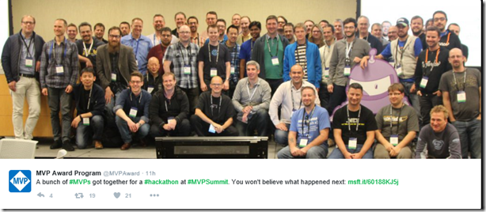
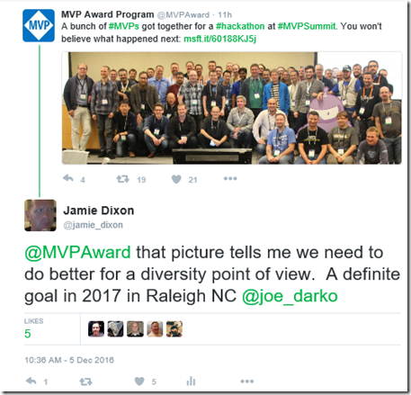
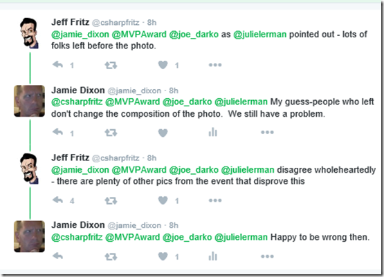
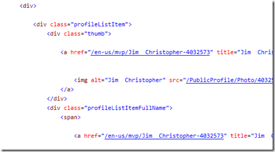
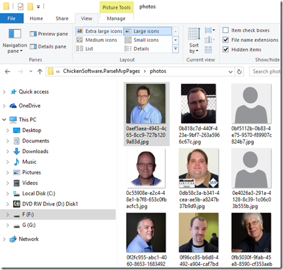
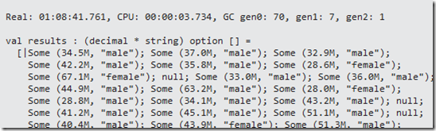
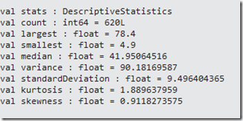
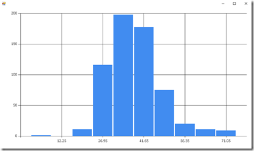




# Age and Sex Analysis Of Microsoft USA MVPs #

*All text and code copyright (c) 2016 by Jamie Dixon. Used with permission.*

*Original post dated 2016-12-25 available at https://jamessdixon.wordpress.com/2016/12/25/age-and-sex-analysis-of-microsoft-usa-mvps/*

**By Jamie Dixon**

A couple of weeks ago, this came across my Twitter




I participated in this hackathon (well, helped run the F# one).  My response was:



I was surprised that I got into this exchange with a Microsoft PM:



That last comment by me was inspired by Mark Twain: “never wrestle with a pig.  You just get dirty and the pig likes it.”  But it did get me to thinking about the composition of the US MVPs.  I did an analysis a couple of years ago of the photos of the Microsoft MVPs (found [here](https://jamessdixon.wordpress.com/2014/10/21/parsing-microsoft-mvp-pages-and-uploading-photos-to-sky-biometry/) and [here](https://jamessdixon.wordpress.com/2014/10/28/parsing-microsoft-mvp-pages-part-2/)) so it made sense to follow up on that code and see if I was wrong about my “middle age white guy” hypothesis.  I could get the photos from the MVP site and pass them into the Microsoft Cognitive Services API for facial analysis for age/sex data.  Using F# made the analysis a snap.

A nice thing about the Microsoft MVP website is that it is public and has photos of the MVPs.  [Here](http://mvp.microsoft.com/en-us/search-mvp.aspx?lo=United+States&sl=0&browse=False&sc=s&ps=36&pn=) is one of the pages:


and when you look at the source of the page, each of those photos has a distinct uri:



I opened up Visual Studio and created a new F# project.  I went into the script file and brought in the libraries to do some http requests.  I then created a couple of functions to pull down the HTML of each of the 19 pages and put it into 1 big string:

```fsharp
let getPageContents(pageNumber:int) =
     let uri = new Uri("http://mvp.microsoft.com/en-us/search-mvp.aspx?lo=United+States&sl=0&browse=False&sc=s&ps=36&pn=" + pageNumber.ToString())
     let request = WebRequest.Create(uri)
     request.Method <- "GET"
     let response = request.GetResponse()
     use stream = response.GetResponseStream()
     use reader = new StreamReader(stream)
     reader.ReadToEnd()

let contents = 
    [|1..19|] 
    |> Array.map(fun i -> getPageContents i)
    |> Seq.reduce(fun x y -> x + y)
```

(OT: Since I did a map..reduce on lines 12 and 13, does that mean I am working with “Big Data”?)

I then created a quick parser to find only the uris of the photos in all of the HTML.

```fsharp
let getUrisFromPageContents(pageContents:string) =
     let pattern = "/PublicProfile/Photo/\d+"
     let matchCollection = Regex.Matches(pageContents, pattern)
     matchCollection 
         |> Seq.cast 
         |> Seq.map(fun (m:Match) -> m.Value)
         |> Seq.map(fun v -> "https://mvp.microsoft.com/en-us" + v + "?language=en-us")
         |> Seq.toArray

let uris = getUrisFromPageContents contents 
```

Sure enough, I got 684 uris for MVP photos.  I then wrote another Web Request to pull down each of the photos and save them to disk:

```fsharp
let saveImage uri =
    use client = new WebClient()
    let id = Guid.NewGuid()
    let path = @"F:\Git\ChickenSoftware.ParseMvpPages.Solution\ChickenSoftware.ParseMvpPages\photos\" + id.ToString() + ".jpg"
    client.DownloadFile(Uri(uri),path)

uris
|> Seq.iter saveImage
```
 
And I now have all 684 photos on disk.



I did not bring down the names of the MVPs – instead using a GUID to randomize the photos, but a name analysis would also be interesting.  With the photos now local, I could then upload them to Microsoft Cognitive Services API to do facial analysis.  You can read about the details of the API [here](https://www.microsoft.com/cognitive-services/en-us/face-api).  I created a third web request to pass the photo up and get the results from the API:

```fsharp
let getOxfordResults path =
    let queryString = HttpUtility.ParseQueryString(String.Empty)
    queryString.Add("returnFaceId","true")
    queryString.Add("returnFaceLandmarks","false")
    queryString.Add("returnFaceAttributes","age,gender")
    let uri = "https://api.projectoxford.ai/face/v1.0/detect?" + queryString.ToString()
    let bytes = File.ReadAllBytes(path)
    let client = new HttpClient()
    client.DefaultRequestHeaders.Add("Ocp-Apim-Subscription-Key","xxxxxxxxxxx")
    let response = new HttpResponseMessage()
    let content = new ByteArrayContent(bytes)
    content.Headers.ContentType <- MediaTypeHeaderValue("application/octet-stream")
    let result = client.PostAsync(uri,content).Result
    Thread.Sleep(TimeSpan.FromSeconds(5.0))
    match result.StatusCode with
    | HttpStatusCode.OK -> Some (result.Content.ReadAsStringAsync().Result)
    | _ -> None
```
    
Notice that I put a 5 second sleep into the call.  This is because Microsoft throttles the requests to 20 per minute. Also, since some of the photos do not have a face, I used the F# option type. The results come back from the Microsoft Cognitive Services API  as Json. To parse the results, I used the FSharp Json Type Provider:

```fsharp
type FaceInfo = JsonProvider<Sample="[{\"faceId\":\"83045097-daa1-4f1c-8669-ed012e9b5975\",\"faceRectangle\":{\"top\":187,\"left\":209,\"width\":214,\"height\":214},\"faceAttributes\":{\"gender\":\"male\",\"age\":42.8}}]">


let parseOxfordResuls results =
    match results with
    | Some r -> 
        let face = FaceInfo.Parse(r)
        match Seq.length face with
        | 0 -> None
        | _ -> let header = face |> Seq.head
               Some(header.FaceAttributes.Age,header.FaceAttributes.Gender)
    | None -> None
```

So now I can get estimated age and gender from Microsoft Cognitive Services API.  I was disappointed that the API does not estimate race.  I assume they have the technology but from a social-acceptance point of view, they don’t make it publically available.  In any event, a look though their photos show that a majority are white people.  In any event, I went ahead and ran this and went out to work on my sons [stock car](https://twitter.com/Sloan4Racing) while the requests were spinning.


```fsharp
#time
let results =
    let path = @"F:\Git\ChickenSoftware.ParseMvpPages.Solution\ChickenSoftware.ParseMvpPages\photos"
    Directory.GetFiles(path)
    |> Array.map(fun f -> getOxfordResults f)
    |> Array.map(fun r -> parseOxfordResuls r)
#time    
```

When I came back, I had a nice sequence of a tuple that contained ages and genders.



To analyze the data, I pulled in [Math.NET](http://numerics.mathdotnet.com/DescriptiveStatistics.html   ).  First, I took a look age:

```fsharp
Seq.length results  //684

let ages =
    results
    |> Seq.filter(fun r -> r.IsSome)
    |> Seq.map(fun o -> fst o.Value)
    |> Seq.map(fun a -> float a)

let stats = new DescriptiveStatistics(ages)
let count = stats.Count
let largest = stats.Maximum
let smallest = stats.Minimum
let mean = stats.Mean
let median = Statistics.Median(ages)
let variance = stats.Variance
let standardDeviation = stats.StandardDeviation
let kurtosis = stats.Kurtosis
let skewness = stats.Skewness
let lowerQuartile = Statistics.LowerQuartile(ages)
let uppserQuartile = Statistics.UpperQuartile(ages)
```

Here are the results. 



I got 620 valid photos of the 684 MVPs – so a 91% hit rate and I have enough observations to make the analysis statistically valid.  It looks like Cognitive Services made at least 1 mistake with an age of 4.9 years –> perhaps someone was using a meme for their photo?  In any event, the mean is estimated at **41.95** and the median is **40.95**, so a slight skew left. (Note I mislabeled it on the screen shot above)

I then wanted to see the distribution of the ages so I brought in FSharp charting and ran a basic histogram:

```fsharp
open FSharp.Charting

let chart = Chart.Histogram(ages,Intervals=10.0)
Chart.Show(chart)
```



So the ages look very Gaussian.

I then decided to look at gender:

```fsharp
let gender =
    results
    |> Seq.filter(fun r -> r.IsSome)
    |> Seq.map(fun o -> snd o.Value)

gender
    |> Seq.countBy(fun v -> v)
    |> Seq.map(fun (g,c) -> g, c, float c/float count)
```    
    
With the results being:


So there are 12% females and 88% males.  With an average age 42 years old and 88% male, “middle age white guy” seems like an appropriate label and I stand by my original tweet – we certainly have work to do in 2017.

You can find the gist [here](https://gist.github.com/jamessdixon/2e51e07170d5133b3a9e15385995d16b).

