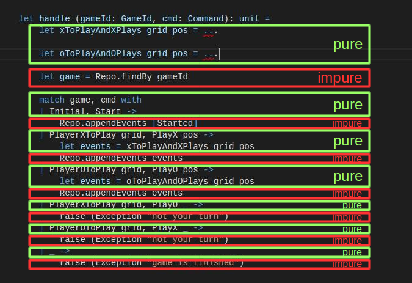




# Purity in an impure language with the free monad – by example of a Tic-Tac-Toe backend with CQRS and event sourcing #

*All text and code copyright (c) 2016 by Leif Battermann. Used with permission.*

*Original post dated 2016-12-25 available at http://blog.leifbattermann.de/2016/12/25/purity-in-an-impure-language-free-monad-tic-tac-toe-cqrs-event-souring/*

**By Leif Battermann**

Pure code intermingled with impure code.

This is not a very good *separation of concerns* and has many other disadvantages.

Here is an example of how many programs look like:



In Haskell e.g. this would not be possible. But how should we deal with this in an impure programming language that does not enforce side effects to be made explicit, like F# e.g.?

There are a few approaches that will be presented in this post, one of which is the free monad pattern.

We will also examine a proof of concept implementation of a Tic-Tac-Toe backend following the command query responsibility segregation pattern (CQRS) together with event sourcing (ES).

See how you can implement a program in F# that is entirely pure and free from any effects and side effects!

## Why should I care about purity?

A pure function is a function, which has only one effect and that is the computation of the return value.

Why do we want our code to be pure?

The reason is simple. When we have an impure expression, it can’t be substituted with its value without changing the semantics of our program.

Here is an example:

```fsharp
printfn "hello world" // evaluates to ()
```

If we substitute `printfn "hello world"` with `()` and run the code again, there won’t be any output on the console, of course.

Whereas if we substitute `1 + 2 + 3` with `6`, our program will still work as expected.

```fsharp
1 + 2 + 3 // evaluates to 6
```

Additionally, we can say that the latter example is *referentially transparent*. This can be (a little simplistically) defined like this:

> An expression `e` is referentially transparent if, for all programs `p`, all occurrences of `e`
in `p` can be replaced by the result of evaluating `e` without affecting the meaning of `p`.
> A function `f` is pure if the expression `f(x)` is referentially transparent for all referentially transparent `x`.

This means that every referentially transparent function, when called many times given the same input, will *always* return the same value. And there won’t be any other observable side effect that would change the meaning of the program.

Such side effects could be e.g:

* Printing to the console
* Getting the current system time
* Throwing an exception
* Generating a random number
* Reading from a database
* I/O in general
* ...

Programming with referentially transparent functions has many implications. Besides the fact that pure functions can easily be [memoized](https://en.wikipedia.org/wiki/Memoization), they are also much easier to reason about.

There is no hidden state, neither implicit inputs nor outputs, that we have to keep in mind. Also there are no exceptions thrown and maybe caught somewhere (or maybe not) which would significantly increase the possible execution paths and therefore the complexity of our program.

For more information on purity and referential transparency refer to these resources:

* [What is functional programming?](http://blog.jenkster.com/2015/12/what-is-functional-programming.html) by Kris Jenkins
* [LDN Functionals #5 Kris Jenkins: What is Functional Programming?](https://www.youtube.com/watch?v=tQRtTSIpye4) by Kris Jenkins
* [Side Effects and Functional Programming](http://codebetter.com/matthewpodwysocki/2008/09/12/side-effects-and-functional-programming/) by Matthew Podwysocki
* [Referential transparency](https://en.wikipedia.org/wiki/Referential_transparency) Wikipedia
* [A Beginner-Friendly Tour through Functional Programming in Scala](http://degoes.net/articles/easy-monads) by John A De Goes
* [Why Functional Programming Matters](https://www.cs.kent.ac.uk/people/staff/dat/miranda/whyfp90.pdf) by John Hughes

## Can I pretend that logging is not a side effect?

F# is an impure programming language, just like many other languages.

That means that the type system does not enforce purity as e.g. the Haskell type system does.

This definitely makes it easier especially for beginners to get started because the type system is not in the way and we can basically do I/O anywhere we like.

So yes, we can pretend that logging is not a side effect and just add logging statements wherever we like. One could even argue that logging does not change the semantics of our program and that therefore the above definition of referential transparency still holds.

However, letting logging aside for now, doing I/O anywhere in our code will lose all the benefits described above. It will lead to much less reasonable code that cannot be considered functional and will also break the separation of concerns principle.

## Dependency injection is not sufficient

Let’s look at an example. Consider the domain of Tic-Tac-Toe that is designed with events and commands. Somewhere there might be a function like this:

```fsharp
let handle (gameId: GameId, cmd: Command): unit =
    let xToPlayAndXPlays grid pos = ...

    let oToPlayAndOPlays grid pos = ...

    let game = Repo.findBy gameId

    match game, cmd with
    | Initial, Start ->
        Repo.appendEvents [Started]
    | PlayerXToPlay grid, PlayX pos ->
        let events = xToPlayAndXPlays grid pos
        Repo.appendEvents events
    | PlayerOToPlay grid, PlayO pos ->
        let events = oToPlayAndOPlays grid pos
        Repo.appendEvents events
    | PlayerXToPlay grid, PlayO _ ->
        raise (Exception "not your turn")
    | PlayerOToPlay grid, PlayX _ ->
        raise (Exception "not your turn")
    | _ -> raise (Exception "game is finished")
```
    
Concerns are very intermingled. Almost every other line has a side effect.

There is an implicit input (`let game = Repo.findBy gameId`) and an implicit output (`Repo.appendEvents events`) as well as additional implicit outputs via exceptions.

Let’s look at some ways to improve this code.

### Inversion of control

We could [inject the dependencies](https://fsharpforfunandprofit.com/posts/dependency-injection-1/) by passing the repository functions as parameters. Following *inversion of control* will significantly improve the code not only because it will make it testable.

Actually for me this has always been one of the major guidelines when designing programs.

But apparently this is not good functional design. As Mark Seeman describes, this would not be possible in Haskell (which is said to be a language that to some extend enforces good functional design) without also making the handle function impure (see [Functional architecture is Ports and Adapters](http://blog.ploeh.dk/2016/03/18/functional-architecture-is-ports-and-adapters/)).

### Make inputs and outputs explicit

We can do better.

And it’s a simple thing though not always very easy to apply.

We don’t pass in a potentially impure function that is responsible of doing I/O. Instead we will just pass in the actual values as parameters. And instead of writing the result to a database, we will just return it.

This way we will give away the responsibility of doing the impure things completely to the caller.

> Inside every function with side effects is a pure function waiting to get out.
> — from Functional Programming in Scala

### Algebraic data types

Finally we have to model the exception cases to be part of the return type of the function. This way we make the failure case explicit.

This technique is also very well described by Scott Wlaschin towards the end of [this article](https://fsharpforfunandprofit.com/posts/dependency-injection-1/).

In the example I used the library [Chessie](https://fsprojects.github.io/Chessie/) which provides ready made types and functions for decent error handling.

Applying the principles described above, the `handle` function is now pure and looks like this:

```fsharp
let handle (version: Version, game: Game)
           (cmd: Command): Result<Version * Event list, Error> =
    let xToPlayAndXPlays grid pos = ...
    let oToPlayAndOPlays grid pos = ...

    match game, cmd with
    | Initial, Start ->
        ok (version, [Started])
    | PlayerXToPlay grid, PlayX pos ->
        xToPlayAndXPlays grid pos
    | PlayerOToPlay grid, PlayO pos ->
        oToPlayAndOPlays grid pos
    | PlayerXToPlay grid, PlayO _ ->
        fail "not your turn"
    | PlayerOToPlay grid, PlayX _ ->
        fail "not your turn"
    | _ -> fail "game is finished"
```
    
Ideally we now have to take a look at the calling function and apply the same refactorings until we get to the top level caller.

This approach has some limitations though.

What do we do when we reach the top level? Are we done?

What if we just cannot manage to pull out any more side effects?

## IO Monad: Separating the program definition from the execution

One way to deal with the impure code that is left would be to use an IO monad.

The idea is to separate the concern of defining the program from the concern of running it.

I don’t want to go into too much detail. Refer to [this post](http://underscore.io/blog/posts/2015/04/28/monadic-io-laziness-makes-you-free.html) for a very nice explanation with samples in Scala.

It can be encoded in F# (see [this example](https://gist.github.com/battermann/ccdbae72858358f0f7250cd0c18fe3f7)). It is also possible to stack other effects (e.g. optional values, exceptions, async, … etc.) on top of it. But this has to be hard coded in F# because F# supports neither monad transformers nor type classes ([see same example from above](https://gist.github.com/battermann/ccdbae72858358f0f7250cd0c18fe3f7) for a combination with optional values).

## Async as surrogate IO

Mark Seeman has a good point [here](http://blog.ploeh.dk/2016/04/11/async-as-surrogate-io/) where he is suggesting to use F#’s [asynchronous workflows](https://docs.microsoft.com/en-us/dotnet/articles/fsharp/language-reference/asynchronous-workflows) as a surrogate for the IO monad.

To use `Async` actually makes a lot of sense in many scenarios anyway, even if we are not concerned about purity, especially when

1. We expect our application to be under heavy traffic
1. There are a lot of non-blocking I/O operations involved

So this is nice. But can we do better?

## Separating program description from interpretation and execution

Taking the *separation of concerns* even one step further we can use the interpreter pattern to separate the description of a program from the interpretation and the execution.

1. Description
  * Each concern is modelled by its own (embedded) domain specific language (EDSL).
  * These different EDSLs can be combined to form larger programs.
  * Programs built from EDSLs are entirely pure and have no side effects.
  * EDSLs and programs that are built from them know nothing about any kind of side effects or monad stacks.
2. Interpretation
  * Each EDSL has its own interpreter(s).
  * Interpreters can be either pure or impure.
  * Interpreters for programs can be composed together.
1. Execution
  * Interpreting the pure program.
  * Actually performing side effects.
  * Should be done last.
  
In pure programming languages the interpretation is not done within the application code. Instead it is done outside of the actual program by the runtime.

### A simplistic example of the interpreter pattern

This is an embedded domain specific language which describes interactions with the terminal:

```fsharp
type Terminal = 
| Print of string
| NewLine
```

With this EDSL we can now build a small and pure program:

```fsharp
let program =
    [ Print "Hello"
      NewLine
      Print "World!" ]
```
      
This is a pure interpreter:

```fsharp
let pureInterpreter prog =
    prog |> List.fold (fun acc x ->
        match x with
        | Print s -> acc + s
        | NewLine -> acc + "\n") ""
```
        
We can run this in the console and we will get this result:

```fsharp
> pureInterpreter program;;
val it : string = "Hello
World!"
```

Now let’s write an impure interpreter:

```fsharp
let impureInterpreter prog =
    prog |> List.iter (function
        | Print s -> printf "%s" s
        | NewLine -> stdout.WriteLine())
```
        
This is the output if we run it:

```fsharp
> impureInterpreter program;;
Hello
World!val it : unit = ()
```

We can write multiple interpreters for the same program and choose the one that best fits our needs, e.g. one for testing and another one for production.

This example is very simplistic. And we won’t get very far with this approach if we want to create more complex programs.

## The free monad pattern

The free monad pattern is like the interpreter pattern on steroids.

If we [combine the interpreter pattern with a monad implementation](http://underscore.io/blog/posts/2015/04/14/free-monads-are-simple.html), we will get a much more flexible construct.

It will allow us to recursively chain operations together and pass on results to subsequent operations.

Additionally we are very flexible with what kind of effects we will use. Things like e.g. error handling, using optional values, or asynchronous operations can be baked in later. I think this is pretty amazing.

Here are two articles that go into more detail on how the free monad pattern can be implemented in F#:

* [13: A turtle interpreter](https://fsharpforfunandprofit.com/posts/13-ways-of-looking-at-a-turtle-2/#way13) by Scott Wlaschin
* [More freedom from side-effects (F#)](http://www.davesquared.net/2013/11/freedom-from-side-effects-fsharp.html) by David Tchepak

In addition to the examples from these tutorials I made a [small PoC](https://gist.github.com/battermann/ca1c778a17d9f996b42e75ac1521ae68) to find out how to write interpreters that interpret to other monads.

But how convenient is it to use this pattern in F# for larger and more complex domain?

## PoC: Implementation of a fully functional CQRS/ES driven Tic-Tac-Toe backend using the free monad pattern

To find out whether the free monad pattern in F# is an applicable approach for larger programs, I implemented a Tic-Tac-Toe backend using the free monad pattern as a proof of concept.

[Here](https://github.com/battermann/tic-tac-toe-backend) is the complete source code.

The application is divided into five F# scripts:

* [`TicTacToe.fsx`](https://github.com/battermann/tic-tac-toe-backend/blob/master/src/TicTacToe.fsx)
  * Entirely pure
  * Contains the definition of the domain types
  * Contains the implementation of the core domain functions
* [`TicTacToe.Dsls.fsx`](https://github.com/battermann/tic-tac-toe-backend/blob/master/src/TicTacToe.Dsls.fsx)
  * Entirely pure
  * Contains the definition of the domain specific languages for effects
  * Contains the definition of the free monad
* [`TicTacToe.Instructions.fsx`](https://github.com/battermann/tic-tac-toe-backend/blob/master/src/TicTacToe.Instructions.fsx)
  * Entirely pure
  * Contains DSL instructions lifted into the free monad
  * Contains programs created by combining the DSLs
* [`TicTacToe.Interpreters.fsx`](https://github.com/battermann/tic-tac-toe-backend/blob/master/src/TicTacToe.Interpreters.fsx)
  * Mainly impure
  * Contains a definition of the *effect type*
  * Contains interpreters for all DSLs
* [`App.fsx`](https://github.com/battermann/tic-tac-toe-backend/blob/master/src/App.fsx)
  * Mainly impure
  * Application layer
  * Provides partly a REST like, partly an RPC like API
  * Responsible for mapping client requests to games and players

### TicTacToe.fsx

`TicTacToe.fsx` is entirely pure ([source](https://github.com/battermann/tic-tac-toe-backend/blob/master/src/TicTacToe.fsx)).

Since the implementation follows a type-first approach the first module contains the types for the Tic-Tac-Toe domain.

It also contains the core domain functions.

`replay` recreates a state from a list of events:

```fsharp
let replay (events: Event list) : Result<State, Error>
```

And `handle` is responsible for handling commands and producing events:

```fsharp
let handle (version: Version, game: Game)
           (cmd: Command): Result<Version * Event list, Error>
```
           
### TicTacToe.Dsls.fsx

This file is entirely pure ([source](https://github.com/battermann/tic-tac-toe-backend/blob/master/src/TicTacToe.Dsls.fsx)).

It contains the definitions of the DSLs for the domain, the read model, the event store and the event bus.

Here is an example of the definition of the DSL for the event store:

```fsharp
type Continuation<'output, 'next> = 'output -> 'next

type EventStore<'next> =
| GetStream of GameId                          * Continuation<Event list, 'next>
| Append    of (GameId * Version * Event list) * Continuation<unit, 'next>

let map f x =
    match x with
    | GetStream(v, cont) -> GetStream(v, cont >> f)
    | Append(v, cont)    -> Append(v, cont >> f)
```
    
Each union case of a DSL type is a tuple. The first part describes the input parameter. The second part describes a continuation from the output type to a generic type `'next`.

Also each DSL has to have a definition of `map`. (It has to be a [Functor](https://bartoszmilewski.com/2015/01/20/functors/).)

In the module `TicTacToeDsl` all DSLs are combined together into one:

```fsharp
module TicTacToeDsl =
    type TicTacToeDsl<'next> =
    | Domain     of Domain.Domain<'next>
    | EventStore of EventStore.EventStore<'next>
    | ReadModel  of ReadModel.ReadModel<'next>
    | EventBus   of EventBus.EventBus<'next>


    let map (f: 'a -> 'b) (dsl : TicTacToeDsl<'a>) : TicTacToeDsl<'b> =
        match dsl with
        | Domain d      -> Domain.map f d |> Domain
        | EventStore es -> EventStore.map f es |> EventStore
        | EventBus bus  -> EventBus.map f bus |> EventBus
        | ReadModel rm  -> ReadModel.map f rm |> ReadModel
```
        
Finally the free monad is defined like this:

```fsharp
type Free<'a> =
| Pure of 'a
| Free of TicTacToeDsl<Free<'a>>

module FreeMonad =
    let rec bind (f: 'a -> Free<'b>) (dsl : Free<'a>) : Free<'b> =
        match dsl with
        | Pure value -> f value
        | Free t  -> map (bind f) t |> Free

type FreeBuilder() =
    member x.Bind(dsl, f) = FreeMonad.bind f dsl
    member x.Return(value) = Pure value
    member x.Zero() = Pure ()

let free = new FreeBuilder()
```

### TicTacToe.Instructions.fsx

Still pure, this file contains convenience functions that are lifted into the free monad ([source](https://github.com/battermann/tic-tac-toe-backend/blob/master/src/TicTacToe.Instructions.fsx)).

It also contains a program composed of the different DSLs, the command handler:

```fsharp
let handle (id: GameId, cmd: Command): Free<unit> =
    free {
        let! events = EventStore.getStream id
        let! state = Domain.replay events
        let! (v, newEvents) = Domain.handle (state, cmd)
        do! EventStore.append (id, v, newEvents)
        do! EventBus.publish (id, newEvents)
        return ()
    }
```
    
Note that this has almost the same signature as the very first impure example from above which was:

```fsharp
(id: GameId, cmd: Command) -> unit
```

The only differences are that this function has a `Free` wrapped around its return type and that it is pure.

### TicTacToe.Interpreters.fsx

This script is mainly impure ([source](https://github.com/battermann/tic-tac-toe-backend/blob/master/src/TicTacToe.Interpreters.fsx)).

The first thing here is the definition of a few helper functions for the effect type of our Tic-Tac-Toe program.

I chose to use the `AsyncResult<'T>` type that is provided by the library [Chessie](https://fsprojects.github.io/Chessie/).

All interpreters must return this type (which is is one of the downsides of the free monad pattern).

Each interpreter is defined by a function that takes a DSL and returns an `Effect<'a>`.

I used an alias for `AsyncResult` because I thought it would have some benefits and make it easier to change the result type later if necessary, but I’m not sure about that any more at this moment.

However, the interpreter matches on the input parameter to extract the type and the input arguments as well as the continuation. Then the continuation will be called on the result of whatever is computed.

Here is an example of a pure interpreter that interprets the core domain DSL. It just calls the implementation of the core domain:

```fsharp
let interpret dsl: Effect<'a> =
    match dsl with
    | Handle((state, cmd), cont) ->
        Domain.handle state cmd |> Trial.lift cont |> Effects.ofResult
    | Replay(events, cont) ->
        Domain.replay events |> Trial.lift cont |> Effects.ofResult
```
        
Here is how interpreters of different DSLs are combined:

```fsharp
let rec interpret dom chan es rm dsl =
    let interpretRec = interpret dom chan es rm
    match dsl with
    | Pure v -> singleton v
    | Free free ->
        match free with
        | Domain x     -> dom x >>= interpretRec
        | EventBus x   -> chan x >>= interpretRec
        | EventStore x -> es x >>= interpretRec
        | ReadModel x  -> rm x >>= interpretRec
```
        
If we want to change one of the interpreters we just pass another one in to this function. Nothing else has to be changed especially the program will be left untouched.

Let’s say we want to switch from an in memory event bus to an external message broker like Kafka. The cost of change will be only the cost of developing the new interpreter.

### App.fsx

This file contains the application layer which is partly a REST like, partly an RPC like implementation ([source](https://github.com/battermann/tic-tac-toe-backend/blob/master/src/TicTacToe.Interpreters.fsx)).

This is already outside the universe of our pure program. Here the interpreter is built:

```fsharp
let interpret free =
    TicTacToe.interpret
        Domain.interpret
        EventBus.interpret
        EventStore.interpret
        ReadModel.interpret free
```
        
And the Tic-Tac-Toe programs are interpreted.

Also the application layer is responsible for mapping requests to games and players.

The API is not designed very well. The reason is that this was just a proof of concept and I focused on getting the Tic-Tac-Toe domain right. However the API should be sufficient to play a couple of rounds of Tic-Tac-Toe.

**Showing a game**

```
GET http://secret-badlands-62551.herokuapp.com/games/{gameId} HTTP/1.1
```

Response 200 OK:

```
JSON
{
    "grid": [
        [
            "",
            "O",
            ""
        ],
        [
            "",
            "",
            ""
        ],
        [
            "",
            "",
            "X"
        ]
    ],
    "id": "b543fb96-c4b0-4429-aeeb-55892b98694a",
    "links": [
        {
            "href": "http://secret-badlands-62551.herokuapp.com/games/b543fb96-c4b0-4429-aeeb-55892b98694a",
            "rel": "self"
        }
    ],
    "status": "player X to play"
}
```

**Showing all games**

```
GET http://secret-badlands-62551.herokuapp.com/games HTTP/1.1
```

**Creating a new game**

```
POST http://secret-badlands-62551.herokuapp.com/games HTTP/1.1
```

Response

```
202 Accepted

Location http://secret-badlands-62551.herokuapp.com/games/{gameId}/players/{playerId}
```

The URL in the location header is a unique URL for identifying player X.

**Joining the game**

```
PUT https://secret-badlands-62551.herokuapp.com/games/{gameId}/join HTTP/1.1
```

Response

```
202 Accepted

Location http://secret-badlands-62551.herokuapp.com/games/{gameId}/players/{playerId}
```

Dedicated URL for player O.

**Making a play**

```
PATCH http://secret-badlands-62551.herokuapp.com/games/{gameId}/players/{playerId} HTTP/1.1
Content-Type: application/json

{
    "vertical": "vcenter",
    "horizontal": "right"
}
```

## Running the application

The app can either be started from the console:

```
fsharpi --exec src/App.fsx 8080
```

Or a docker container can be built and started:

```
docker build -t tictactoe .
docker run -d -p 8080:8080 -e PORT=8080 tictactoe
```

Also the API can be [temporarily accessed here](https://secret-badlands-62551.herokuapp.com/games).

## Some remarks about the implementation

### Subscribing to events

I had some difficulties along the way while implementing the subscription to the event bus.

At first the event bus DSL had a definition for subscribing to it. This seems the right approach because that’s what you do with an event bus if you want to consume events.

The result of calling the `subscribe` function can be `unit`. But what should it take as an input parameter? Maybe `Event -> unit` seems a good fit.

When implementing the interpreters I found out that this just doesn’t work. There is no way I can get a value of type `Event -> unit` from a subscriber such as the read model because that would make the program potentially impure.

Maybe there are other and better solutions, but at the end I defined a union case for the read model that describes the subscription to the event bus and has the type `unit -> unit`.

Therefore the subscription is entirely taken care of within the interpreter. Only the subscription has to be interpreted before executing the other programs. In this case right before starting the web server:

```fsharp
interpret (ReadModel.subscribe())

startWebServer config app
```

### Publishing events

The `publish` function actually takes a list of events to publish. Publishing events individually can’t be done right now.

For that reason and in general, mapping a function of type `'a -> Free<'b>` over a list, an option or a result would need some additional helper functions.

### Composition

Due to missing type classes it is not possible to compose existing programs together without any hard dependencies.

If we wanted to make the application layer of the Tic-Tac-Toe backend more pure by implementing the free monad pattern there as well, the only way I see right now is to model the Tic-Tac-Toe domain as an effect and interpret it within the interpreter of the application layer.

### Getting the types right

Also getting the types right while defining the combined interpreter was a bit tricky, but worked out well at the end.

### Error handling

Error handling can be improved a lot. The error type should not be string. And there is no mechanism for notifying users of domain errors.

## Conclusion

The free monad pattern is a very powerful concept because it allows to write pure programs and follows a very strict separation of description, interpretation and execution of a program.

If e.g. interpreters have to be changed, the program does not have to be touched at all.

It has some disadvantages as it needs some boiler-plate code e.g. and it doesn’t compose well with other programs due to missing type classes in F#.

The implementation presented here is just an experiment and represents work in progress. It is my first shot at it and there is probably a lot of room for improvement. If you have any suggestions of how to make the implementation better and cleaner, please let me know, comment here or feel free to send a pull request.

Also if you have any questions, please post a comment. I’d be happy to try to answer them.

Also checkout Chris Meyers awesome introduction to the free monad ([A Year living Freely](https://www.youtube.com/watch?v=rK53C-xyPWw)).

[Complete source code](https://github.com/battermann/tic-tac-toe-backend) of the tic-tac-toe backend.

