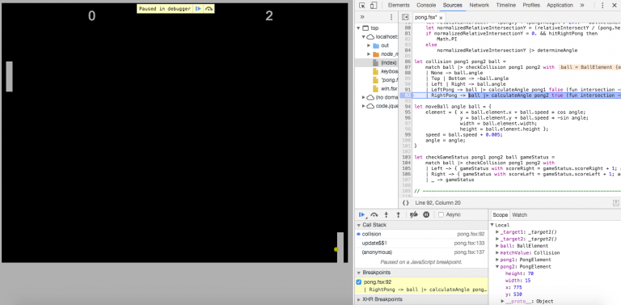




# Implementing Pong in a functional manner with Fable #

*All text and code copyright (c) 2016 by Marcel Schwark. Used with permission.*

*Original post dated 2016-12-26 available at http://oopbase.de/implementing-pong-in-a-functional-manner-with-fable/*

**By Marcel Schwark**

For the last few weeks I’ve been playing around with [Fable](http://fable.io/). As a F# enthusiast who had to deal with a lot of JavaScript code during his studies, I was quite curious what Fable was all about. For those of you who don’t know what Fable is, here is a quote from their website:

> Fable brings together the power of the F# compiler and Babel to make JavaScript a true backend for F#. It works directly on F# source code, no compilation needed. Fable optimizes F# code to generate as clean JavaScript as possible. – ([fable.io](http://fable.io/))

Being motivated by [Super Fable Mario](http://fable.io/samples/mario/index.html), I thought creating a simple game myself might be a good way to start with Fable. As you can read by the title, I chose [Pong](https://en.wikipedia.org/wiki/Pong) as my starting project. So without further ado, let’s start with the actual game.

## Defining the model

When thinking about the Pong game, there are basically three types of models:

* **Paddles**: The paddles have got a position and a specific size.
* **Ball**: The ball has got a position and a size as well. But it has also got speed and an angle.
* **Game status**: Some kind of storage containing information about the current score.

To implement those models, selecting record types seemed appropriate to me.

```fsharp
type PongElement = { 
    x : float; 
    y : float; 
    width : float; 
    height : float;
}

type BallElement = { 
    element : PongElement; 
    speed : float;
    angle : float; 
}

type GameStatus = {
    scoreLeft : int;
    scoreRight : int;
    active : bool;
}
```

As you can see in line 9, the ball stores a `PongElement` itself, since the ball has almost got the same properties as the paddles. The `GameStatus` does also contain the boolean flag `active` to indicate whether the game is currently running. The rest of the model is quite straightforward I guess. Obviously it is straightforward. It is F# code, isn’t it? 😉

## Controlling the paddles

To control a paddle there are only two functions necessary. A `canMove`-function, to indicate whether a paddle can move in a certain direction, and an actual `move`-function to move the paddle.

```fsharp
let canMove direction paddle =
    match direction with
    | (1, _) -> paddle.y > 0.
    | (_, 1) -> paddle.y + paddle.height < h
    | _ -> false

let move direction paddle =
    if paddle |> canMove direction then
        match direction with
        | (1, _) -> { paddle with y = paddle.y - 5. }
        | (_, 1) -> { paddle with y = paddle.y + 5. }
        | _ -> paddle
    else
        paddle
```

The parameter `direction` is a tuple (`int * int`). When the first parameter of the tuple is set to 1, we want the paddle to move up. When the second parameter of the tuple is set to 1, we want the paddle to move down. By using pattern matching we can check which value of the tuple is set to 1. Since every object is immutable, we either return a copy of the current paddle with its new Y-position (line 10 and 11) or simply return the input-paddle if no movement is allowed.

## Ball movement

As described in the model, the ball has got some speed value and an angle it is flying with. Using simple trigonometry, a function to move the ball may look as follows.

```fsharp
let moveBall angle ball = { 
    element = { x = ball.element.x + ball.speed * cos angle;
                y = ball.element.y + ball.speed * -sin angle; 
                width = ball.element.width; 
                height = ball.element.height }; 
    speed = ball.speed + 0.005;
    angle = angle; 
}
```

So everytime the `moveBall` function is called, a new instance of the ball record is being returned with a new position and an adjusted speed value.

## Collision detection

Before implementing the `checkCollision`-function, let’s start visualizing the collision by using a discriminated union.

```fsharp
type Collision = 
    | None
    | Top
    | Bottom
    | Left
    | Right
    | LeftPaddle
    | RightPaddle
```

This discriminated union describes the whole collision system of the game: There can be no collision (**None**), the **Top** or **Bottom** of the canvas may be hit, the **Left** or **Right** part of the canvas may be hit (so a player scored) or finally a paddle was hit (**LeftPaddle** & **RightPaddle**). The following function takes the paddles and the ball as input parameters and returns the found type of collision.

```fsharp
let checkCollision leftPaddle rightPaddle ball =
    let hitTop = ball.element.y <= 0.
    let hitBottom = ball.element.y + ball.element.height >= h
    let hitLeft = ball.element.x <= leftPaddle.x && ((ball.element.y >= leftPaddle.y && ball.element.y <= leftPaddle.y + leftPaddle.height) |> not)
    let hitRight = ball.element.x + ball.element.width >= rightPaddle.x + rightPaddle.width && ((ball.element.y >= rightPaddle.y && ball.element.y <= rightPaddle.y + rightPaddle.height) |> not)
    let hitLeftPaddle = ball.element.x <= leftPaddle.x + leftPaddle.width && ball.element.y >= leftPaddle.y && ball.element.y <= leftPaddle.y + leftPaddle.height
    let hitRightPaddle = ball.element.x + ball.element.width >= rightPaddle.x && ball.element.y >= rightPaddle.y && ball.element.y <= rightPaddle.y + rightPaddle.height
    match (hitTop, hitBottom, hitLeft, hitRight, hitLeftPaddle, hitRightPaddle) with
    | (true, _, _, _, _, _) -> Top
    | (_, true, _, _, _, _) -> Bottom
    | (_, _, true, _, _, _) -> Left
    | (_, _, _, true, _, _) -> Right
    | (_, _, _, _, true, _) -> LeftPaddle
    | (_, _, _, _, _, true) -> RightPaddle
    | _ -> None
```

With this function, implementing a final `collision`-function to determine the new angle of the ball is straight forward again. (Thanks to pattern matching)

```fsharp
let collision leftPaddle rightPaddle ball =
    match ball |> checkCollision leftPaddle rightPaddle with
    | None -> ball.angle
    | Top | Bottom -> -ball.angle
    | Left | Right -> ball.angle
    | LeftPaddle -> ball |> calculateAngle leftPaddle false (fun intersection -> intersection * (5. * Math.PI / 12.)) // Max. bounce = 75°
    | RightPaddle -> ball |> calculateAngle rightPaddle true (fun intersection -> Math.PI - intersection * (5. * Math.PI / 12.))
```

When hitting either the top or the bottom of the canvas, we negate the value of the angle (angle of incidence is equal to the angle of reflection). When hitting the left or right part of the canvas, we simply keep the input angle, since evaluating the score isn’t done here. To actually calculate the angle when a paddle is hit, we use yet another function.

```fsharp
let calculateAngle paddle hitRightPaddle determineAngle ball =
    let relativeIntersectY = (paddle.y + (paddle.height / 2.)) - ball.element.y
    let normalizedRelativeIntersectionY = (relativeIntersectY / (paddle.height / 2.))
    if normalizedRelativeIntersectionY = 0. && hitRightPaddle then
        Math.PI
    else
        normalizedRelativeIntersectionY |> determineAngle
```

For the calculation, we determine the relative intersection where the ball hit the paddle. Afterwards we normalize that value. So for example, if the paddle is 20 pixels high, that value will be between -10 and 10. Therefore we can dynamically calculate the angle depending on the impact. As seen in the collision function, the `determineAngle` parameter of this calculation-function is a function itself. Depending on which paddle is hit, we have to use a slightly modified calculation of the final angle. As you can see in line 5, we’ve also got a special case we have to deal with. If the right paddle got hit in the exact center, so `normalizedRelativeIntersectionY = 0. && hitRightPaddle`, we will have to return Pi as the new angle, since the radiant value of Pi is equal to 180°.

## Keyboard interaction

The whole code you’ve seen until now was plain F# code. To actually interact with the game, we finally need the Fable libraries. Let’s start with the Keyboard.

```fsharp
#r "../../node_modules/fable-core/Fable.Core.dll"
open Fable.Import.Browser

module Keyboard =
    let mutable keysPressed = Set.empty

    /// Returns 1 if key with given code is pressed
    let code x =
      if keysPressed.Contains(x) then 1 else 0

    /// Update the state of the set for given key event
    let update (e : KeyboardEvent, pressed) =
        let keyCode = int e.keyCode
        let op =  if pressed then Set.add else Set.remove
        keysPressed <- op keyCode keysPressed
        null

    /// code 87 = w, code 83 = s
    let leftControlsPressed() = (code 87, code 83)

    /// code 38 = up, code 40 = down
    let rightControlsPressed() = (code 38, code 40)

    let spacePressed() = code 32

    let init () =
      document.addEventListener_keydown(fun e -> update(e, true))
      document.addEventListener_keyup(fun e -> update(e, false))
```

The basic idea of the keyboard module is to store the pressed keys in a mutable set. By adding an `EventListener` for the `KeyDown`- and `KeyUp`-Event of the HTML document, we can identify which key is being pressed. So if the W-Key is pressed, the decimal value 87 (ASCII value for W) is stored into the set. Therefore the `leftControlsPressed`-function will return a tuple containing the values (1, 0).

## Window

The final part of the game is drawing the elements. We use a HTML canvas element and some encapsulated functions to draw the paddles, the scores and the ball.

```fsharp
#r "../../node_modules/fable-core/Fable.Core.dll"
open Fable.Core
open Fable.Import.Browser

module Win =
    let canvas = document.getElementsByTagName_canvas().[0]
    let context = canvas.getContext_2d()

    /// Fill rectangle with given color
    let drawRect color rect =
        let ctx = context
        ctx.fillStyle <- U3.Case1 color
        ctx.fillRect rect
    
    let drawCircle color (x, y, radius, startAngle, endAngle) =
        let ctx = context
        ctx.beginPath()
        ctx.arc(x, y, radius, startAngle, endAngle)
        ctx.fillStyle <- U3.Case1 color
        ctx.fill()

    let drawText text color font position =
        let ctx = context
        ctx.fillStyle <- U3.Case1 color
        ctx.font <- font
        ctx.fillText(text, (fst position), (snd position))

    let dimensions() =
      canvas.width, canvas.height
```

## Game loop

Now we have defined everything which is necessary to play the game. We can now initialize our paddles and the ball. We also use a recursive `update`-function to render the new positions of the elements.

```fsharp
let checkGameStatus leftPaddle rightPaddle ball gameStatus =
    match ball |> checkCollision leftPaddle rightPaddle with
    | Left -> { gameStatus with scoreRight = gameStatus.scoreRight + 1; active = false }
    | Right -> { gameStatus with scoreLeft = gameStatus.scoreLeft + 1; active = false }
    | _ -> gameStatus

let render (w, h) leftPaddle rightPaddle ball gameStatus  =
    (0., 0., w, h) |> Win.drawRect("black")
    (leftPaddle.x, leftPaddle.y, leftPaddle.width, leftPaddle.height) |> Win.drawRect("white")
    (rightPaddle.x, rightPaddle.y, rightPaddle.width, rightPaddle.height) |> Win.drawRect("white")
    (w / 4., 40.) |> Win.drawText (string(gameStatus.scoreLeft)) "white" "30px Arial"
    (w / 1.25 - 30., 40.) |> Win.drawText (string(gameStatus.scoreRight)) "white" "30px Arial"
    (ball.element.x, ball.element.y, ball.element.width, 0., 2. * Math.PI) |> Win.drawCircle("yellow")
    if gameStatus.active |> not then
        (w / 2. - 230., h / 2. + 40.) |> Win.drawText "Press space to start" "green" "40px Lucida Console"

let initialLeftPaddle = { x = 10.; y = h / 2. - 70. / 2.; width = 15.; height = 70. }
let initialRightPaddle = { x = w - 15. - 10.; y = h / 2. - 70. / 2.; width = 15.; height = 70. }
let initialBall = 
    { element = { x = w / 2.; y = h / 2.; width = 5.; height = 5. }; 
    speed = 3.;
    angle = 0. }

let initialGameStatus = { scoreLeft = 0; scoreRight = 0; active = false; }

Keyboard.init()

let rec update leftPaddle rightPaddle ball gameStatus () =
    let leftPaddle = if gameStatus.active then leftPaddle |> move (Keyboard.leftControlsPressed()) else initialLeftPaddle
    let rightPaddle = if gameStatus.active then rightPaddle |> move (Keyboard.rightControlsPressed()) else initialRightPaddle
    let angle = if gameStatus.active then collision leftPaddle rightPaddle ball else ball.angle
    let ball = if gameStatus.active then ball |> moveBall angle else { initialBall with angle = if angle = 0. then Math.PI else 0. }
    let gameStatus = if Keyboard.spacePressed() = 1 then { gameStatus with active = true } else gameStatus |> checkGameStatus leftPaddle rightPaddle ball
    render (w, h) leftPaddle rightPaddle ball gameStatus
    window.setTimeout(update leftPaddle rightPaddle ball gameStatus, 1000. / 60.) |> ignore

update initialLeftPaddle initialRightPaddle initialBall initialGameStatus ()
```

And that’s it. We can now use Fable to transpile our F# files. We then simply need an HTML-file which contains a canvas and includes the transpiled script. Since I forked the Fable repository, the whole code of the game can be found [right here](https://github.com/oopbase/Fable/tree/pong-sample/samples/browser/pong).

