


# Implementing Two-Factor Authentication in Suave #

*All text and code copyright (c) 2016 by Tamizh Vendan. Used with permission.*

*Original post dated 2016-12-26 available at http://blog.tamizhvendan.in/blog/2016/12/26/implementing-two-factor-authentication-in-suave/*

**By Tamizh Vendan**


Two-factor authentication is a type of [Multi-factor authentication](https://en.wikipedia.org/wiki/Multi-factor_authentication) which adds an extra layer of security to the applications.

[Google Authenticator](https://en.wikipedia.org/wiki/Google_Authenticator) is one of the popular application that implements two-factor authentication services. In this blog post, we are going to learn how to implement Two-factor authentication in web applications developed using [suave](https://suave.io/).

The idea presented here is a naive implementation of Two-factor authentication. The objective here is to demonstrate how to implement it in a functional programming language, F#. Things like TLS/HTTPS, preventing CSRF and other attacks are ignored for brevity.


## Prerequisite

This blog post assumes that you are familiar with the concept of Two-factor authentication and Google Authenticator.
If you would like to know more about these, check out the below resources to get a picture of what it is all about.

* [Two-step verification](https://www.google.com/landing/2step) by Google
* [How Google Authenticator works](https://garbagecollected.org/2014/09/14/how-google-authenticator-works/)
* [A Stack-Overflow Question](https://security.stackexchange.com/questions/35157/how-does-google-authenticator-work)

We are going to use [Time-based One-time Password(TOTP) algorithm](https://en.wikipedia.org/wiki/Time-based_One-time_Password_Algorithm) in this blog post

## What we will be building

We are going to build a tiny web appliaction that has an inbuilt user account with the username `foo` and the password `bar`

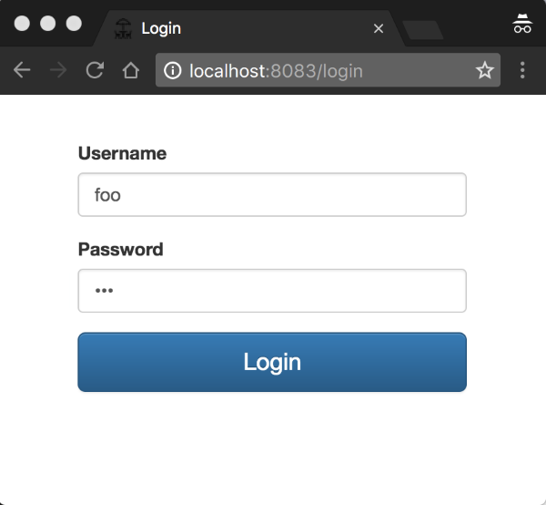

After successful login, the user redirected to the **Profile** page where the user sees his name with a couple of buttons. One to enable *Two-factor authentication* and another one to *log out*.

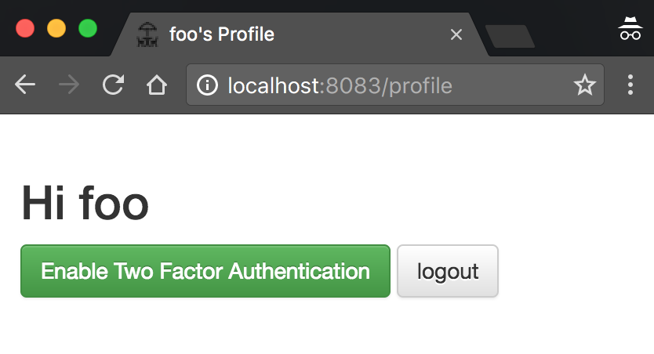

Upon clicking the *Enable Two Factor Authentication* button, the user redirected to the **Enable Two Factor Authentication** page where the user has to scan the QR Code with the Google Authenticator App (For [Android](https://play.google.com/store/apps/details?id=com.google.android.apps.authenticator2&hl=en) or [iPhone](https://itunes.apple.com/in/app/google-authenticator/id388497605?mt=8)). Then he needs to enter the verification code to enable Two-factor authentication for his account.

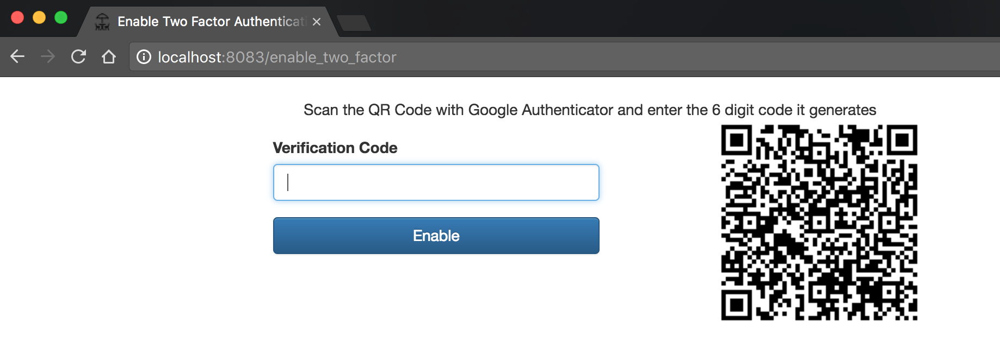

*Google Authenticator App*

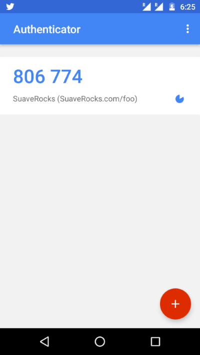

If the verification code matches, the updated **Profile** page will look like

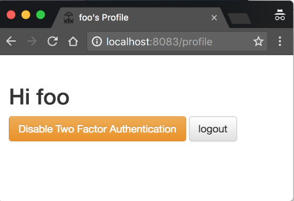

Now if the user logout and login again, he will be prompted to enter the verification code

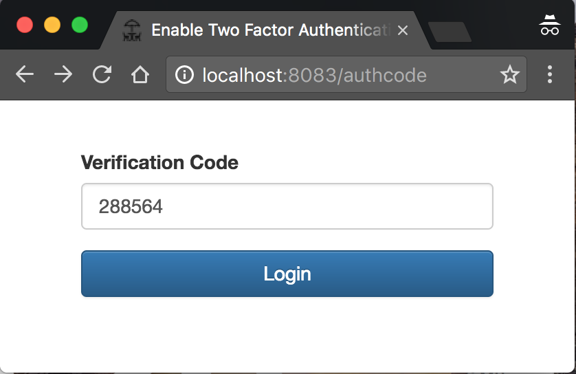

After entering the verification code from the Google Authenticator, the user will be redirected to his **Profile** page.

## Getting Started

Create a new **F# Console Project** with the name *Suave.TwoFactorAuth* and use Paket to install the following dependencies.

*paket.dependencies*

```
nuget FSharp.Core
nuget Suave
nuget DotLiquid
nuget Suave.DotLiquid
nuget OtpSharp
```

Then reference them in the *Suave.TwoFactorAuth* project.

*Suave.TwoFactorAuth/paket.references*

```
FSharp.Core
Suave
DotLiquid
Suave.DotLiquid
OtpSharp
```

The [OtpSharp](https://www.nuget.org/packages/OtpSharp/) is an .NET library that we will be using to generate keys and to verify the verification code from Google Authenticator app using the [TOTP](https://en.wikipedia.org/wiki/Time-based_One-time_Password_Algorithm) algorithm.

The reference to [DotLiquid](https://www.nuget.org/packages/DotLiquid/) library is required to render the templates using [Suave.DotLiquid](https://www.nuget.org/packages/Suave.DotLiquid/).

## Initializing DotLiquid

To use [DotLiquid](https://github.com/Shopify/liquid/wiki/Liquid-for-Designers) to render the views in Suave, we need to set the templates directory explicitly.

```fsharp
// Suave.TwoFactorAuth/Suave.TwoFactorAuth.fs
module Suave.TwoFactorAuth.Main

open Suave
open System.IO
open System.Reflection
open Suave.DotLiquid

let initializeDotLiquid () =
  let currentDirectory =
    let mainExeFileInfo =
      new FileInfo(Assembly.GetEntryAssembly().Location)
    mainExeFileInfo.Directory
  Path.Combine(currentDirectory.FullName, "views")
  |> setTemplatesDir

[<EntryPoint>]
let main argv =
  initializeDotLiquid ()
  0
```
  
In this sample application we are going to create a directory views. This views directory will contain the liquid templates of our application

## Serving the Login Page

Let’s start by serving the Login page.

Create a new directory with the name views in the *Suave.TwoFactorAuth project and add a new liquid template *page.liquid*. This *page.liquid* is the master template for our application

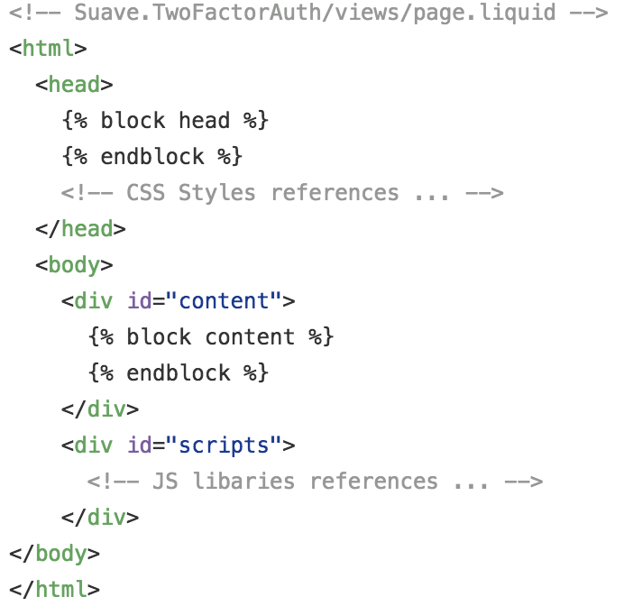

After creating, change the ‘Copy to output’ property of the *page.liquid* file to ‘Copy if newer’ so that the view files copied to the build output directory.

This step is applicable for all the other view templates that we will be creating later

> If you are using VS Code or atom editor, you need to do this property change manually by opening the *Suave.TwoFactorAuth.fsproj* file

```
<!-- .... -->
<ItemGroup>
  <Folder Include="views\" />
</ItemGroup>
<ItemGroup>
  <None Include="views\page.liquid">
    <CopyToOutputDirectory>PreserveNewest</CopyToOutputDirectory>
  </None>
</ItemGroup>
<!-- .... -->
```

Then create a new template file *login.liquid* in the views directory

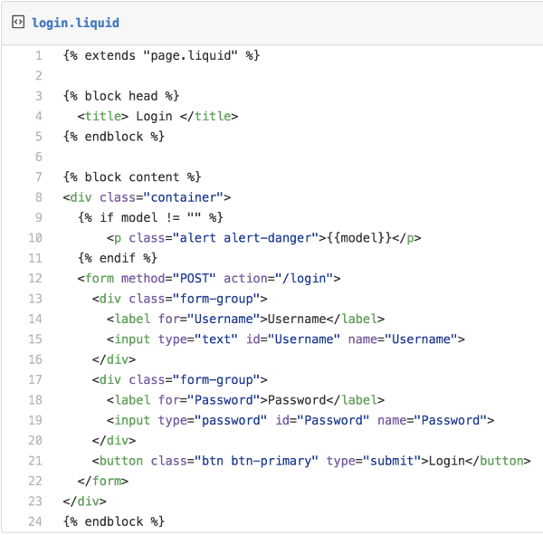

The *login.liquid* view extends the *page.liquid* view and fill the placeholders for `head` and `content`.

To display the error messages like *Password didn’t match*, *login.liquid* view bounded to the model of type `string`.

Now we have the view template for the login page ready and the next step is to render it upon receiving an HTTP request.

Create a new fsharp source file *Login.fs* and update it as below

```fsharp
module Suave.TwoFactorAuth.Login

open Suave
open Suave.DotLiquid
open Suave.Filters
open Suave.Operators

let loginPath = "/login"

let renderLoginView (request : HttpRequest) =
  let errMsg =
    match request.["err"] with
    | Some msg -> msg
    | _ -> ""
  page "login.liquid" errMsg

let loginWebPart =
  path loginPath >=> choose [
      GET >=> request renderLoginView]
```
      
As a good practice let’s create a new module `Web` which will be containing all the WebParts of the application

```fsharp
// Suave.TwoFactorAuth/Suave.Web.fs
open Suave
open Login

let app =
  choose [
    loginWebPart]
```
    
Then start the Web Server

```fsharp
// Suave.TwoFactorAuth/Suave.TwoFactorAuth.fs
// ...
open Web
// ...
let main argv =
  // ...
  startWebServer defaultConfig app
  0
```
  
> Keeping all the Suave WebParts in a single place like we did in the `Web.fs` file, enable us to host Suave in [Azure Functions](https://www.nuget.org/packages/Suave.Azure.Functions) or [Asp.Net Core](https://dusted.codes/running-suave-in-aspnet-core-and-on-top-of-kestrel) without doing any significant changes.

## Handling User Login

To handle the login request from the user, we need to have some users in the application. Let’s hardcode a user account.

```fsharp
// Suave.TwoFactorAuth/Suave.TwoFactorAuth.fs
module Suave.TwoFactorAuth.User

open System.Collections.Generic

type User = {
  Username : string
  Password : string
}

let private users = new Dictionary<string, User>()

users.Add("foo", {Username = "foo"; Password = "bar"})

let getUser username =
  match users.TryGetValue username with
  | true, user -> Some user
  | _ -> None
```
  
Post successful login, to serve the subsequent requests we need to identify the user who logged in. We can achieve it Suave using `statefulForSession`, which initializes a user state for a browsing session.

Let’s create some helper functions to do this.

```fsharp
// Suave.TwoFactorAuth/Combinators.fs
module Suave.TwoFactorAuth.Combinators

open Suave.State.CookieStateStore
open Suave.Cookie
open Suave
open Suave.Operators
open Suave.Authentication

let sessionSet failureF key value =
  statefulForSession
  >=> context (fun ctx ->
                match HttpContext.state ctx with
                | Some state -> state.set key value
                | _ -> failureF
              )

let sessionGet failureF key successF =
  statefulForSession
  >=> context (fun ctx ->
                match HttpContext.state ctx with
                | Some store ->
                  match store.get key with
                  | Some value -> successF value
                  | _ -> failureF
                | _ -> failureF
  )

let clearSession =
  unsetPair SessionAuthCookie
    >=> unsetPair StateCookie
```
    
The `sessionSet` function takes a WebPart and a key value pair and tries to persist the value in the session state with the given key. If it fails, it calls the WebPart.

The `sessionGet` function takes a success WebPart Combinator, a failure WebPart, and a key. If retrieving the value from session state is successful it calls the success WebPart combinator with the retrieved value. In case of retrieval failure it calls the failure WebPart

The `clearSession` function clears the state. We will be using it while implementing log out

Now we have all the building blocks for handling user login request, and it’s time to start its implementation

```fsharp
// Suave.TwoFactorAuth/Login.fs
// ...
open Suave.Redirection
open Suave.Authentication
open Suave.Cookie

open Combinators
open User
// ...
let userSessionKey = "loggedUser"

let redirectToLogin = function
  | Some errMsg -> FOUND (sprintf "%s?err=%s" loginPath errMsg)
  | None -> FOUND loginPath

let loginSucess failureW redirectPath username =
  authenticated Cookie.CookieLife.Session false
    >=> sessionSet failureW userSessionKey username
    >=> FOUND redirectPath

let onLogin redirectPath (request : HttpRequest) =
  match request.["Username"], request.["Password"] with
  | Some username, Some password ->
    match getUser username with
    | Some user ->
      match user.Password = password with
      | true -> loginSucess never redirectPath username
      | _ -> redirectToLogin (Some "Password didn't match")
    | _ -> redirectToLogin (Some "Invalid username")
  | _ -> redirectToLogin (Some "Invalid request")

let secured webpart =
  let onFail = redirectToLogin (Some "sign-in to access")
  sessionGet onFail userSessionKey webpart

let loginWebPart redirectPath =
  path loginPath >=> choose [
      // ...
      POST >=> request (onLogin redirectPath)]
```
      
The key function to note here is `secured` that takes a WebPart. It calls this WebPart only if the user has logged in. If he didn’t the user will be redirected to the Login page

After successful login, we need to redirect the user to his profile page. Let’s create a `profile.liquid` a view template for the Profile page


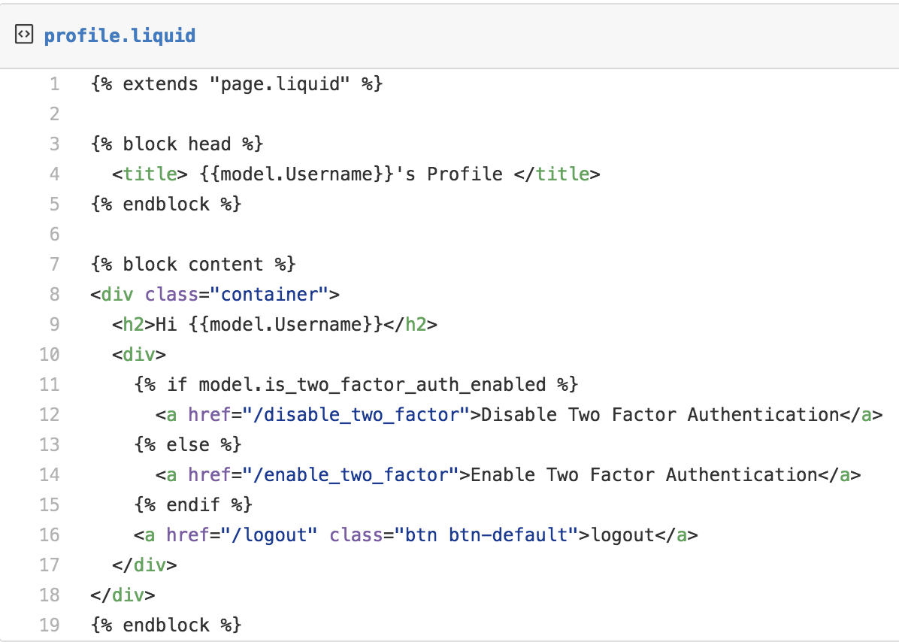

To render this profile page let’s add some code

```fsharp
// Suave.TwoFactorAuth/Profile.fs
module Suave.TwoFactorAuth.Profile

open Suave.DotLiquid
open Suave.Redirection
open Suave.Filters
open Suave.Operators

open User
open Login

type ProfileViewModel = {
  Username: string
  SecretKey : string
  IsTwoFactorAuthEnabled : bool
}
with static member FromUser user =
        {
          SecretKey = ""
          IsTwoFactorAuthEnabled = false
          Username = user.Username
        }

let profilePath = "/profile"

let renderProfile notFoundPath username =
  match getUser username with
  | Some user ->
    user
    |> ProfileViewModel.FromUser
    |> page "profile.liquid"
  | _ -> FOUND notFoundPath

let profileWebPart notFoundPath =
  path profilePath >=> secured (renderProfile notFoundPath)
```
  
The labels `IsTwoFactorAuthEnabled`, `SecretKey` are just blank right now, and we will be seeing them in action while adding two-factor authentication

The `notfound.liquid` page that is going to our fancy 404 page

```
<!-- Suave.TwoFactorAuth/views/not_found.liquid -->
Not Found :(
```

The final step is to put these WebParts together

```fsharp
// Suave.TwoFactorAuth/Web.fs
// ...
open Profile
open Suave.DotLiquid
open Suave.Filters
open Suave.Operators

let notFoundPath = "/notfound"

let app =
  choose [
    loginWebPart profilePath
    profileWebPart notFoundPath
    path notFoundPath >=> page "not_found.liquid" ""
  ]
```
  
## Handling Logout

Handling logout is a simpler task as we have all the infrastructure already in place.

```fsharp
// Suave.TwoFactorAuth/Web.fs
// ...
open Combinators
open Login
// ...

let app =
  choose [
    // ...
    path "/logout" >=> clearSession >=> redirectToLogin None
  ]
```
  
## Enabling Two-factor Authentication

To enable Two-factor authentication, we need to change our `User` domain model first.

```fsharp
// Suave.TwoFactorAuth/User.fs
// ...
type TwoFactorAuthentication =
| Enabled of SecretKey:string
| Disabled

type User = {
  // ...
  TwoFactorAuthentication : TwoFactorAuthentication
}
// ... 
// Let's assume TwoFactorAuthentication is disabled by default 
users.Add("foo", {Username = "foo"; Password = "bar"; TwoFactorAuthentication = Disabled})
// ...
let enableTwoFactorAuth username key =
  match getUser username with
  | Some user ->
    users.[username] <- {user with TwoFactorAuthentication = Enabled key}
  | _ -> ()
```  
  
The next step is to define a liquid view template for the `enable_two_factor` page.

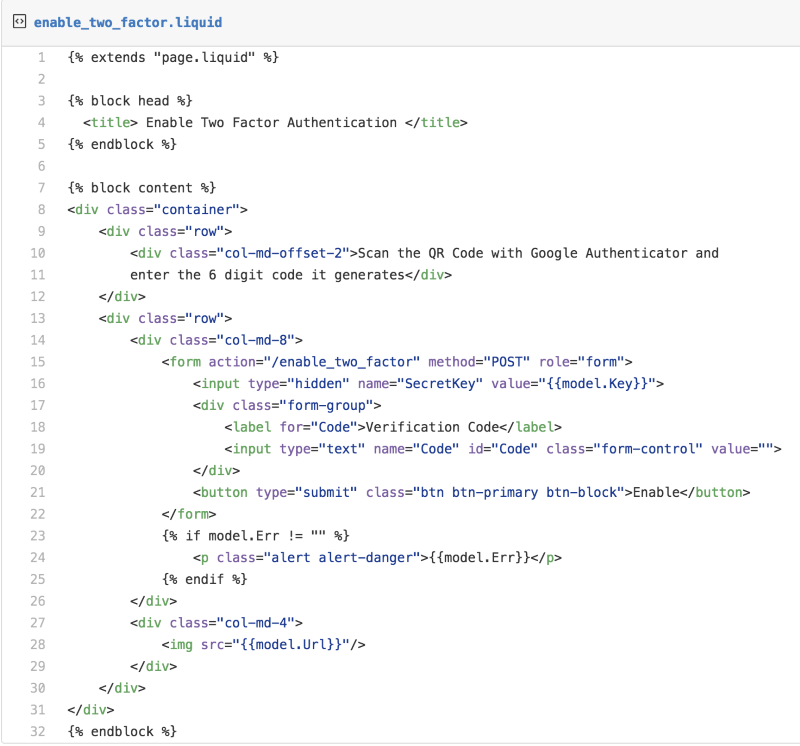

While enabling the Two-factor authentication, we need to generate a secret key for the user that will be required for both, one-time verification code generation as well as its verification.

So, in the *enable_two_factor.liquid* template we pass the generated `SecretKey` as a `hidden` input which will then be used for the verification of the code.

```
<input type="hidden" name="SecretKey" value="">
```

Now we need to render the `enable_two_factor` page in response to the HTTP GET request `/enable_two_factor`


Let’s create a new module `GoogleAuthenticator` to put the Two-factor authentication related functions together

```fsharp
// Suave.TwoFactorAuth/GoogleAuthenticator.fs
module Suave.TwoFactorAuth.GoogleAuthenticator

open Suave
open Suave.Filters
open Suave.Operators
open Suave.DotLiquid
open Suave.Redirection
open OtpSharp
open Base32

open Login
open User

let enableTwoFactorAuthPath = "/enable_two_factor"

type EnableTwoFactorViewModel = {
  Key : string
  Url : string
  Err : string
}
with static member From username err =
      let secretKey = KeyGeneration.GenerateRandomKey(20)
      let appName = "SuaveRocks"
      let label = sprintf "%s (%s.com/%s)" appName appName username
      let keyUrl = KeyUrl.GetTotpUrl(secretKey, label)
      { Url = sprintf "https://qrcode.kaywa.com/img.php?s=4&d=%s&issuer=%s" keyUrl appName
        Key = Base32Encoder.Encode(secretKey)
        Err = err}

let renderEnableTwoFactorAuthView notFoundPath username ctx = async {
  match getUser username with
  | Some user ->
    let err =
      match ctx.request.["err"] with
      | Some err -> err
      | _ -> ""
    let vm = EnableTwoFactorViewModel.From username err
    return! page "enable_two_factor.liquid" vm ctx
  | _ -> return! redirect notFoundPath ctx
}

let googleAuthenticatorWebPart notFoundPath =
  choose [
    path enableTwoFactorAuthPath >=> choose [
      GET >=> secured (renderEnableTwoFactorAuthView notFoundPath)
    ]]
```
    
As we did in the login page, we are using the `err` query string in the request to pass the verification code mismatch errors.

We are leveraging the `OtpSharp` library to generate the URL that is in turn represented as a QR Code.

> If you would like to how Google Authenticator interprets the generated key and the issuer name from the URL embedded in the QR Code, check out the [UriFormat](https://github.com/google/google-authenticator/wiki/Key-Uri-Format) documentation.

The last step in rendering this page is adding the `googleAuthenticatorWebPart` in the `Web` module where we are putting all the WebParts together

```fsharp
// Suave.TwoFactorAuth/Web.fs
// ...
open GoogleAuthenticator

let app =
  choose [
    // ...
    googleAuthenticatorWebPart notFoundPath
  ]
```
  
While enabling Two-factor authentication, the user has to scan the QR-Code from his *Google Authenticator* app and he will be getting a one-time verification code like this upon adding


Then he will be entering this in the `enable_two_factor` page and click `Enable`.

Let’s handle this POST request.

```fsharp
// Suave.TwoFactorAuth/GoogleAuthenticator.fs
// ...
let verifyOtp secretKey code =
  let otp = new Totp(Base32Encoder.Decode secretKey)
  otp.VerifyTotp(code, ref 0L, new VerificationWindow(2, 2))

let enableTwoFactorAuth redirectPath notFoundPath username ctx = async {
  match ctx.request.["SecretKey"], ctx.request.["Code"] with
  | Some secretKey, Some code ->
    match verifyOtp secretKey code with
    | true ->
      enableTwoFactorAuth username secretKey
      return! redirect redirectPath ctx
    | _ ->
      let redirectTo =
        sprintf "%s?err=code validation failed" enableTwoFactorAuthPath
      return! redirect redirectTo ctx
  | _ -> return! redirect notFoundPath ctx
}

let googleAuthenticatorWebPart redirectPath notFoundPath =
  choose [
    path enableTwoFactorAuthPath >=> choose [
      // ...
      POST >=> secured (enableTwoFactorAuth redirectPath notFoundPath)
    ]]
```
    
Thanks to the *OtpSharp* library for making our job simpler here. We just need to get the `SecretKey`, and the `Code` from the POST request and get it verified using *OtpSharp’s* [VerifyTotp](https://bitbucket.org/devinmartin/otp-sharp/wiki/TOTP) function.

If the verification is successful, we will be enabling the Two-factor authentication for the user in our in-memory backend using the `enableTwoFactorAuth` function and then redirect to the redirect path which in this case the *Profile* page.

```fsharp
// Suave.TwoFactorAuth/Web.fs
// ...

let app =
  choose [
    // ...
    googleAuthenticatorWebPart profilePath notFoundPath
  ]
```
  
## Login With Two-factor Authentication


The last step is to prompt for the verification code whenever the Two-factor Authentication enabled user tries to log in and verify the one-time verification code before granting the access.

Let’s start by defining the liquid view template *auth_code.liquid* for getting the one-time verification code.

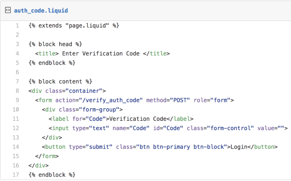

```fsharp
// Suave.TwoFactorAuth/GoogleAuthenticator.fs
// ...
let authCodePath = "/authcode"

let googleAuthenticatorWebPart redirectPath notFoundPath =
  choose [
    // ...
    path authCodePath >=> page "auth_code.liquid" ""]
```
    
After username and password verification, the user has to be redirected the *auth_code* page

```fsharp
// Suave.TwoFactorAuth/Login.fs
// ...
let authCodeSessionKey = "loginUser"

let onLogin redirectPath authCodePath (request : HttpRequest) =
  match request.["Username"], request.["Password"] with
  | Some username, Some password ->
    match getUser username with
    | Some user ->
      match user.Password = password, user.TwoFactorAuthentication with
      | true, Disabled -> loginSucess never redirectPath username
      | true, Enabled _ ->
          sessionSet never authCodeSessionKey username
            >=> FOUND authCodePath
      // ...

// ...

let loginWebPart redirectPath authCodePath =
  path loginPath >=> choose [
      // ...
      POST >=> request (onLogin redirectPath authCodePath)]
```

```fsharp      
// Suave.TwoFactorAuth/Web.fs
// ...
let app =
  choose [
    loginWebPart profilePath authCodePath
    // ...
  ]
```
  
We are using a separate session key `authCodeSessionKey` to hold the username of the user.

The final step is verifying the one-time verification code (from the Google Authenticator app) entered by the user.


```fsharp
// Suave.TwoFactorAuth/GoogleAuthenticator.fs
// ...
open Combinators
// ...
let onAuthCodeVerification redirectPath (request : HttpRequest) username =
  match request.["Code"], getUser username with
  | Some code, Some user ->
    match user.TwoFactorAuthentication with
    | Enabled secretKey ->
      match verifyOtp secretKey code with
      | true -> loginSucess never redirectPath user.Username
      | _ -> redirectToLogin (Some "invalid otp")
    | _ -> redirectToLogin (Some "invalid request")
  | _ -> redirectToLogin (Some "invalid request")

let onVerifyAuthCode redirectPath httpRequest =
  let onFail = redirectToLogin (Some "invalid request")
  let onAuthCodeVerification =
    onAuthCodeVerification redirectPath httpRequest
  sessionGet onFail authCodeSessionKey onAuthCodeVerification

let googleAuthenticatorWebPart redirectPath notFoundPath =
  choose [
    // ...
    path "/verify_auth_code" >=> request (onVerifyAuthCode redirectPath)]
```
    
That’s it! We have successfully implemented Two-factor authentication.

The complete source code is available in [my GitHub repository](https://github.com/tamizhvendan/blog-samples/tree/master/SuaveTwoFactorAuth)

### Related Post(s)

* [Securing APIs in Suave using JSON Web Token](http://blog.tamizhvendan.in/blog/2015/07/15/securing-apis-in-suave-using-json-web-token/)

