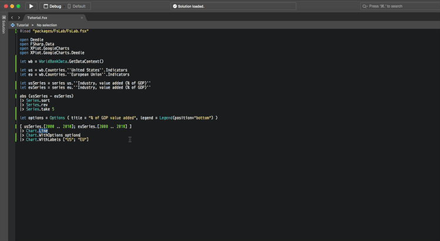




# Getting Up and Running with FsLab for Data Science  #

*All text and code copyright (c) 2016 by Jon Wood. Used with permission.*

*Original post dated 2016-12-27 available at https://dotnetmeditations.com/blog/2016/12/27/getting-up-and-running-with-fslabs-for-data-science*

**By Jon Wood**


FSAdvent time is back this year! I'm going to use this post to start a new work in progress series on using F# for Dara science. This series will mainly consist of using [FsLab](https://fslab.org/) to manipulate and visualize data.

## Setting Up Your Environment

The easiest way to get setup in the IDE of you choosing is to just download the [basic template](https://github.com/fslaborg/FsLab.Templates) of FsLab. This just references FsLab with [Paket](http://dotnetmeditations.com/blog/2014/10/22/introduction-to-paket) and gives a small script example. That's perfect for all that we need to do.

We're going to go through the script that it provides (with a bit of changes) in this post. Don't worry though, we'll go through a good bit of different aspects of the script in [future posts](https://dotnetmeditations.com/?tag=fslabs). We're just getting up and running here as sometimes that can be the biggest hurdle to get started in something new.

## Generating Data

FsLab comes with the [FSharp.Data](http://fsharp.github.io/FSharp.Data/) package which includes a few very useful [type providers](https://docs.microsoft.com/en-us/dotnet/articles/fsharp/tutorials/type-providers/) which help provide a safe and easy way to get data from external sources.

### World Bank Type Provider

As previously mentioned, FSharp.Data comes with a few very useful type providers. One that we'll use here to help give us some real world data is the [World Bank type provider](http://fsharp.github.io/FSharp.Data/library/WorldBank.html). You could spend all day looking at what data it provides. For this post, though, we'll look at the US and EU percent added to their [GDP](https://en.wikipedia.org/wiki/Gross_domestic_product) from industry.

## Setting Up Script

Before we can access the World Bank type provider, though, we need to set up our script to access it. If you used the basic template it will already have FsLab setup with Paket so you would just need to run `paket.exe install` or build the project.

Now we can reference FsLab so first thing to do is to load the script to access everything we need from it:

```
#load "packages/FsLab/FsLab.fsx"
```

Now that we have the FsLab script loaded we can access all sorts of libraries from it by using the '[open](https://msdn.microsoft.com/en-us/visualfsharpdocs/conceptual/import-declarations-the-open-keyword-%5Bfsharp%5D)' keyword in F#.

```fsharp
open Deedle
open FSharp.Data
open XPlot.GoogleCharts
open XPlot.GoogleCharts.Deedle
```

We have a few external libraries we're using throughout our script:

* Using [Deedle](http://bluemountaincapital.github.io/Deedle/) to explore our data.
* The `FSharp.Data` library for our World Bank type provider.
* [GoogleCharts](https://tahahachana.github.io/XPlot/) and GoogleCharts.Deedle to visualize our data.

## Getting Our Data

Next we instantiate the World Bank type provider and from there we get a reference to the `Indicators` object for the US and for the EU.

```fsharp
let wb = WorldBankData.GetDataContext()

let us = wb.Countries.``United States``.Indicators
let eu = wb.Countries.``European Union``.Indicators
```

From there we get the industry percent value added to the country's GDP and create a data series.

```fsharp
let usSeries = series us.``Industry, value added (% of GDP)``
let euSeries = series eu.``Industry, value added (% of GDP)``
```

Now here is where some work on the data happens.

```fsharp
abs (usSeries - euSeries)
|> Series.sort
|> Series.rev
|> Series.take 5
```

From here we get the absolute value of the difference of the two series, sort it, get the reverse of it, then take only the first five items. Looks like a bit, but we'll go into details of certain statistics for data science in future posts.

## Charting Our Data

Now that we have the data we want, let's chart it. The charting library in FsLabs will allow us to customize the chart as we see fit for visualizing. For this there is an [Options](https://tahahachana.github.io/XPlot/reference/xplot-googlecharts-configuration-options.html) type that we can create. We'll just give a title and tell the legend to appear at the bottom.

```fsharp
let options = Options ( title = "% of GDP value added", legend = Legend(position="bottom") )
```

Now we just need to tell the charting library to chart our data.

```fsharp
[ usSeries.[2000 .. 2010]; euSeries.[2000 .. 2010] ]
|> Chart.Line
|> Chart.WithOptions options
|> Chart.WithLabels ["US"; "EU"]
```

We give it our data as an F# list, tell it to create a line chart, give it our options, and then tell what our labels are for our legend.

### Executing

Just run it all in F# Interactive. :)

