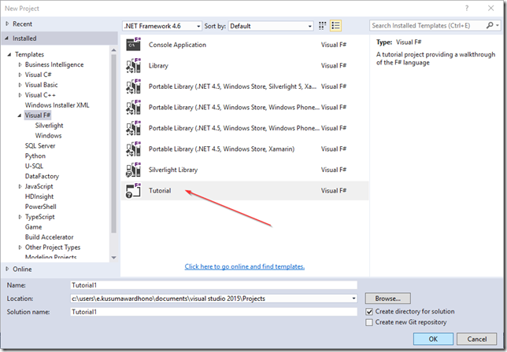
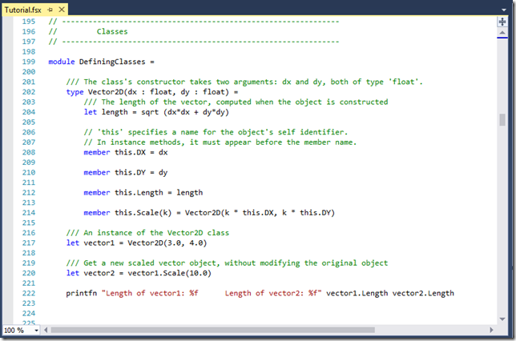




# F# Advent: F# 4.0 function first constructor  #

*All text and code copyright (c) 2016 by Eriawan Kusumawardho. Used with permission.*

*Original post dated 2016-12-29 available at https://fsharpmonologue.blogspot.com.by/2016/12/f-advent-f-40-function-first-constructor.html*

**By Eriawan Kusumawardho**

Hi there!

I know it’s been long promised before, that I will discuss constructor as function in F# 4.0 in my previous blog entry of [What’s new in F# 4.0](http://fsharpmonologue.blogspot.com/2015/12/whats-new-in-f-40-in-visual-studio-2015.html). 

> This blog is part of F# blog Advent in December that contains blogs of F# developer communities, thanks to Sergey Tihan to organize this advent series! 

Now we can simply treat any object constructor as a simple function call that always returns an object typed as the same as the name of the function, and this is the same as constructor in C#/VB.

## Quick background of OOP support in F#

F# is functional programming language, and we all know that it is basically what F# really shines as programming language. But F# has very good support for OOP, including the nature of inheritance, encapsulation, polymorphism and mutability. Every class defined in F# also supports method calls that parts of the object’s behaviors, including object’s constructors.

Since F# first release, OOP support is improving, including nice supports for upcast and downcast of a type. But this type casting support is nicely documented in F# documentation at Microsoft’s new documentation repository: https://docs.microsoft.com/en-us/dotnet/articles/fsharp/language-reference/casting-and-conversions

## Function constructor in action

Now let’s visit F# tutorial sample on Visual Studio:



And we now have a Tutorial.fsx file opened. Go to the Classes section in the comments, and we will see the sample code to create class with default constructor that has 2 parameters:



We can see that the code instantiate Vector2D by calling the constructor directly instead of using `new` keyword!

In previous release of F#, we have to use new to call constructor. For example:

```
let vector3 = new Vector2D(1.5, 4.5)
```

Now we can simply call the constructor without new, as demonstrated in the tutorial sample:

```
let vector1 = Vector2D(3.0, 4.0)
```

Yes, it’s more succinct, cleaner, and one thing is also nice: it’s more functional in style. This new function constructor is typed to return the same object as the function name, therefore there’s no constructor that will return void or unit because this is not allowed. 

WARNING: The name resolution is important, we should not have implemented another function with the same name as the name of the class. Otherwise compile error will occur. 

Unfortunately, current documentation of F# object expression does not cover this function constructor yet: https://docs.microsoft.com/en-us/dotnet/articles/fsharp/language-reference/object-expressions

I invite all of you, my blog reader, to contribute to F# docs repo. Enjoy contributing and happy coding!
