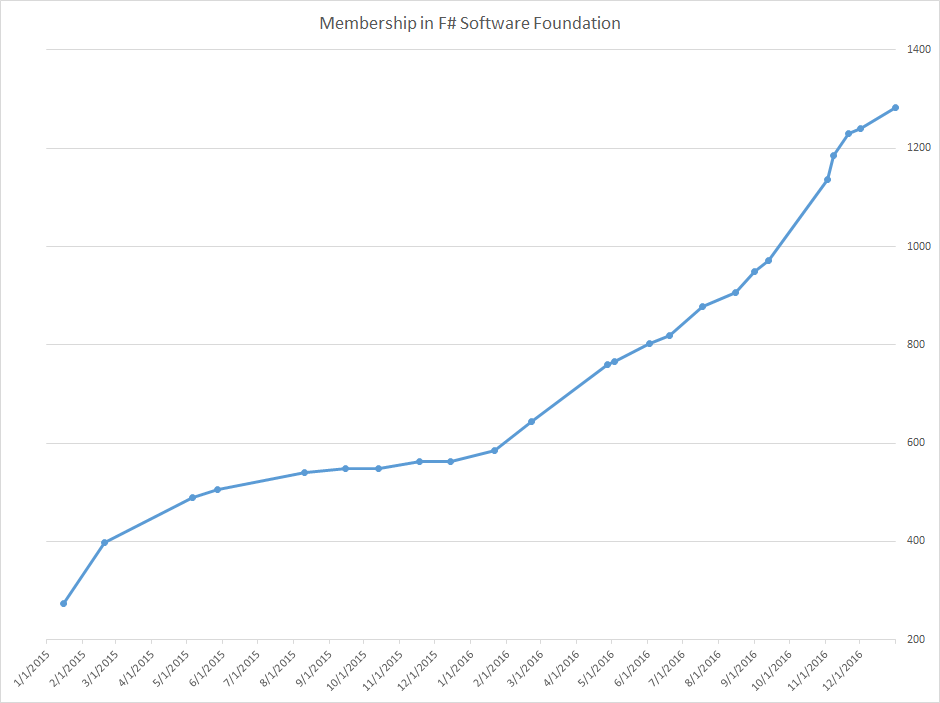
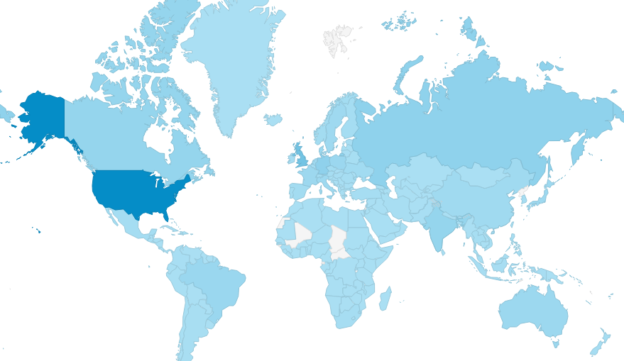
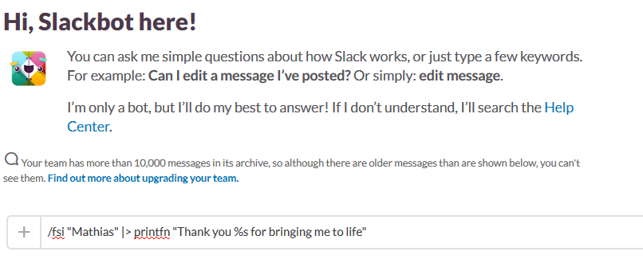
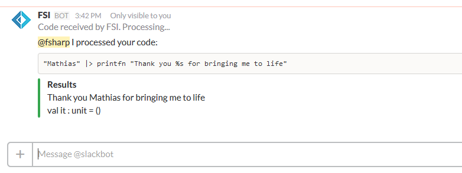



# Welcome to 2017! A retrospective of the past year #

*All text and code copyright (c) 2017 by Reed Copsey. Used with permission.*

*Original post dated 2017-01-01 available at http://foundation.fsharp.org/welcome_to_2017*

**By Reed Copsey**

Happy New Year from the F# Software Foundation!

As we begin the new year, I thought it'd be nice to look back at some of what we've accomplished in 2016, and provide a small surprise gift for our members as we begin the new year.

One of the goals of the F# Software Foundation is to represent the F# community, in all its diversity. We have been very pleased to observe that the community has been growing steadily, at an increased pace over 2016:

We passed the 1000 member mark in the fourth quarter, with members joining from all over the world.  Visits to learn about F# are up, with content being shown to people across the globe:

 

One of the bright spots for 2016 has been the [mentorship program](http://fsharp.org/mentorship/index.html). We launched it in beta this year, with ten mentors paired up with an F# beginner, and guiding them through their journey. By all measures, this was a great success, with new and confident F# developers, as well as a couple of pull requests to the F# Compiler. As a result, the Education Working Group started a second round recently, now with 42 pairs, and we look forward to incorporating the feedback and lessons learned to expanding this program further, and make it even better!

This year, the F# Software Foundation also focused efforts towards helping local user groups. We started engaging more closely with [meetups everywhere](http://community.fsharp.org/user_groups), as well as creating a [speakers list](http://community.fsharp.org/speakers). As a result, we put together a program to help [speakers visiting user groups](http://community.fsharp.org/speakers_program), and very recently, an [affiliated user group program that allows us to support local groups more directly](http://community.fsharp.org/affiliated_user_group_program). We have been very happy that speakers have begun requesting assistance, and six meetups worldwide have already become [affiliates](http://community.fsharp.org/user_groups).

If you are either running a meetup, giving F# talks, or want to do either of these in 2017, we would love to hear from you and help you succeed. Contact us on Slack or via speakers@fsharp.org.

I'd also like to call attention to the [F# Software Foundation Slack Team](http://fsharp.org/guides/slack/). With close to 1,000 active users, our Slack has become an extremely active place for the Community to find help and discuss a variety of topics, in many dedicated channels ranging from web development with F# to machine learning and everything in between. In particular, the #beginners channel has allowed many newcomers to ask questions and get friendly help; and the #fssf channel, with its weekly office hours, is now a place where members regularly bring up their Foundation-related ideas.

So... if you have ideas about how the F# Software Foundation can help F# grow, or serve the Community better, we hope to see you there soon!

Finally, I promised a small gift for our members... As I mentioned, the [Slack team](http://fsharp.org/guides/slack/) has become a great place for discussion and help. Thanks to the dedication and hard work of [Mathias](http://foundation.fsharp.org/member_roster?search=brandewinder), I'm happy to announce that our Slack is now even more fun with a custom written FSI integration, available immediately. Using the new `/fsi` command:

Provides direct integration with F# Interactive, with nicely formatted responses:

If you're on the Slack team, have fun with the new integration.  If you're not, [Join the F# Software Foundation today](http://foundation.fsharp.org/join) - it's free, and will give you immediate access! 

Thank you all, Happy New Years, and may 2017 prove to be even more fortuitous than 2016!

